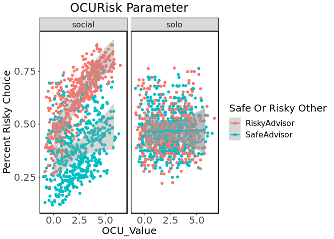

-   [Whats New Now?](#whats-new-now)
-   [Inspection of the Raw data and Simulations.](#inspection-of-the-raw-data-and-simulations.)
-   [Social Information Model](#social-information-model)
    -   [Risk Averse OCU Agent Simulation](#risk-averse-ocu-agent-simulation)
    -   [Risk "Neutral" (rho=1) OCU Agent Simulation](#risk-neutral-rho1-ocu-agent-simulation)
    -   [Risk Seeking OCU Agent Simulation](#risk-seeking-ocu-agent-simulation)
-   [Social RISK Model](#social-risk-model)
    -   [Risk Averse Reward Sensitivity Agent Simulation](#risk-averse-reward-sensitivity-agent-simulation)
    -   [Risk Neutral Reward Sensitivity Agent Simulation](#risk-neutral-reward-sensitivity-agent-simulation)
    -   [Risk Seeking Reward Sensitivity Agent Simulation](#risk-seeking-reward-sensitivity-agent-simulation)
-   [Social Noise model.](#social-noise-model.)
    -   [Risk Averse Trembling Hand Agent Simulation](#risk-averse-trembling-hand-agent-simulation)
    -   [Risk Neutral Trembling Hand Agent Simulation](#risk-neutral-trembling-hand-agent-simulation)
    -   [Risk Seeking Trembling Hand Agent Simulation](#risk-seeking-trembling-hand-agent-simulation)
    
-   [Seperate Advice](#seperate-advice)
    -   [Risk Averse Assymetric OCU Simulation](#risk-averse-assymetric-ocu-simulation)
    -   [Risk Neutral Assymetric OCU Simulation](#risk-neutral-assymetric-ocu-simulation)
    -   [Risk Seeking Assymetric OCU Simulation](#risk-seeking-assymetric-ocu-simulation)

Whats New Now?
==============

I changed the simulations so that there can not be a negative OCU Value. Because I still simulate the same amount of data; the density in plausible ranges is higher now. I simulate data under 3 different groups that I will then use to explore the boundary conditions of my model fitting procedure. The first group is a very risk averse group, the second is a medium risk averse and the third is a risk seeking.

Inspection of the raw data and simulations
===========================================

Here we look at the agents who make choices under different models. I simulate data with a safe and a risky advisor. To get risky and safe advisors, I export one subject of the pilot which has been collected in the laboratory and duplicate the dataset. I then invert the sign of the advice. After our last mails, I just duplicate this whole dataset again so I get a total of 436 trials which I use to aimulate data under different models.

Social Information Model
========================

The Social Information Model assumes that an advised option contributes to the utility of this option in a linear fashion. This happens irrespective of whether the advice is "safe" or "risky". Depending on the value for *ψ* this leads to more risk seeking or more risk averse policies in the social than in the solo condition.

*E**U**S**O**L**O**s**a**f**e* = 5
*E**U**S**O**L**O**r**i**s**k* = *p* \* *V**ρ*

*E**U**s**o**c**i**a**l**r**i**s**k* = *E**U**S**O**L**O**r**i**s**k* + *ψ*  ∀*A**d**v**i**c**e* = *R**i**s**k**y*

*E**U**s**o**c**i**a**l**s**a**f**e* = *E**U**S**O**L**O**s**a**f**e* + *ψ*  ∀*A**d**v**i**c**e* = *S**a**f**e*

Risk Averse OCU Agent Simulation
--------------------------------

Risk "Neutral" (rho=1) OCU Agent Simulation
-------------------------------------------

Risk Seeking OCU Agent Simulation
---------------------------------

 Here we can see that in the solo condition, our *risk averse agents* chose the risky option in about *20 to 40%* of the cases. A *risk neutral* agent chooses the risky option in *40-60 %* and the *risk seeking* agent chooses the risky option in more than *60 to 70* percent of the cases. For all condition, the social information condition contributes to the behavior in the following way: If the agent has a negative *ψ*, this indicates non conformity. A negative value here means on the behavioral level that the agent does exactly the opposite of what she is advised to. This can be seen in the interaction on the left hand. High *ψ* values lead to a risk seeking policy if there is a risk seeking advisor. Negative values of *ψ* lead to a risk seeking policy if there is a risk averse or "safe" advisor. Values around 0 are similar to the solo condition.

Social RISK Model
=================

The Social Risk Model assumes that in the social condition of the experiment, agents or subjects become more risk seeking, irrespective of the advice. The value for *ψ* is now an direct indicator of the increase in general risk taking of our agent in the social part of the simulated experiment. In our newest simulations, we do not allow this value to become negative anymore, because this allwos risk averse strategies after all, which we wanted to avoid.

*E**U**S**O**L**O**s**a**f**e* = 5

*E**U**S**O**L**O**r**i**s**k* = *p* \* *V**ρ*

*E**U**s**o**c**i**a**l**r**i**s**k* = *E**U**S**O**L**O**r**i**s**k* + *ψ*  ∀*A**d**v**i**c**e**s*

Risk Averse Reward Sensitivity Agent Simulation
-----------------------------------------------

Risk Neutral Reward Sensitivity Agent Simulation
------------------------------------------------

Risk Seeking Reward Sensitivity Agent Simulation
------------------------------------------------

 We can see that irrespective of the advisors policy, our agents become more risk seeking in the social part of the simulated experiment, the more *ψ* diverges positively from 0. They get less risk seeking, the more *ψ* diverges into the negative domain.

Social Noise model.
===================

In this model we assume that the Agents choices become more stocastic or "noisy" when decisions are made in the social part of the experiemt. This was first caputred by a parameter that was added to the Temperature Paramter *τ* in the Choice model. The problem with this was, that value information and the effect of "noise" are correlated. To make this independent, i changed to social model to a "trembling hand choice model", where *ψ* now is interpretable as the degree of "Guessing".

*p**S**O**L**O**C**h**o**o**s**e**R**i**s**k* = 1/1*e*−(*U**R**i**s**k* − *U**s**a**f**e* \* *τ*−1)

*p**S**O**C**I**A**l**C**h**o**o**s**e**R**i**s**k* = (1 − *ψ*)\*1/1*e*−(*U**R**i**s**k* − *U**s**a**f**e* \* (*τ*)−1) + (*ψ*/2)

Risk Averse Trembling Hand Agent Simulation
-------------------------------------------

 

Risk Neutral Trembling Hand Agent Simulation
-------------------------------------------

 

Risk Seeking Trembling Hand Agent Simulation
-------------------------------------------

 

Indeed in the social condition, choices become more "random". It does not matter if there is a risky or a safe advisor. Note that negative values do not make sense on the temperature parameter or at least it's hard to interpret; because there is nothing like less than no noise. So to keep the number of artificial experiments constant, I am using values from 1 through 10 for my OCU simulations.

Why Trembling Hand Error?
-------------------------------------------
As you can see in the animations below, The effect on "Randomness" of a higher temperature parameter is dependent on 
1) The differnece in expected Value and 
2) Indirectly therefore also on *ρ*

 

Separate Advice
===============

To allow pieces of advice to have different weights, depending on whether its a safe or a risky advice, thus reflecting known constructs such as loss or risk aversion, I also simulated data under the following model:

*EU**social**safe* = *EU**SOLO**safe* + *ψ**safe*  ∀*SafePiecesOfAdvice*

*E**U**s**o**c**i**a**l**r**i**s**k* = *E**U**S**O**L**O**r**i**s**k* + *ψ**r**i**s**k*  ∀*R**i**s**k**y**P**i**e**c**e**s**O**f**A**d**v**i**c**e*

This model has two instead of one free parameters which are capturing social influence.

Risk Averse Assymetric OCU Simulation
-------------------------------------

Risk Neutral Assymetric OCU Simulation
--------------------------------------

Risk Seeking Assymetric OCU Simulation
--------------------------------------

