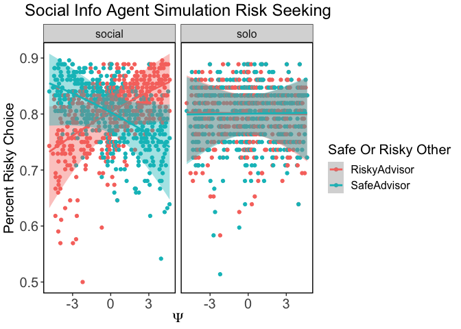

Inspection of Simulations
================
Simon
10/26/2018

# Whats New Now?

Now I simulate Data under 4 different Groups that i will then use to
explore the Boudnary Conditions of the model Parameters. The first
Group is a very risk averse group, the second is a medium risk averse
and the third is a risk seeking.

I added the Simulation Results for The Seperate OCU parameter Model.

# Inspection of the Raw data and Simulations.

Here we look at the agents who make choices under different models. I
Simulate data with a Safe and a Risky Advisor. To get risky and Safe
advisors, i export one subject of the Pilot which has been collected in
the laboratory and duplicate teh Dataset. I then invert the sign of the
Advice. After our last mails, I just duplicate this whole dataset again
so i get a total of 436 Trails which I use to Simulate Data under
different models.

# Social Information Model

The social Information Model assumes that an advised Option contributes
to the Utility of this Option in a linear Fashion. This happens
irrespective of whether the advice is “safe” or “risky”. Depending on
the value for \(\psi\) this leads to more Risk Seeking or more Risk
averse Policies in the Social Than in the Solo Condition.

*E**U**S**O**L**O**s**a**f**e* = 5

*E**U**S**O**L**O**r**i**s**k* = *p* \* *V**ρ*

*E**U**s**o**c**i**a**l**r**i**s**k* = *E**U**S**O**L**O**r**i**s**k* + *ψ*  ∀*A**d**v**i**c**e* = *R**i**s**k**y*

*E**U**s**o**c**i**a**l**s**a**f**e* = *E**U**S**O**L**O**s**a**f**e* + *ψ*  ∀*A**d**v**i**c**e* = *S**a**f**e*

Here we can see that in the solo condition, our *risk averse agents*
chose the Risky option in about *10 to 20%* of the cases. A *risk
neutral* agent chooses the Risky Option in *40-50 %* and the *risk
seeking* agent chooses the risky Option in *60 to 70* percent of the
cases. For all condition, the social information conditioncontributes to
the behavior in the following way: If the agent has a negative \(\psi\),
this indicates non conformity. A negative value here means on the
behavioral level that the Agent does exactly the opposite of what it is
advised to. This can be seen in the interaction on the left hand. High
\(\psi\) values lead to a risk seeking policy if there is a risk seeking
advisor. Negative values of \(\psi\) lead to a risk seeking policy if
there is a risk averse or “safe” advisor. Values around 0 are similar to
the solo condition.

# Social RISK Model

The social Risk Model assumes that in the social condition of the
experiment become more risk seeking, irrespective of the advice. The
value for \(\psi\) is now an direct indicator of the increase in general
Risk taking of our agent in the social part of the simulated Experiment.

*E**U**S**O**L**O**s**a**f**e* = 5

*E**U**S**O**L**O**r**i**s**k* = *p* \* *V**ρ*

*E**U**s**o**c**i**a**l**r**i**s**k* = *E**U**S**O**L**O**r**i**s**k* + *ψ*  ∀*A**d**v**i**c**e**s*

We can see that irrespective of the Advisors Policy, Our agents become
more risk seeking in the Social part of the Simulated experiment, the
more \(\psi\) diverges positively from 0. They get less risk seeking,
the more \(\psi\) diverges into the negative domain.

\#Social Noise model. In this model we assume that the Agents choices
become more stocastic or “noisy” when decisions are made in the social
part of the experiemt. This was caputred by a parameter that was added
to the Temperature Paramter \(\tau\) in the Choice model. The problem
with this is, that value information and the effect of “noise” are
correlated. To make this independent, i changed to social model to a
“trembling hand choice model”, where \(\psi\) now relates to the
degree of “Guessing”.

*p**S**O**L**O**C**h**o**o**s**e**R**i**s**k* = 1/1*e*−(*U**R**i**s**k* − *U**s**a**f**e* \* *τ* − 1)

*p**S**O**C**I**A**l**C**h**o**o**s**e**R**i**s**k* = (1 − *ψ*) \* 1/1*e*−(*U**R**i**s**k* − *U**s**a**f**e* \* (*τ*) − 1) + (2/*ψ*)

Indeed In the social Condition, choices become more “random”. It does
not matter if there is a Risky or a Safe Advisor. Note that negative
values do not make sense on the temperature parameter or at least its
hard to interpret; because there is nothing like less than no noise. So
to keep the number of Artificial Experiments constant, I am using values
from 1 through 10 for my OCU simulations.

We can see that in the solo condition, there is a distribution around
the percentage of risky choice that results from differences in the
value for \(\rho\) which i drew from a distribution around .3 before.
So, of course \(\rho\) can capture differences in the percentage of
risky choice. To some extend we therefore have a [sloppy
model](https://www.ncbi.nlm.nih.gov/pubmed/20556289): the Social model
just finds a higher value with higher uncertainty for \(\rho\). A higher
value for rho pushes the % of risky choices up, just like a higher
temperature Parameter does.

# Seperate Advice

To allow pieces of advice to have different weights, depending on
whether its a safe or a risky advice, thus reflecting known constructs
such as loss or risk aversion, i also simulated data under the following
model:

*E**U**S**O**L**O**s**a**f**e* = 5

*E**U**S**O**L**O**r**i**s**k* = *p* \* *V**ρ*

*E**U**s**o**c**i**a**l**r**i**s**k* = *E**U**S**O**L**O**r**i**s**k* + *ψRisk*  ∀*A**d**v**i**c**e* = *R**i**s**k**y*

*E**U**s**o**c**i**a**l**s**a**f**e* = *E**U**S**O**L**O**s**a**f**e* + *ψSafe*  ∀*A**d**v**i**c**e* = *S**a**f**e*

