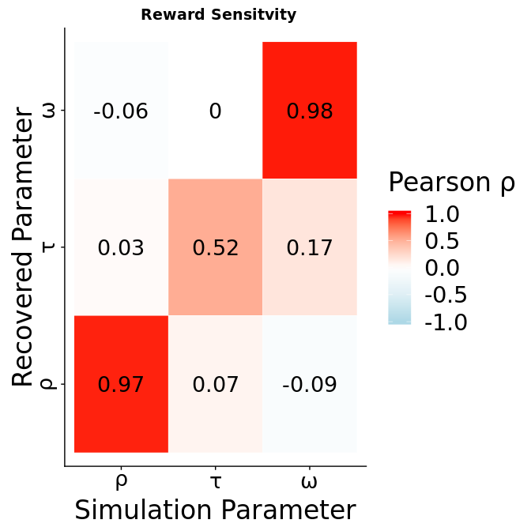
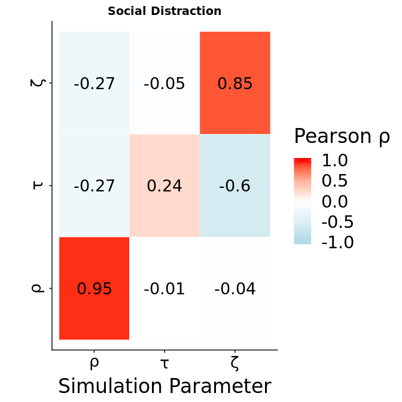
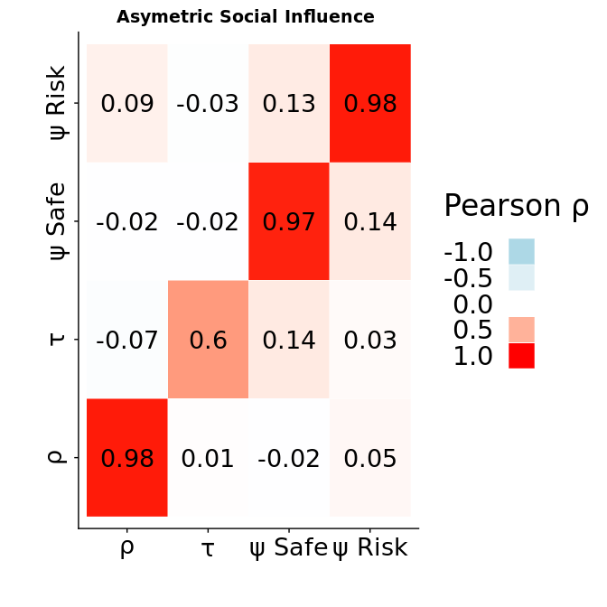
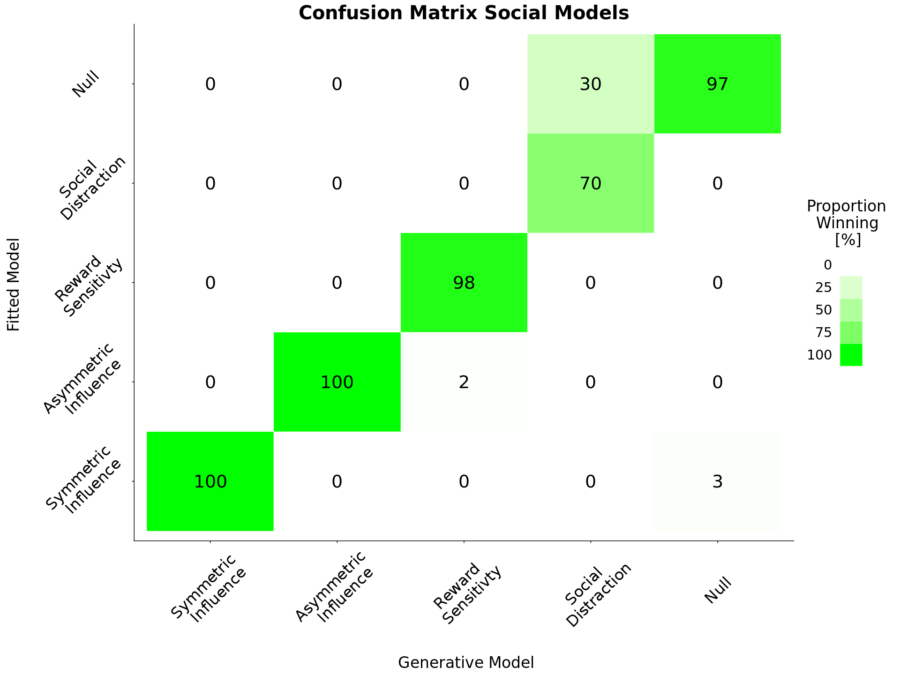
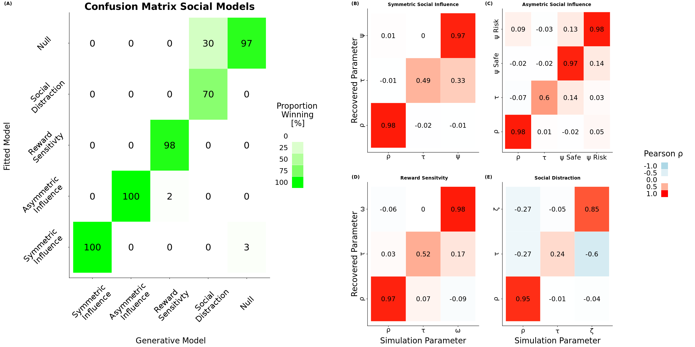

-   [Crossvalidation Code and Procedure -&gt; Major Changes:](#crossvalidation-code-and-procedure---major-changes)
-   [Parameter Recovery](#parameter-recovery)
-   [Confusion Heatmap.](#confusion-heatmap.)
    -   [Does DIC Differ?](#does-dic-differ)
-   [Make a nice Figure](#make-a-nice-figure)

``` r
knitr::opts_chunk$set(echo = TRUE)
library(loo)
```

    ## This is loo version 2.0.0.
    ## **NOTE: As of version 2.0.0 loo defaults to 1 core but we recommend using as many as possible. Use the 'cores' argument or set options(mc.cores = NUM_CORES) for an entire session. Visit mc-stan.org/loo/news for details on other changes.

``` r
#library(shinystan)
library(rstan)
```

    ## Loading required package: ggplot2

    ## Loading required package: StanHeaders

    ## rstan (Version 2.18.2, GitRev: 2e1f913d3ca3)

    ## For execution on a local, multicore CPU with excess RAM we recommend calling
    ## options(mc.cores = parallel::detectCores()).
    ## To avoid recompilation of unchanged Stan programs, we recommend calling
    ## rstan_options(auto_write = TRUE)

``` r
library(tidyverse)
```

    ## ── Attaching packages ─────────────────────────────────────── tidyverse 1.2.1 ──

    ## ✔ tibble  2.0.1       ✔ purrr   0.2.5  
    ## ✔ tidyr   0.8.2       ✔ dplyr   0.8.0.1
    ## ✔ readr   1.3.1       ✔ stringr 1.3.1  
    ## ✔ tibble  2.0.1       ✔ forcats 0.3.0

    ## ── Conflicts ────────────────────────────────────────── tidyverse_conflicts() ──
    ## ✖ tidyr::extract() masks rstan::extract()
    ## ✖ dplyr::filter()  masks stats::filter()
    ## ✖ dplyr::lag()     masks stats::lag()

``` r
library(PerformanceAnalytics)
```

    ## Loading required package: xts

    ## Loading required package: zoo

    ## 
    ## Attaching package: 'zoo'

    ## The following objects are masked from 'package:base':
    ## 
    ##     as.Date, as.Date.numeric

    ## 
    ## Attaching package: 'xts'

    ## The following objects are masked from 'package:dplyr':
    ## 
    ##     first, last

    ## 
    ## Attaching package: 'PerformanceAnalytics'

    ## The following object is masked from 'package:graphics':
    ## 
    ##     legend

``` r
#library(corrr)
library(here)
```

    ## here() starts at /home/ciranka/Users/CirankaSimon/Projects/Social_Adolescence_Public/B_ModelComparison

``` r
library(knitr)
library(stringr)
library(sigmoid)
library(reshape2)
```

    ## 
    ## Attaching package: 'reshape2'

    ## The following object is masked from 'package:tidyr':
    ## 
    ##     smiths

``` r
library(cowplot)
```

    ## 
    ## Attaching package: 'cowplot'

    ## The following object is masked from 'package:ggplot2':
    ## 
    ##     ggsave

``` r
source("../C_Fit_BraamsData/Helpers/Start_Workflow.R")# in here there is the DIC script defined.
source("../C_Fit_BraamsData/Helpers/R_rainclouds.R")
source("../C_Fit_BraamsData/Helpers/summarySE.R")

###### these tow functions where once used to make half correlation Matrixes.
#But now not anymore.
get_lower_tri<-function(cormat){
  cormat[upper.tri(cormat)] <- NA
  return(cormat)
}

get_upper_tri <- function(cormat){
  cormat[lower.tri(cormat)]<- NA
  return(cormat)
}

# Loads the results of my stan 
```

Crossvalidation Code and Procedure -&gt; Major Changes:
=======================================================

The i used different values for Simulating the Agents now. Namely i checked the parameter Estimates of the Blankenstein et al model This is the paremter recovery and crossvalidation of the social influence models. I simulated data under different Models.

1.  [The Chung Model](Model_Code/ocu_hier.stan)
2.  [The Risky Utility Model](Model_Code/ocu_hier_Risk.stan)
3.  [The Noise Model](Model_Code/ocu_hier_Noise.stan)
4.  [The Null Model](Model_Code/expUtil_hier.stan)
5.  [A Model that Assumes Assymetric Influence](Model_Code/ocu_hier_Sep.stan)

For each generative model there are 6 "raw data" files. Each of these files contains Simulated responses of two 100 agents, devided into two groups. Both groups only differ in the mu of the *ψ* value that has been used to generate the data. One group draws OCU values froma normal distribution with a negative and the other with a positive deviation from 0 with equal variance. Each file contains simulated data of two groups that have varying OCU values that symmetricaly differ from 0. The file with the 0 flag contains responses of a null model where the other conferred utility parameter is 0. Followingly there are 11 groups of ocu values that are then used to fit the hierarchical bayesian version of the OCU model. If you want to inspect the Simulations [click here](../A_Simulations/).

On each of these files; 5 models are fitted with [this script](ModelFitting/FitOCUModels.R) sent to the tardis cluster of the mpi [with this script](ModelFitting/FitOCUModelsOnCluster.sh). The rationale behind this is to be able to identify if the genreative models turn out to be the most likely model under the data after the fitting procedure. Only then we can be sure that these models represent falsifiable hypothesis.

``` r
# this does the Model Comparison
#library("here")
setwd(here())# Should have Happened Before but anyway.

#We First PReallocate Everything that we might need, so nothing gets Confused Later.
rhoSim<-(cbind(1:50,1:50))
rhoFit<-(cbind(1:50,1:50))
tauSim<-(cbind(1:50,1:50))
tauFit<-(cbind(1:50,1:50))
ocuSim<-(cbind(1:50,1:50))
ocuFit<-(cbind(1:50,1:50))
#For the Sep Model
ocuSafeSim<-(cbind(1:50,1:50))
ocuSafeFit<-(cbind(1:50,1:50))
ocuRiskSim<-(cbind(1:50,1:50))
ocuRiskFit<-(cbind(1:50,1:50))

names<-c("rhoSim","rhoFit","tauSim","tauFit","ocuSim","ocuFit")
namesSep<-c("rhoSim","rhoFit","tauSim","tauFit","ocuSafeSim","ocuSafeFit","ocuRiskSim","ocuRiskFit")


#Beginning of the Filenames which indicates the Model that i used for fitting.
FittedModel<-c("Info","Risk","Noise","Null","Sep")
#What was used for Simualtion?

SimulationName<-c("Info","Risk","Temperature","Null","Sep")
nFittedModels=5;#The Model That I Used to Fit 
nModels=5;# the True Model.
nValues=5;
nSubs=50;# how many subs?
nGroups=2;#how many groups

#preallocate the correlation matrix
makeRecoveryMatrix<-data.frame(as.vector(rhoSim),as.vector(rhoFit),as.vector(tauSim),as.vector(tauSim),as.vector(ocuSim),as.vector(ocuSim))
colnames(makeRecoveryMatrix)<-names

FullMatrixRisk<-makeRecoveryMatrix
FullMatrixRisk[1:length(makeRecoveryMatrix$rhoSim),]<-NA

FullMatrixNoise<-makeRecoveryMatrix
FullMatrixNoise[1:length(makeRecoveryMatrix$rhoSim),]<-NA

FullMatrixInfo<-makeRecoveryMatrix
FullMatrixInfo[1:length(makeRecoveryMatrix$rhoSim),]<-NA

makeRecoveryMatrixSep<-data.frame(as.vector(rhoSim),as.vector(rhoFit),as.vector(tauSim),as.vector(tauSim),as.vector(ocuSim),as.vector(ocuSim),as.vector(ocuSim),as.vector(ocuSim))
colnames(makeRecoveryMatrixSep)<-namesSep

FullMatrixSep<-makeRecoveryMatrixSep
FullMatrixSep[1:length(makeRecoveryMatrixSep$rhoSim),]<-NA

#Make a structure that you can save the DIC in and the Gsquares in. 
#DIC.tibble
DIC.tibble<-tibble(TrueModel=rep(1,nSubs*2*(nValues+1)*nModels*nFittedModels), FittedModel=rep(1,nSubs*2*(nValues+1)*nModels*nFittedModels), DICValue=rep(1,nSubs*2*(nValues+1)*nModels*nFittedModels), GsqValue=rep(1,nSubs*2*(nValues+1)*nModels*nFittedModels))

DICdfCount=1;# this i need to make my sweet dataframe for DIC.
```

Now I preallocated Everything. So i can smoothly loop through all the models and make my nice matricies

    ## remove big file again to save space.
    ## remove big file again to save space.
    ## remove big file again to save space.
    ## remove big file again to save space.
    ## remove big file again to save space.
    ## remove big file again to save space.
    ## remove big file again to save space.
    ## remove big file again to save space.
    ## remove big file again to save space.
    ## remove big file again to save space.
    ## remove big file again to save space.
    ## remove big file again to save space.
    ## remove big file again to save space.
    ## remove big file again to save space.
    ## remove big file again to save space.
    ## remove big file again to save space.
    ## remove big file again to save space.
    ## remove big file again to save space.
    ## remove big file again to save space.
    ## remove big file again to save space.
    ## remove big file again to save space.
    ## remove big file again to save space.
    ## remove big file again to save space.
    ## remove big file again to save space.
    ## remove big file again to save space.
    ## remove big file again to save space.
    ## remove big file again to save space.
    ## remove big file again to save space.
    ## remove big file again to save space.
    ## remove big file again to save space.
    ## remove big file again to save space.
    ## remove big file again to save space.
    ## remove big file again to save space.
    ## remove big file again to save space.
    ## remove big file again to save space.
    ## remove big file again to save space.
    ## remove big file again to save space.
    ## remove big file again to save space.
    ## remove big file again to save space.
    ## remove big file again to save space.
    ## remove big file again to save space.
    ## remove big file again to save space.
    ## remove big file again to save space.
    ## remove big file again to save space.
    ## remove big file again to save space.
    ## remove big file again to save space.
    ## remove big file again to save space.
    ## remove big file again to save space.
    ## remove big file again to save space.
    ## remove big file again to save space.
    ## remove big file again to save space.
    ## remove big file again to save space.
    ## remove big file again to save space.
    ## remove big file again to save space.
    ## remove big file again to save space.
    ## remove big file again to save space.
    ## remove big file again to save space.
    ## remove big file again to save space.
    ## remove big file again to save space.
    ## remove big file again to save space.
    ## remove big file again to save space.
    ## remove big file again to save space.
    ## remove big file again to save space.
    ## remove big file again to save space.
    ## remove big file again to save space.
    ## remove big file again to save space.
    ## remove big file again to save space.
    ## remove big file again to save space.
    ## remove big file again to save space.
    ## remove big file again to save space.
    ## remove big file again to save space.
    ## remove big file again to save space.
    ## remove big file again to save space.
    ## remove big file again to save space.
    ## remove big file again to save space.
    ## remove big file again to save space.
    ## remove big file again to save space.
    ## remove big file again to save space.
    ## remove big file again to save space.
    ## remove big file again to save space.
    ## remove big file again to save space.
    ## remove big file again to save space.
    ## remove big file again to save space.
    ## remove big file again to save space.
    ## remove big file again to save space.
    ## remove big file again to save space.
    ## remove big file again to save space.
    ## remove big file again to save space.
    ## remove big file again to save space.
    ## remove big file again to save space.
    ## remove big file again to save space.
    ## remove big file again to save space.
    ## remove big file again to save space.
    ## remove big file again to save space.
    ## remove big file again to save space.
    ## remove big file again to save space.
    ## remove big file again to save space.
    ## remove big file again to save space.
    ## remove big file again to save space.
    ## remove big file again to save space.
    ## remove big file again to save space.
    ## remove big file again to save space.
    ## remove big file again to save space.
    ## remove big file again to save space.
    ## remove big file again to save space.
    ## remove big file again to save space.
    ## remove big file again to save space.
    ## remove big file again to save space.
    ## remove big file again to save space.
    ## remove big file again to save space.
    ## remove big file again to save space.
    ## remove big file again to save space.
    ## remove big file again to save space.
    ## remove big file again to save space.
    ## remove big file again to save space.
    ## remove big file again to save space.
    ## remove big file again to save space.
    ## remove big file again to save space.
    ## remove big file again to save space.
    ## remove big file again to save space.
    ## remove big file again to save space.
    ## remove big file again to save space.
    ## remove big file again to save space.
    ## remove big file again to save space.
    ## remove big file again to save space.
    ## remove big file again to save space.
    ## remove big file again to save space.
    ## remove big file again to save space.
    ## remove big file again to save space.
    ## remove big file again to save space.
    ## remove big file again to save space.
    ## remove big file again to save space.
    ## remove big file again to save space.
    ## remove big file again to save space.
    ## remove big file again to save space.
    ## remove big file again to save space.
    ## remove big file again to save space.
    ## remove big file again to save space.
    ## remove big file again to save space.
    ## remove big file again to save space.
    ## remove big file again to save space.
    ## remove big file again to save space.
    ## remove big file again to save space.
    ## remove big file again to save space.
    ## remove big file again to save space.
    ## remove big file again to save space.
    ## remove big file again to save space.
    ## remove big file again to save space.
    ## remove big file again to save space.
    ## remove big file again to save space.

Parameter Recovery
==================

After running the code we can first see that the simulated parameters substantially correlate with the fitted parameters for the Chung OCU model. While the means are not exactly the same; rank orders remain equal. Parameter values used for simulation correlate strongly with parameter estimates that result from the fitting procedure. I simulated new data as compared to last time and ran chains that were only half as long as before. This is why the correlations for the risk attitude parameter dont look as good anymore but its still decent. This will change again when i use longer chains. Very nice is that we get a correlation of 1 for the ocu value, since this is the value we are finally interested in.



    ## Saving 7 x 7 in image


    ## Saving 7 x 7 in image



    ## Saving 7 x 7 in image



    ## Saving 7 x 7 in image

Confusion Heatmap.
==================

You can see 5 Models here, which have been fitted 5 times to different Simulated Subjects. The x axis depicts the true, generative model. The y axis is the Model that wins according to DIC. In each cell you see how often which model was inferred under which generative model. If everything is perfect you see color on the diagonal and nowwhere else. I plan to make 100 Simulations per Subject which will take some computing time, now the story does not look convincing yet. You probably notice that if the Noise model was the true model, it always got misidentified as the Risk model.

Does DIC Differ?
----------------

``` r
##### make confusion matrix

Info<-DIC.tibble%>%filter(FittedModel==1)%>%select(TrueModel=TrueModel,DICInfo=DICValue)%>%rowid_to_column("ID")
Risk<-DIC.tibble%>%filter(FittedModel==2)%>%select(DICRisk=DICValue)%>%rowid_to_column("ID")
Noise<-DIC.tibble%>%filter(FittedModel==3)%>%select(DICNoise=DICValue)%>%rowid_to_column("ID")
Null<-DIC.tibble%>%filter(FittedModel==4)%>%select(DICNull=DICValue)%>%rowid_to_column("ID")
Sep<-DIC.tibble%>%filter(FittedModel==5)%>%select(DICSep=DICValue)%>%rowid_to_column("ID")


full<-merge(Info,Risk,by=c("ID"))%>%merge(Noise,by=c("ID"))%>%merge(Null,by=c("ID"))%>%merge(Sep,by=c("ID"))%>%rowwise() %>% 
  mutate(#Add The calculated Some from before to the
    Winner = case_when(
      (min(DICInfo,DICRisk,DICNoise,DICNull,DICSep)==DICInfo) ~ 1,
      (min(DICInfo,DICRisk,DICNoise,DICNull,DICSep)==DICRisk)~ 2,
      (min(DICInfo,DICRisk,DICNoise,DICNull,DICSep)==DICNoise)~ 3,
      (min(DICInfo,DICRisk,DICNoise,DICNull,DICSep)==DICNull)~ 4,
      (min(DICInfo,DICRisk,DICNoise,DICNull,DICSep)==DICSep)~ 5
    )
  )
length(full[full$TrueModel==1 & full$TrueModel == full$Winner,]$ID)
```

    ## [1] 301

``` r
# make confusion matrix.
#check if they are all equal. if so then let the null model win.


#subset these where the more compelx was equal to one of the other models and evaluate again.
full[(round(full$DICInfo) == round(full$DICSep)) | (round(full$DICRisk) == round(full$DICSep)) | (round(full$DICNoise) == round(full$DICSep)),]
```

    ## Source: local data frame [2,359 x 8]
    ## Groups: <by row>
    ## 
    ## # A tibble: 2,359 x 8
    ##       ID TrueModel DICInfo DICRisk DICNoise DICNull DICSep Winner
    ##    <int>     <dbl>   <dbl>   <dbl>    <dbl>   <dbl>  <dbl>  <dbl>
    ##  1     1         1    202.    237.     231.    237.   202.      1
    ##  2     2         1    202.    237.     231.    237.   202.      1
    ##  3     4         1    202.    237.     231.    237.   202.      1
    ##  4     5         1    202.    238.     232.    238.   202.      1
    ##  5     6         1    202.    238.     232.    238.   202.      1
    ##  6     8         1    202.    238.     232.    238.   202.      1
    ##  7    10         1    202.    237.     231.    237.   202.      1
    ##  8    12         1    202.    237.     231.    237.   202.      1
    ##  9    13         1    201.    237.     231.    237.   201.      1
    ## 10    14         1    202.    237.     231.    237.   202.      1
    ## # … with 2,349 more rows

``` r
argh<-full[(round(full$DICNull) == round(full$DICSep))|(round(full$DICInfo) == round(full$DICSep)) | (round(full$DICRisk) == round(full$DICSep)) | (round(full$DICNoise) == round(full$DICSep)),]%>%mutate(#Add The calculated Some from before to the
  Winner = case_when(
    (min(DICInfo,DICRisk,DICNoise,DICNull)==DICInfo) ~ 1,
    (min(DICInfo,DICRisk,DICNoise,DICNull)==DICRisk)~ 2,
    (min(DICInfo,DICRisk,DICNoise,DICNull)==DICNoise)~ 3,
    (min(DICInfo,DICRisk,DICNoise,DICNull)==DICNull)~ 4,
    TRUE ~ Winner#keep the rest as it is
  )
)
#replace the old values with the new ones.


ahm<-full[full$Winner == 5,]%>%mutate(#Add The calculated Some from before to the
  Winner = case_when(
    (round(DICSep)==round(DICInfo)) ~ 1,
    (round(DICSep)==round(DICRisk))~ 2,
    (round(DICSep)==round(DICNoise))~ 3,
    (round(DICSep)==round(DICNull))~ 4,
    TRUE ~ Winner#keep the rest as it is
  )
)


full[full$ID %in% ahm$ID,]<-ahm

for(i in 1:length(full$ID)){
  if(min(round(full$DICInfo[i]),round(full$DICRisk[i]),round(full$DICNoise[i]),round(full$DICSep[i])) == round(full$DICNull[i])){
    full$Winner[i]=4
  }
}


confusion<-tibble(
  Count=rep(0,5),
  Truth=c("1","2","3","4","5"),
  Predicted=c("1","2", "3", "4","5"),
  Percent=rep(0,5)
)%>%expand(Truth,Predicted,Count,Percent)

Generative=c("1","2","3","4","5")

for(i in 1:length(Generative)){
  
  #confusion[,i][1:length(t(TruePreds))]<-t(TruePreds)
  # oy vey.
  confusion <- confusion %>% mutate(#Add The calculated Some from before to the
    Count = case_when((Predicted == "1" & Truth==Generative[i])~ as.double(length(full[full$TrueModel==i & full$Winner==1,]$ID)),
                      (Predicted == "2" & Truth==Generative[i])~ as.double(length(full[full$TrueModel==i & full$Winner==2,]$ID)),
                      (Predicted == "3" & Truth==Generative[i])~ as.double(length(full[full$TrueModel==i & full$Winner==3,]$ID)),
                      (Predicted == "4" & Truth==Generative[i])~ as.double(length(full[full$TrueModel==i & full$Winner==4,]$ID)),
                      (Predicted == "5" & Truth==Generative[i])~ as.double(length(full[full$TrueModel==i & full$Winner==5,]$ID)),
                      TRUE ~ Count#keep the rest as it is
    )#end cases
  ) #no mutation
}#end loop.

#make it a percent Value 
confusion$Percent=round(confusion$Count/6)

#k this whole crap just happens so that the Confusion Matrix has the same order as the Parameter Recovery and Everything else.
confusion%>%mutate(
  Predicted= case_when((Predicted == "1" ~"Social Information"),
                       (Predicted == "2" ~"Reward Sensitivty"),
                       (Predicted == "3" ~"Trembling Hand"),
                       (Predicted == "4" ~"Null"),
                       (Predicted == "5" ~"Assymetric"),
                       TRUE ~ Predicted#keep the rest as it is
  ),#end cases
  Truth= case_when((Truth == "1" ~"Social Information"),
                   (Truth == "2" ~"Reward Sensitivty"),
                   (Truth == "3" ~"Trembling Hand"),
                   (Truth == "4" ~"Null"),
                   (Truth == "5" ~"Assymetric"),
                   TRUE ~ Truth#keep the rest as it is
  )
)%>%mutate(
  Predicted= case_when((Predicted == "Social Information"~"1"),
                       (Predicted == "Reward Sensitivty"~"3"),
                       (Predicted == "Trembling Hand"~"4"),
                       (Predicted == "Null"~"5"),
                       (Predicted == "Assymetric"~"2"),
                       TRUE ~ Predicted#keep the rest as it is
  ),#end cases
  Truth= case_when((Truth == "Social Information"~"1"),
                   (Truth == "Reward Sensitivty"~"3"),
                   (Truth == "Trembling Hand"~"4"),
                   (Truth == "Null"~"5"),
                   (Truth == "Assymetric"~"2"),
                   TRUE ~ Truth#keep the rest as it is
  )
)%>%ggplot( aes(Truth, Predicted)) + geom_tile(aes(fill = Percent), colour = "white") + 
  scale_fill_gradient(low = "white", high = "green",name="Proportion \n  Winning \n      [%] ",
                      guide = guide_legend(
                        label.position = "left"
                      ))+
  geom_text(aes(label=Percent),size=10)+
  scale_y_discrete(name="Fitted Model \n",breaks=c(1,2,3,4,5), labels=c("Symmetric \n Influence","Asymmetric \n Influence","Reward \n Sensitivty","Social \n Distraction","Null"))+
  scale_x_discrete(name="\n Generative Model",breaks=c(1,2,3,4,5), labels=c("Symmetric \n Influence","Asymmetric \n Influence","Reward \n Sensitivty","Social \n Distraction","Null"))+
  ggtitle("Confusion Matrix Social Models")+
  theme(
    text = element_text(size=25),
    axis.text.y=element_text(angle=45,hjust=0.5, size=25),
    axis.text.x=element_text(angle=45,vjust = 0.5,size=25),
    legend.key.size =  unit(0.5, "in"),
    plot.title = element_text(hjust = 0.5,size=30)
  )->A
print(A)
```



``` r
ggsave("../X_Figures/ModelComp.pdf",width = 10, height = 15)
```

Make a nice Figure
==================

Down here i make a nice figure into one panel

``` r
legend<-get_legend(C)

bottom_row <- cowplot::plot_grid(B+theme(legend.position="none"),
                                 C+theme(legend.position="none"),
                                 D+theme(legend.position="none"),
                                 E+theme(legend.position="none"),
                                 labels = c('(B)', '(C)','(D)','(E)'),ncol = 2, align = 'h')
cowplot::plot_grid(A, NULL, bottom_row,NULL,legend, labels = c('(A)', ''), ncol = 5, rel_heights = c(1,1,1,1,1),rel_widths = c(1.2,0.1,1,0.1,0.2))
```



``` r
ggsave("../X_Figures/ModelParamRecov.tiff",width = 30, height = 15,dpi=300)
```
