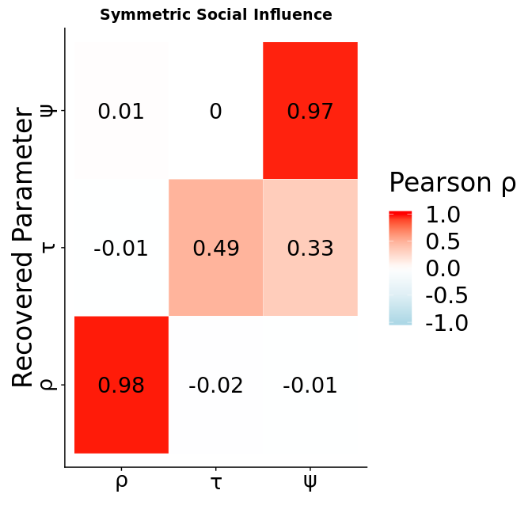

Model Comparison and Parameter Correlations
================
Simon
8/27/2018

-   [Crossvalidation Code and Procedure -&gt; Major Changes:](#crossvalidation-code-and-procedure---major-changes)
-   [Parameter Recovery](#parameter-recovery)
    -   [Model Comparison.](#model-comparison.)
-   [Confusion Heatmap.](#confusion-heatmap.)
    -   [Does DIC Differ?](#does-dic-differ)


Crossvalidation Code and Procedure -&gt; Major Changes:
=======================================================

The i used different values for Simulating the Agents now. Namely i checked the parameter Estimates of the Blankenstein et al model This is the paremter recovery and crossvalidation of the social influence models. I simulated data under different Models.

1.  [The Chung Model](Model_Code/ocu_hier.stan)
2.  [The Risky Utility Model](Model_Code/ocu_hier_Noise.stan)
3.  [The Noise Model](Model_Code/ocu_hier_Risk.stan)
4.  [The Null Model](Model_Code/expUtil_hier.stan)
5.  [A Model that Assumes Assymetric Influence](Model_Code/expUtil_hier.stan)

For each generative model there are 6 "raw data" files. Each of these files contains Simulated responses of two 100 agents, devided into two groups. Both groups only differ in the mu of the *ψ* value that has been used to generate the data. One group draws OCU values froma normal distribution with a negative and the other with a positive deviation from 0 with equal variance. Each file contains simulated data of two groups that have varying OCU values that symmetricaly differ from 0. The file with the 0 flag contains responses of a null model where the other conferred utility parameter is 0. Followingly there are 11 groups of ocu values that are then used to fit the hierarchical bayesian version of the OCU model. If you want to inspect the Simulations [click here](../A_Simulations/).

On each of these files; 5 models are fitted with [this script](ModelFitting/FitOCUModels.R) sent to the tardis cluster of the mpi [with this script](ModelFitting/FitOCUModelsOnCluster.sh). The rationale behind this is to be able to identify if the genreative models turn out to be the most likely model under the data after the fitting procedure. Only then we can be sure that these models represent falsifiable hypothesis.

``` r
# this does the Model Comparison
#library("here")
setwd(here())# Should have Happened Before but anyway.

#We First PReallocate Everything that we might need, so nothing gets Confused Later.
rhoSim<-(cbind(1:50,1:50))
rhoFit<-(cbind(1:50,1:50))
tauSim<-(cbind(1:50,1:50))
tauFit<-(cbind(1:50,1:50))
ocuSim<-(cbind(1:50,1:50))
ocuFit<-(cbind(1:50,1:50))
#For the Sep Model
ocuSafeSim<-(cbind(1:50,1:50))
ocuSafeFit<-(cbind(1:50,1:50))
ocuRiskSim<-(cbind(1:50,1:50))
ocuRiskFit<-(cbind(1:50,1:50))

names<-c("rhoSim","rhoFit","tauSim","tauFit","ocuSim","ocuFit")
namesSep<-c("rhoSim","rhoFit","tauSim","tauFit","ocuSafeSim","ocuSafeFit","ocuRiskSim","ocuRiskFit")


#Beginning of the Filenames which indicates the Model that i used for fitting.
FittedModel<-c("Info","Risk","Noise","Null","Sep")
#What was used for Simualtion?

SimulationName<-c("Info","Risk","Temperature","Null","Sep")
nFittedModels=5;#The Model That I Used to Fit 
nModels=5;# the True Model.
nValues=5;
nSubs=50;# how many subs?
nGroups=2;#how many groups

#preallocate the correlation matrix
makeRecoveryMatrix<-data.frame(as.vector(rhoSim),as.vector(rhoFit),as.vector(tauSim),as.vector(tauSim),as.vector(ocuSim),as.vector(ocuSim))
colnames(makeRecoveryMatrix)<-names

FullMatrixRisk<-makeRecoveryMatrix
FullMatrixRisk[1:length(makeRecoveryMatrix$rhoSim),]<-NA

FullMatrixNoise<-makeRecoveryMatrix
FullMatrixNoise[1:length(makeRecoveryMatrix$rhoSim),]<-NA

FullMatrixInfo<-makeRecoveryMatrix
FullMatrixInfo[1:length(makeRecoveryMatrix$rhoSim),]<-NA

makeRecoveryMatrixSep<-data.frame(as.vector(rhoSim),as.vector(rhoFit),as.vector(tauSim),as.vector(tauSim),as.vector(ocuSim),as.vector(ocuSim),as.vector(ocuSim),as.vector(ocuSim))
colnames(makeRecoveryMatrixSep)<-namesSep

FullMatrixSep<-makeRecoveryMatrixSep
FullMatrixSep[1:length(makeRecoveryMatrixSep$rhoSim),]<-NA

#Make a structure that you can save the DIC in and the Gsquares in. 
DIC.tibble<-tibble(TrueModel=rep(1,nSubs*2*(nValues+1)*nModels*nFittedModels), FittedModel=rep(1,nSubs*2*(nValues+1)*nModels*nFittedModels), DICValue=rep(1,nSubs*2*(nValues+1)*nModels*nFittedModels), GsqValue=rep(1,nSubs*2*(nValues+1)*nModels*nFittedModels))

DICdfCount=1;# this i need to make my sweet dataframe for DIC.
```

Now I preallocated Everything. So i can smoothly loop through all the models and make my nice matricies

``` r
#########################################
#########################################
#########################################
#######################################
#########################################
for (i in 1:nModels){# is the True Model.
  # empty the "make recovery Matrix."
            makeRecoveryMatrixSep<-data.frame(as.vector(rhoSim),as.vector(rhoFit),as.vector(tauSim),as.vector(tauFit),as.vector(ocuSafeSim),as.vector(ocuSafeFit),as.vector(ocuRiskSim),as.vector(ocuRiskFit))
  colnames(makeRecoveryMatrixSep)<-namesSep

  
makeRecoveryMatrix<-data.frame(as.vector(rhoSim),as.vector(rhoFit),as.vector(tauSim),as.vector(tauFit),as.vector(ocuSim),as.vector(ocuFit))
colnames(makeRecoveryMatrix)<-names
  
  for (k in 1:nFittedModels){# Is the Model that i used to fit.
    for (j in 0:nValues){
      tryCatch(
        {
          
          #message("Read_In_Model")
          load(paste0("ModelFits_Comparison/LongModelFits",FittedModel[k],k,"_Model",i,"OCU_",j,"_1.RData"))
          
          #This extracts the right Parameters from Simulation and fitted procedure.
          if(FittedModel[k]=="Risk"){# I exctract all the Models where the Risk Model was used to fit the Data
            parameters<-rstan::extract(fitRisk)#getparams
          }else if (FittedModel[k]=="Noise"){# I exctract all the Models where the NOISE Model was used to fit the Data
            parameters<-rstan::extract(fitNoise)#getparams
          }# end noise
          else if (FittedModel[k]=="Info"){# I exctract all the Models where the INFO Model was used to fit the Data
            parameters<-rstan::extract(fitInfo)
          }else if (FittedModel[k]=="Null"){# I exctract all the Models where the NULL Model was used to fit the Data
            parameters<-rstan::extract(fitNull)
          }else if (FittedModel[k]=="Sep"){# I exctract all the Models where the NULL Model was used to fit the Data
            parameters<-rstan::extract(fitRisk)#Whoops. That was a Bug
          }
          
          #Models with 3 Paramters:
          # Look if the Generative Model Matches the Fitted Model
          if (FittedModel[k]=="Info" && i==1 || FittedModel[k]=="Risk" && i==2 || FittedModel[k]=="Noise" && i==3){#when generative and fitted model re the same.
            # here you construct a matrix for parameter recovery but only if the fitted model 
            # is equal the generative one. Otherwise it does not make sense here.
            #  TsubjG<-array(1,c(numSubjsG,nGroups))
            load(paste0("../A_Simulations/Model",SimulationName[k],"/1",SimulationName[k],"Social",j,"1.RData"))# load the Right Simulation
            #here i get the original parameter values back.
            g1=1;
            g2=1;
            #append all entries of the simulation in one matrix that i then can use to make my correlations
            for (g in 1:length(Simulations)) {
              if (Simulations[[g]]$group==1){
                # FOR PARAMETER RECOVERY:
                rhoSim[g1,Simulations[[g]]$group]<-Simulations[[g]]$alpha[1]
                tauSim[g1,Simulations[[g]]$group]<-Simulations[[g]]$theta[1]
                ocuSim[g1,Simulations[[g]]$group]<-Simulations[[g]]$ocu[1]
                g1=g1+1;
              }else if (Simulations[[g]]$group==2){
                # FOR PARAMETER RECOVERY:
                rhoSim[g2,Simulations[[g]]$group]<-Simulations[[g]]$alpha[1]
                tauSim[g2,Simulations[[g]]$group]<-Simulations[[g]]$theta[1]
                ocuSim[g2,Simulations[[g]]$group]<-Simulations[[g]]$ocu[1]
                g2=g2+1
              }
            }
            #fuck ppl im a crazy ugly programmer. Here i paste it ass into my matrix.
            for (z in 1:length(parameters$rho[1,,1])){
              rhoFit[z,1]<-mean(parameters$rho[,z,1])
              tauFit[z,1]<-mean(parameters$tau[,z,1])
              ocuFit[z,1]<-mean(parameters$ocu[,z,1])
              
              rhoFit[z,2]<-mean(parameters$rho[,z,2])
              tauFit[z,2]<-mean(parameters$tau[,z,2])
              ocuFit[z,2]<-mean(parameters$ocu[,z,2])
            }
            # Here i put everything into one dataframe. This gf is generated newly each iteration
              makeRecoveryMatrix<-data.frame(as.vector(rhoSim),as.vector(rhoFit),as.vector(tauSim),as.vector(tauFit),as.vector(ocuSim),as.vector(ocuFit))
              colnames(makeRecoveryMatrix)<-names
            switch( FittedModel[k],# concatenate the right matrix please.
                    "Risk"= FullMatrixRisk<-rbind(FullMatrixRisk,makeRecoveryMatrix),
                    "Noise"= FullMatrixNoise<-rbind(FullMatrixNoise,makeRecoveryMatrix),
                    "Info"=FullMatrixInfo<-rbind(FullMatrixInfo,makeRecoveryMatrix)
            )
            
            # Okay and now do the same for the 4 Parameter Model. 
          } else if (FittedModel[k]=="Sep" && i==5 ){#when generative and fitted model are the same.... We need a slightly different structure for the additional Parameter in the Assymetric Model.
            # here you construct a matrix for parameter recovery but only if the fitted model 
            # is equal the generative one. Otherwise it does not make sense here.
            #  TsubjG<-array(1,c(numSubjsG,nGroups))
            load(paste0("../A_Simulations/Model",SimulationName[k],"/1",SimulationName[k],"Social",j,"1.RData"))
            #here i get the original parameter values back.
            g1=1;
            g2=1;
            #append all entries of the simulation in one matrix that i then can use to make my correlations
            for (g in 1:length(Simulations)) {
              if (Simulations[[g]]$group==1){
                # FOR PARAMETER RECOVERY:
                rhoSim[g1,Simulations[[g]]$group]<-Simulations[[g]]$alpha[1]
                tauSim[g1,Simulations[[g]]$group]<-Simulations[[g]]$theta[1]
                ocuSafeSim[g1,Simulations[[g]]$group]<-Simulations[[g]]$ocuSafe[1]
                ocuRiskSim[g1,Simulations[[g]]$group]<-Simulations[[g]]$ocuRisk[1]
                g1=g1+1;
              }else if (Simulations[[g]]$group==2){
                # FOR PARAMETER RECOVERY:
                rhoSim[g2,Simulations[[g]]$group]<-Simulations[[g]]$alpha[1]
                tauSim[g2,Simulations[[g]]$group]<-Simulations[[g]]$theta[1]
                ocuSafeSim[g2,Simulations[[g]]$group]<-Simulations[[g]]$ocuSafe[1]
                ocuRiskSim[g2,Simulations[[g]]$group]<-Simulations[[g]]$ocuRisk[1]
                g2=g2+1
              }
            }
            #fuck ppl im a crazy ugly programmer. Here i paste it ass into my matrix.
            for (z in 1:length(parameters$rho[1,,1])){
              rhoFit[z,1]<-mean(parameters$rho[,z,1])
              tauFit[z,1]<-mean(parameters$tau[,z,1])
              rhoFit[z,2]<-mean(parameters$rho[,z,2])
              tauFit[z,2]<-mean(parameters$tau[,z,2])
              ocuSafeFit[z,1]<-mean(parameters$ocuSafe[,z,1])
              ocuRiskFit[z,1]<-mean(parameters$ocuRisk[,z,1])
              ocuSafeFit[z,2]<-mean(parameters$ocuSafe[,z,2])
              ocuRiskFit[z,2]<-mean(parameters$ocuRisk[,z,2])
            }
            makeRecoveryMatrixSep<-data.frame(as.vector(rhoSim),as.vector(rhoFit),as.vector(tauSim),as.vector(tauFit),as.vector(ocuSafeSim),as.vector(ocuSafeFit),as.vector(ocuRiskSim),as.vector(ocuRiskFit))
            
            colnames(makeRecoveryMatrixSep)<-namesSep
            FullMatrixSep<-rbind(FullMatrixSep,makeRecoveryMatrixSep)
          }
          
          message("remove big file again to save space.")
          rm(fitInfo,fitNoise,fitRisk,fitNull)
          
          ##########  in this section i extract the randomly merged chains
          subject=1# There are 100 Subjects but i need to index it that way. That is Because i use a funny matrix in stan for these simulations. 
          loglikSub <- array(NA, dim=c(6000*216, 1, 100))# because DIC expects Iteration x Chains x Data, i need to insert a new Dimension
          for (subjects in 1:nSubs){
            for (groups in 1:nGroups){
              ######## This uses the randomly merged chains.
              #loglikSub<-loglik_Info[,,subjects]#Get the logliklihoods of my from the paramters and not with the extract loglik function
              loglikSub[,1,subject]<-as.vector(parameters$log_lik[,subjects,,groups])
              #EffectiveSamples<-relative_eff(exp(loglikSub.Loo))
              subject=subject+1
            }#endgroups
          }#endsubs
          
          #THIS IS WHERE I CALCULATE THE DIC!
          #######################
          DICAll<-calculateDIC(loglikSub)
          #######################
          
          #Here i store them in my datastructure. 
          for(Entries in 1:length(DICAll$DIC)){
            DIC.tibble$TrueModel[DICdfCount]=i;# i is the generative model count
            DIC.tibble$FittedModel[DICdfCount]=k;# k is the fitted model count
            DIC.tibble$DICValue[DICdfCount]=DICAll$DIC[Entries];
            DIC.tibble$GsqValue[DICdfCount]=DICAll$L[Entries];
            DICdfCount=DICdfCount+1
          } 
        },#Do some Error Handling.
        error=function(cond) {
          message(paste("File",paste0("ModelFits",FittedModel[k],"_Model",i,"OCU_",j,".RData")," does not exist (yet), will proceed to next index."))
          message("Here's the original error message:")
          message(cond)
        })
    }# end values
  }#end fitted
}#end generative model.
```

Parameter Recovery
==================

After running the code we can first see that the simulated parameters substantially correlate with the fitted parameters for the Chung OCU model. While the means are not exactly the same; rank orders remain equal. Parameter values used for simulation correlate strongly with parameter estimates that result from the fitting procedure. I simulated new data as compared to last time and ran chains that were only half as long as before. This is why the correlations for the risk attitude parameter dont look as good anymore but its still decent. This will change again when i use longer chains. Very nice is that we get a correlation of 1 for the ocu value, since this is the value we are finally interested in.

## Trembling Hand Model.

The Temperature Parameter and the Termbling Hand social influence parameter are negatively correlated.
This can be expected to some extend, however knowing this, parameter recovery should be handeled with care.

## Reward Sensitiviy Model

Parameter Recovery for this model works fine. If we scroll down however, we will see that the MODEL RECOVERY
does not work that well, since we included the assymetric OCU model

## Classic OCU Model

This works.

## Assymetric Influence of Advice

This Does work great, too.

Model Comparison.
-----------------

Confusion Heatmap.
==================

You can see 5 Models here, which have been fitted 5 times to different Simulated Subjects. The x axis depicts the true, generative model. The y axis is the Model that wins according to DIC. In each cell you see how often which model was inferred under which generative model. If everything is perfect you see color on the diagonal and nowwhere else. Under Each Model, 600 Agents were Simulated and all models were fit to all agents, meaning the following Confusion Matrix refers to 600x5x5 unique Datasets.The Model Recovery does not look great. 
I made three Changes since last time. 

* I fixed the trembling hand model and have a better parametrization. 
* Then added the "Assymetric Influence" Model. 
* I further used random starting values for model fitting. Which is the thing to to if you want to be taken seriously. 


Does DIC Differ?
----------------

``` r
##### make confusion matrix

Info<-DIC.tibble%>%filter(FittedModel==1)%>%select(TrueModel=TrueModel,DICInfo=DICValue)%>%rowid_to_column("ID")
Risk<-DIC.tibble%>%filter(FittedModel==2)%>%select(DICRisk=DICValue)%>%rowid_to_column("ID")
Noise<-DIC.tibble%>%filter(FittedModel==3)%>%select(DICNoise=DICValue)%>%rowid_to_column("ID")
Null<-DIC.tibble%>%filter(FittedModel==4)%>%select(DICNull=DICValue)%>%rowid_to_column("ID")
Sep<-DIC.tibble%>%filter(FittedModel==5)%>%select(DICSep=DICValue)%>%rowid_to_column("ID")


full<-merge(Info,Risk,by=c("ID"))%>%merge(Noise,by=c("ID"))%>%merge(Null,by=c("ID"))%>%merge(Sep,by=c("ID"))%>%rowwise() %>% 
  mutate(#Add The calculated Some from before to the
    Winner = case_when(
      (min(DICInfo,DICRisk,DICNoise,DICNull,DICSep)==DICInfo) ~ 1,
      (min(DICInfo,DICRisk,DICNoise,DICNull,DICSep)==DICRisk)~ 2,
      (min(DICInfo,DICRisk,DICNoise,DICNull,DICSep)==DICNoise)~ 3,
      (min(DICInfo,DICRisk,DICNoise,DICNull,DICSep)==DICNull)~ 4,
      (min(DICInfo,DICRisk,DICNoise,DICNull,DICSep)==DICSep)~ 5
    )
  )
length(full[full$TrueModel==1 & full$TrueModel == full$Winner,])
```

    ## [1] 8

``` r
# make confusion matrix.
#check if they are all equal. if so then let the null model win.


#subset these where the more compelx was equal to one of the other models and evaluate again.
full[(round(full$DICInfo) == round(full$DICSep)) | (round(full$DICRisk) == round(full$DICSep)) | (round(full$DICNoise) == round(full$DICSep)),]
```

    ## # A tibble: 1,700 x 8
    ##       ID TrueModel DICInfo DICRisk DICNoise DICNull DICSep Winner
    ##    <int>     <dbl>   <dbl>   <dbl>    <dbl>   <dbl>  <dbl>  <dbl>
    ##  1     3         1    217.    230.     231.    230.   230.      1
    ##  2    17         1    217.    230.     230.    230.   230.      1
    ##  3    20         1    217.    230.     231.    230.   230.      1
    ##  4    47         1    216.    230.     231.    230.   230.      1
    ##  5    52         1    217.    230.     231.    230.   230.      1
    ##  6    60         1    216.    230.     231.    230.   230.      1
    ##  7    61         1    216.    230.     231.    230.   230.      1
    ##  8    62         1    217.    230.     231.    230.   230.      1
    ##  9    83         1    217.    230.     231.    230.   230.      1
    ## 10    99         1    217.    230.     231.    230.   230.      1
    ## # ... with 1,690 more rows

``` r
argh<-full[(round(full$DICNull) == round(full$DICSep))|(round(full$DICInfo) == round(full$DICSep)) | (round(full$DICRisk) == round(full$DICSep)) | (round(full$DICNoise) == round(full$DICSep)),]%>%mutate(#Add The calculated Some from before to the
    Winner = case_when(
      (min(DICInfo,DICRisk,DICNoise,DICNull)==DICInfo) ~ 1,
      (min(DICInfo,DICRisk,DICNoise,DICNull)==DICRisk)~ 2,
      (min(DICInfo,DICRisk,DICNoise,DICNull)==DICNoise)~ 3,
      (min(DICInfo,DICRisk,DICNoise,DICNull)==DICNull)~ 4,
      TRUE ~ Winner#keep the rest as it is
    )
  )
#replace the old values with the new ones.
full[full$ID %in% argh$ID,]<-argh

for(i in 1:length(full$ID)){
  if(min(round(full$DICInfo[i]),round(full$DICRisk[i]),round(full$DICNoise[i]),round(full$DICSep[i])) == round(full$DICNull[i])){
    full$Winner[i]=4
  }
}


confusion<-tibble(
  Count=rep(0,5),
  Truth=c("1","2","3","4","5"),
  Predicted=c("1","2", "3", "4","5"),
  Percent=rep(0,5)
)%>%expand(Truth,Predicted,Count,Percent)

Generative=c("1","2","3","4","5")

for(i in 1:length(Generative)){
  
  #confusion[,i][1:length(t(TruePreds))]<-t(TruePreds)
  # oy vey.
  confusion <- confusion %>% mutate(#Add The calculated Some from before to the
    Count = case_when((Predicted == "1" & Truth==Generative[i])~ as.double(length(full[full$TrueModel==i & full$Winner==1,]$ID)),
                      (Predicted == "2" & Truth==Generative[i])~ as.double(length(full[full$TrueModel==i & full$Winner==2,]$ID)),
                      (Predicted == "3" & Truth==Generative[i])~ as.double(length(full[full$TrueModel==i & full$Winner==3,]$ID)),
                      (Predicted == "4" & Truth==Generative[i])~ as.double(length(full[full$TrueModel==i & full$Winner==4,]$ID)),
                      (Predicted == "5" & Truth==Generative[i])~ as.double(length(full[full$TrueModel==i & full$Winner==5,]$ID)),
                      TRUE ~ Count#keep the rest as it is
    )#end cases
  ) #no mutation
}#end loop.

#make it a percent Value 
confusion[confusion$Truth!=3,]$Percent=round(confusion[confusion$Truth!=3,]$Count/6)
confusion[confusion$Truth==3,]$Percent=round(confusion[confusion$Truth==3,]$Count/6)


ggplot(confusion, aes(Truth, Predicted)) + geom_tile(aes(fill = Percent), colour = "white") + scale_fill_gradient(low = "white", high = "green",name="Proportion \n  Winning \n      [%] ")+ geom_text(aes(label=Percent))+
  scale_y_discrete(name="Winning Model",breaks=c(1,2,3,4,5), labels=c("Social Information","Reward Sensitivty","Trembling Hand","Null","Assymetric"))+
  scale_x_discrete(name="Generative Model",breaks=c(1,2,3,4,5), labels=c("Social Information","Reward Sensitivty","Trembling Hand","Null","Assymetric"))+
  ggtitle("Confusion Matrix Social Models")+
  my_theme
```


I am not sure what messed this confusion Matrix up now.  The classic OCU Model seems oversensitive And the Assymetric Model takes over the reward Sensitivity model. If you look [here](../A_Simulations) We at least may get an understanding as to why the Reward sensitivity Model is so much worse now. The behavior actually looks very similar to the Assymetric model.
I dont understand yet why the null model is so bad now. Im looking for bugs in the Code but i dont see them. Maybe this is because of the random starting values?

