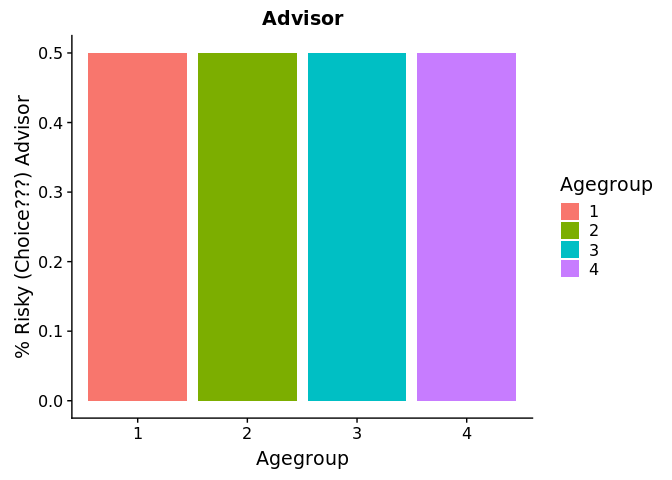
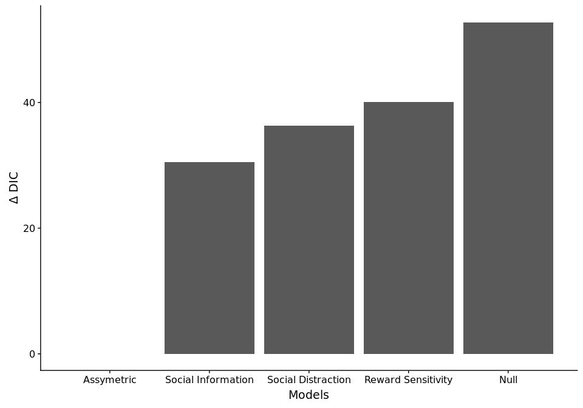
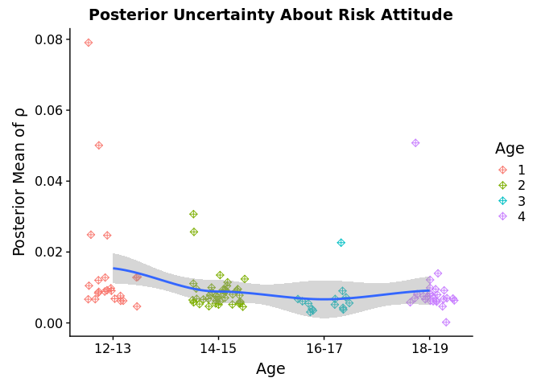
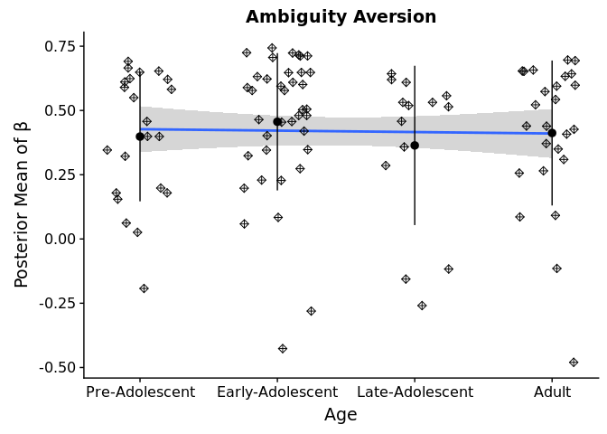
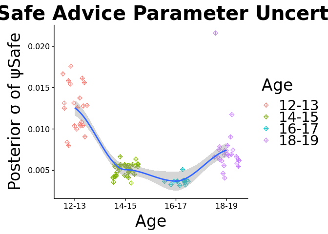

Braams\_PerAge
================
Simon Ciranka
24 10 2018

-   [News](#news)
-   [Braams Data](#braams-data)
    -   ["Stimuli"](#stimuli)
-   [Modelling](#modelling)
    -   [What am I doing here?](#what-am-i-doing-here)
-   [Leave One Out Cross Validation.](#leave-one-out-cross-validation.)
-   [Leave One Out Cross Validation. Per Age Bin](#leave-one-out-cross-validation.-per-age-bin)
-   [Percent per Agegroup](#percent-per-agegroup)
-   [Plot Parameter Erstimates.](#plot-parameter-erstimates.)
-   [Parameter Correlations](#parameter-correlations)
-   [Parameter Distributions](#parameter-distributions)
    -   [rho](#rho)
    -   [Tau.](#tau.)
    -   [Beta](#beta)
-   [Panel](#panel)
    -   [Psi Safe Advices](#psi-safe-advices)
    -   [Psi Risky Advices.](#psi-risky-advices.)
    -   [A small regression](#a-small-regression)
    -   [Psi Sum of Risk and Safe Advices.](#psi-sum-of-risk-and-safe-advices.)
-   [Posterior Predictives](#posterior-predictives)
    -   [Posterior Predictives Plot per Age](#posterior-predictives-plot-per-age)
-   [Chocie Functions.](#chocie-functions.)
    -   [Summary Plot](#summary-plot)
    -   [Agent Choice Curve](#agent-choice-curve)
-   [Now i need to add the Agents Parameters to the Parameters above.](#now-i-need-to-add-the-agents-parameters-to-the-parameters-above.)
    -   [Subjectwise plots](#subjectwise-plots)
-   [Advisor Choice Function](#advisor-choice-function)

News
====

I found quite a bug in my code that attenuated all Ambiguity parameter estimates. I realized it when i looked ad Parameter Correlations (Added A Matrix now.) I changed it now. and now there is more variance and the parameter Estiamtes look less suspicious. I implemented a model that assumes one hyperdistribution and compared it against a mode that assumes a separate hyperdistribution for parameters depending on age. The Model that assumes and estimates seperate hyperdistribtuions wins. Further i made new sigmoid plots for Agegroups. For this i used the standart error of the mean for errors and the mean of the posterior parameter estimates for the mean lines per agegroup.

Braams Data
===========

``` r
setwd("../C_Fit_BraamsData/")
BraamsGamble<-read.csv("RawData/PG_raw_data_combined_cleaned_Wouter.csv")

BraamsGamble<- BraamsGamble%>%dplyr::mutate(
  PeerChoiceSafe0_Risk1 = case_when(
    condition1=="solo" ~ 2,# i dont need this but i restricted the numbers in stan between 1 and 3
    condition1=="socialrisky" ~ 3,# risky choices are coded as 3 in my stan code
    condition1=="socialsafe" ~ 1,# safe choices are coded as 1 in my stan code
    TRUE~0 # keep the rest.
  ),#end PeerChoice.
  typeRA = case_when(
    Ambiguity>0~0,# AMBIGUITY IS RECODED AS 0
    Ambiguity==0~1,# RISK IS RECODED AS 1
    TRUE~0
  ),Agegroup = case_when(
    Age.bins=="12-13"~1,# AMBIGUITY IS RECODED AS 0
    Age.bins=="14-15"~2,# RISK IS RECODED AS 1
    Age.bins=="16-17"~2,
    Age.bins=="16-17"~3,
    Age.bins=="18-19"~3,
    Age.bins=="20-21"~4,
    Age.bins=="22"~4,
    TRUE~0
  ),
  #thats where i calculate the EV.
  EVDiff= case_when(
    Ambiguity>0 ~ ((0.5*Vhighrisky)+((1-0.5)*Vlowrisky))-((0.5*Vhighsafe)+((1-0.5)*Vlowsafe)),#calculate ambiguity neutral expected value
    Ambiguity==0 ~ ((Phigh*Vhighrisky)+((1-Phigh)*Vlowrisky))-((Phigh*Vhighsafe)+((1-Phigh)*Vlowsafe))#calculate risk expected value
  )# end Riskamb
)
#ModelP
# first check if the data looks like in the paper. OK NOW I NEED TO ADD TRIALWISE POSTERIOR PREDICTIVES HERE!
ggplot(BraamsGamble, aes(y=as.numeric(choice),x=as.factor(PeerChoiceSafe0_Risk1)))+
  stat_summary(fun.y = 'mean', fun.ymin = function(x) 0, geom = 'bar', 
               aes(fill =as.factor(PeerChoiceSafe0_Risk1)), position = 'dodge')+
  stat_summary(fun.y = mean, fun.ymin =function(x) mean(x) - 1.960*(sd(x)/sqrt(length(x))), fun.ymax =function(x) mean(x)+ 1.960*(sd(x)/sqrt(length(x))))+
  scale_fill_discrete(name="Social Condition",breaks=c(1,2,3),labels=c("OtherSafe","Solo","OtherRisk"))+
  ylab("% Risky Choice")+
  scale_x_discrete(name="Social Condition",breaks=c(1,2,3),labels=c("OtherSafe","Solo","OtherRisk"))
```


We see that there is a difference in Number of Risky Choice depending on the Advice. If i put this into a linear mixed model we find a significant difference between the advice condition and the Solo Condition. I added Errorbars as the 95%Ci.This looks tricky, because judging from this, the effect seems quite small. Now, in order to split up the age group and get the Continous age back, we need to load another dataset in which all sorts of measures are stored. Then we merge them, so that for further analysis, the exact age is available. At the same time and importantly, we rearrange the data so that it is ordered per age, ascendingly. This is done because we arranged the data like that for fitting the model as well and it will save us a lot of trouble if we have the same structure.

``` r
BraamsGamble<-BraamsGamble%>%arrange(Age.bins)# i order it first so i can make sure that 
Agegroups<-unique(BraamsGamble$Age.bins)# for indexing my agegroups.
```

### "Stimuli"

Since we were investigating the distribution of Expected Value differences (Stimuli in the classical Sense). We can see that there is a slight assymetry in the Stimuli but not a huge one. This means that the Difference in expected Value did overall not have a big influence on what is advised. An Optimal Advice Policy Probably lies in between the two extremes that the two datasets to my disposal represent.

``` r
ggplot(data=BraamsGamble[BraamsGamble$typeRA==1,], aes(EVDiff*10, fill=as.factor(PeerChoiceSafe0_Risk1))) + 
  geom_histogram(bins=100)+facet_grid(.~PeerChoiceSafe0_Risk1)+
  scale_fill_discrete(name="SocialSolo",breaks=c(1,2,3),labels=c("Safe Advice","Solo","Risky Advice"))
```


Next step is again to check if the Advisor shows behaviors that vary systematically with the age of our participants.

``` r
BraamsGamble[BraamsGamble$PeerChoiceSafe0_Risk1!=2,]%>%mutate(PeerChoiceSafe0_Risk1=case_when(PeerChoiceSafe0_Risk1==1 ~0, PeerChoiceSafe0_Risk1==3 ~1)) %>%
  ggplot(aes(y=as.numeric(PeerChoiceSafe0_Risk1),x=as.factor(Agegroup)))+
  stat_summary(fun.y = 'mean', fun.ymin = function(x) 0, geom = 'bar', 
               aes(fill = as.factor(Agegroup)), position = 'dodge')+
  ggtitle("Advisor")+ylab("% Risky (Choice???) Advisor")+
  scale_x_discrete(name="Agegroup")+
  scale_fill_discrete(name="Agegroup")
```



This agent chose the Risky Option in 50% of the cases for All Agegroups. This is how its supposed to be i guess.

Modelling
=========

Here too, I compare a Reward Sensitivity Model with a trembling hand Noise model, a OCU model and a null model, in the latest version, I added the Model with that accounts for that safe and risky advice may have assymetric effects on behavior. I omit approximate loo and only focus on DIC. How i compute that is defined in my start\_workflow script. I assumed different hyperdistributions per age but I started with the same priors for each agegroup in order not to bias my analysis before. The script which I used to fit the model on a linux cluster can be found here \[\]LINK and the shell script that sent everything out to the cluster can be found \[\]LINK

What am I doing here?
---------------------

I inspect the folder for how many different agegrops there is a seperate modelfit file and load them. For each age i compute the fit criteria seperately. The structure of the Files is always as follows: Age\[NUMBER\]\_Braams\_ModelFits\[MODELLNAME\]\_Model\[INDEX\].RData

``` r
#First i prepare a structure to add up the DIC.
#Agerange is from 10 to 25. 

Agegroups=c("12-13","14-15","16-17","18-19","20-21","22")
setwd("../C_Fit_BraamsData/")
Subz<-unique(BraamsGamble$OSFparticipantID)
nSubz<-length(Subz)
#Agegroups=c("NA") #Change this to ages when you know the Ages. 

Models=c("Info_Model1","Risk_Model2","Noise_Model3","Null_Model4","Sep_Model5")
nGroups=length(Agegroups)
nModels=5
nTrials=180

DICtibble<-tibble(
  Value=rep(NA,(nGroups*nModels*nSubz)),
  Model=rep(NA,(nGroups*nModels*nSubz)),
  Group=rep(NA,(nGroups*nModels*nSubz)),
  Sub=rep(NA,(nGroups*nModels*nSubz))
)#setwd(paste0(here(),"/Fit_BraamsensteinData"))
#
tibbleCNT=1;
loglik.Loo<- array(NA, dim=c(12000*nTrials, 1, length(unique(BraamsGamble$OSFparticipantID)[1:(length(unique(BraamsGamble$OSFparticipantID)))]),nModels))#dim1=Samples*Trials; dim2=Chains; dim3=Subs

#########################################
#########################################
for(AgeIDX in 1:nGroups){
  for (ModelIDX in 1:nModels){
    
    load(paste0("Model_Comparison/Age",Agegroups[AgeIDX],"_Braams_ModelFits",Models[ModelIDX],".RData"))# load early adolescents.
    Subz<-unique(BraamsGamble[BraamsGamble$Age.bins==Agegroups[AgeIDX],]$OSFparticipantID)

    # I have to do this because as a sanity check the Data structure comes with different names for 
    switch(ModelIDX,
           "1"={
             params<-rstan::extract(fitInfo)
           },
           "2"={
             params<-rstan::extract(fitRisk)
           },
           "3"={
             params<-rstan::extract(fitNoise)
           },
           "4"={
             params<-rstan::extract(fitNull)
           },
           "5"={
             params<-rstan::extract(fitSep)
           }
    )
    
    n=length(params$beta[1,])
    # here i make a matrix that stores all the loglikelhoods in a way that i can pass them to my DIC function... which is written to take the same structure
    # as the waic and the loo function in the loo package
    
    loglik<- array(NA, dim=c(12000*nTrials, 1, n))#dim1=Samples*Trials; dim2=Chains; dim3=Subs
    for(i in 1:n){
      # here i make the vectors that i need for model comparison.
      loglik[,,i]<-as.vector(params$log_lik[,i,])
    }
    # make model comparison.
    DICAll<-calculateDIC((loglik))
    
    for(Entries in 1:length(DICAll$DIC)){
      DICtibble$Value[tibbleCNT]=DICAll$DIC[Entries]
      DICtibble$Model[tibbleCNT]=ModelIDX
      DICtibble$Group[tibbleCNT]=Agegroups[AgeIDX]
      DICtibble$Sub[tibbleCNT]=Subz[Entries]
      tibbleCNT=tibbleCNT+1;
    }

    # this is just to see if its doing sth
     for(i in 1:n){
      # here i make the vectors that i need for model comparison.
      NonNAindex <- which(is.na(loglik.Loo[1,1,,ModelIDX]))# Check the first NA value and use this as index 
      loglik.Loo[,,NonNAindex[1],ModelIDX]<-as.vector(params$log_lik[,i,])
     }
    print(paste0("Model_Comparison/Age",Agegroups[AgeIDX],"_Braams_ModelFits",Models[ModelIDX],".RData \n Done"))
  }
}
```

    ## [1] "Model_Comparison/Age12-13_Braams_ModelFitsInfo_Model1.RData \n Done"
    ## [1] "Model_Comparison/Age12-13_Braams_ModelFitsRisk_Model2.RData \n Done"
    ## [1] "Model_Comparison/Age12-13_Braams_ModelFitsNoise_Model3.RData \n Done"
    ## [1] "Model_Comparison/Age12-13_Braams_ModelFitsNull_Model4.RData \n Done"
    ## [1] "Model_Comparison/Age12-13_Braams_ModelFitsSep_Model5.RData \n Done"
    ## [1] "Model_Comparison/Age14-15_Braams_ModelFitsInfo_Model1.RData \n Done"
    ## [1] "Model_Comparison/Age14-15_Braams_ModelFitsRisk_Model2.RData \n Done"
    ## [1] "Model_Comparison/Age14-15_Braams_ModelFitsNoise_Model3.RData \n Done"
    ## [1] "Model_Comparison/Age14-15_Braams_ModelFitsNull_Model4.RData \n Done"
    ## [1] "Model_Comparison/Age14-15_Braams_ModelFitsSep_Model5.RData \n Done"
    ## [1] "Model_Comparison/Age16-17_Braams_ModelFitsInfo_Model1.RData \n Done"
    ## [1] "Model_Comparison/Age16-17_Braams_ModelFitsRisk_Model2.RData \n Done"
    ## [1] "Model_Comparison/Age16-17_Braams_ModelFitsNoise_Model3.RData \n Done"
    ## [1] "Model_Comparison/Age16-17_Braams_ModelFitsNull_Model4.RData \n Done"
    ## [1] "Model_Comparison/Age16-17_Braams_ModelFitsSep_Model5.RData \n Done"
    ## [1] "Model_Comparison/Age18-19_Braams_ModelFitsInfo_Model1.RData \n Done"
    ## [1] "Model_Comparison/Age18-19_Braams_ModelFitsRisk_Model2.RData \n Done"
    ## [1] "Model_Comparison/Age18-19_Braams_ModelFitsNoise_Model3.RData \n Done"
    ## [1] "Model_Comparison/Age18-19_Braams_ModelFitsNull_Model4.RData \n Done"
    ## [1] "Model_Comparison/Age18-19_Braams_ModelFitsSep_Model5.RData \n Done"
    ## [1] "Model_Comparison/Age20-21_Braams_ModelFitsInfo_Model1.RData \n Done"
    ## [1] "Model_Comparison/Age20-21_Braams_ModelFitsRisk_Model2.RData \n Done"
    ## [1] "Model_Comparison/Age20-21_Braams_ModelFitsNoise_Model3.RData \n Done"
    ## [1] "Model_Comparison/Age20-21_Braams_ModelFitsNull_Model4.RData \n Done"
    ## [1] "Model_Comparison/Age20-21_Braams_ModelFitsSep_Model5.RData \n Done"
    ## [1] "Model_Comparison/Age22_Braams_ModelFitsInfo_Model1.RData \n Done"
    ## [1] "Model_Comparison/Age22_Braams_ModelFitsRisk_Model2.RData \n Done"
    ## [1] "Model_Comparison/Age22_Braams_ModelFitsNoise_Model3.RData \n Done"
    ## [1] "Model_Comparison/Age22_Braams_ModelFitsNull_Model4.RData \n Done"
    ## [1] "Model_Comparison/Age22_Braams_ModelFitsSep_Model5.RData \n Done"

Leave One Out Cross Validation.
===============================

Since You were not sure if i was cheating i now again also after discussion with some Visitor guy who works with Thorsten and Ruben performed loo. This is the gold standart of avoiding overfitting. The Value, expected log po Interestingly, as we do this, the Null model actually has best predictive Acuracy. Lower Values are better predictive arrucaty.

I the following i compare the different Models via DIC. This quantifies Within Sample model fit. The smallest value is indicative for the best fitting model. I added the model that assumes seperate Contributions of safe and risky signals. It outperforms the others.

Leave One Out Cross Validation. Per Age Bin
===========================================

In the Following I perform this crossvalidation for each Agebin Seperately and see if there is something going on.

``` r
DICtibble=DICtibble[!is.na(DICtibble$Model),]

DICtibble=DICtibble[!is.na(DICtibble$Model),]
Argh<-DICtibble%>%group_by(Model)%>%summarise(DICSum=sum(Value))%>%mutate(
  delta=DICSum-min(DICSum,na.rm = T),
  ModelName=case_when(
    Model==1~"Social Information",
    Model==2~"Reward Sensitivity",
    Model==3~"Social Distraction",
    Model==4~"Null",
    Model==5~"Assymetric"
  )
)%>%arrange(delta)%>%mutate(id = row_number())
ggplot(Argh,aes(y=delta,x=id))+geom_bar(stat="identity")+
  scale_x_continuous(name="Models",breaks=c(1,2,3,4,5),labels=Argh$ModelName)+
  ylab(expression(paste(Delta," DIC")))->B
  print(B)
```



``` r
  ggsave("../X_Figures/Braams_DIC.pdf",height = 4,width=10)

Winner<-DICtibble%>%dplyr::group_by(Model)%>%
  dplyr::summarise(mean = sum(Value), n = dplyr::n()) %>%
  dplyr::mutate(Win=case_when(
    (min(mean)==mean)~1,
    (min(mean)!=mean)~0
  )
  )
WinnerIDX<-Winner[Winner$Win==1,]$Model
```

Percent per Agegroup
====================

Another thing that might be interesting to look at is how many percent of the participants are best described by which model. so lets check.

``` r
DICtibble<-DICtibble[!is.na(DICtibble$Value),]

DICtibble%>%mutate(
  Agegroup = case_when(
     Group=="12-13"~1,
    Group=="14-15"~2,
    Group=="16-17"~2,
    Group=="18-19"~3,
    Group=="20-21"~3,
    Group=="22"~4
  )
)%>%group_by(Sub)%>%dplyr::mutate(Win=case_when(
  (min(Value)==Value)~1,
  (min(Value)!=Value)~0
)
)%>%ungroup()%>%group_by(Agegroup,Model)%>%summarise(
  NumberWinner=sum(Win),
  n=n(),
  PercentWinner=sum(Win)/n()*100
)%>%ggplot(aes(y=PercentWinner,x=as.factor(Agegroup),fill=as.factor(Model)))+geom_bar(stat="identity")+
    scale_fill_discrete(name="Modelspace",breaks=c(1,2,3,4,5),labels=c("Info","RewSensitivity","TremblingHand","No Influence","Assymetric"))+scale_x_discrete(name="Age",breaks=c(1,2,3,4),labels=c(">13","14-17","17-21",">=22"))
```


``` r
ggsave("../X_Figures/Percent_Blanky_DIC.pdf")
```

    ## Saving 20 x 10 in image

Ok this now looks as if we would be satisfied by this on the first glimpse. Lets check out the individual Parameters of the winning model. This is not the general OCU model anymore but is now the one for seperate Learningrates. We Look at both Models fit.

Plot Parameter Erstimates.
==========================

``` r
#setwd(paste0(here(),"/Fit_BraamsensteinData"))

# This only wokrs because i sorted it before for modelfitting. 
# I get an array of Agegroups that i can stick to the 
IdentifierDF<-unique(BraamsGamble%>%group_by(OSFparticipantID)%>%select(OSFparticipantID,Age.bins,Agegroup))
#I look at the null model here because they dont differ so much.
setwd("../C_Fit_BraamsData/")

Subjs<-length(unique(BraamsGamble$OSFparticipantID))
RaincloudTibbleBraams<-tibble(
  PostMeanRho=rep(0,Subjs),
  PostVarRho=rep(0,Subjs),
  PostMeanTau=rep(0,Subjs),
  PostVarTau=rep(0,Subjs),
  PostMeanBeta=rep(0,Subjs),
  PostVarBeta=rep(0,Subjs),
  PostMeanPsiSafe=rep(0,Subjs),
  PostVarPsiSafe=rep(0,Subjs),
  PostMeanPsiRisk=rep(0,Subjs),
  PostVarPsiRisk=rep(0,Subjs),
  Group="12-13"
)
i=1;#this is my tibbleIndex
for(AgeIDX in 1:nGroups){
  # okay whatever model i want to look at.
  load(paste0("Model_Comparison/Age",Agegroups[AgeIDX],"_Braams_ModelFits",Models[WinnerIDX],".RData"))
  print(paste0("Processing... \n Age",Agegroups[AgeIDX],"_Braams_ModelFits",Models[WinnerIDX],".RData"))
  params<-rstan::extract(fitSep)
  # get means and variance of each agegroup and 
  for (j in 1:length(params$rho[1,])){
    RaincloudTibbleBraams$PostMeanRho[i]=mean(params$rho[,j])
    RaincloudTibbleBraams$PostVarRho[i]=var(params$rho[,j])
    RaincloudTibbleBraams$PostMeanTau[i]=mean(params$tau[,j])
    RaincloudTibbleBraams$PostVarTau[i]=var(params$tau[,j])
    RaincloudTibbleBraams$PostMeanBeta[i]=mean(params$beta[,j])
    RaincloudTibbleBraams$PostVarBeta[i]=var(params$beta[,j])
    RaincloudTibbleBraams$PostMeanPsiSafe[i]=mean(params$ocuSafe[,j])
    RaincloudTibbleBraams$PostVarPsiSafe[i]=var(params$ocuSafe[,j])
    RaincloudTibbleBraams$PostMeanPsiRisk[i]=mean(params$ocuRisk[,j])
    RaincloudTibbleBraams$PostVarPsiRisk[i]=var(params$ocuRisk[,j])
    RaincloudTibbleBraams$Group[i]=IdentifierDF$Age.bins[i]
    RaincloudTibbleBraams$Group[i]=IdentifierDF$Agegroup[i]

    i=i+1;
  }#End Entryloop 
}#EndAgeloop
```

    ## [1] "Processing... \n Age12-13_Braams_ModelFitsSep_Model5.RData"
    ## [1] "Processing... \n Age14-15_Braams_ModelFitsSep_Model5.RData"
    ## [1] "Processing... \n Age16-17_Braams_ModelFitsSep_Model5.RData"
    ## [1] "Processing... \n Age18-19_Braams_ModelFitsSep_Model5.RData"
    ## [1] "Processing... \n Age20-21_Braams_ModelFitsSep_Model5.RData"
    ## [1] "Processing... \n Age22_Braams_ModelFitsSep_Model5.RData"

Okay now i want to plot nice fit lines as i do it for the other Dataset so i need to make the Agegroup numeric. Is easiest with jusing dplyr again, as above.

Parameter Correlations
======================

If we want to continue with Parameter inference we should not have substantial correlations between the Model parameter. There is a non neglegible negative Correlation between the Reward Sensitivity and the Temperature Parameter. Im not sure what that means now... Also OCU for Save and for Risky Advices Are negatively correlated. This Emphazizes that we actualy do need these two parameters because they seem to oppose each other.

``` r
Matrix<-RaincloudTibbleBraams[c(1,3,5,7,9)]
cormat<-round(cor(Matrix,use = "complete.obs"),2)
lower_tri <- get_lower_tri(cormat)
melted_cormat <- reshape2::melt(lower_tri)
#melted_cormat<-reshape2::melt(cormat)# 
ggplot(data = melted_cormat, aes(x=Var1, y=Var2, fill=value)) +  geom_tile(color = "white") +
  scale_fill_gradientn(limits=c(-1,1),na.value = "white",trans="identity",name=expression(paste("Pearson ", rho)),
                       colors = c("lightblue","white","red"),
                       values=scales::rescale(identity(
                         c(-1, -0.5, #blue parameters
                           -0.5, 0.5,#
                           0.5, 1 ))))+ #red parametersrs
  geom_text(aes(Var1, Var2, label = value), color = "black", size = 5) +
  ggtitle("Parameter Correlations")+
  scale_y_discrete(name="",breaks=c("PostMeanRho","PostMeanTau","PostMeanBeta","PostMeanPsiRisk","PostMeanPsiSafe"),labels=c(expression(rho),expression(tau),expression(beta),expression(paste(psi," Safe")),expression(paste(psi," Risk"))))+
scale_x_discrete(name="",breaks=c("PostMeanRho","PostMeanTau","PostMeanBeta","PostMeanPsiRisk","PostMeanPsiSafe"),labels=c(expression(rho),expression(tau),expression(beta),expression(paste(psi," Safe")),expression(paste(psi," Risk"))))->ParameterCorrs
print(ParameterCorrs)
```

    ## Warning: Removed 10 rows containing missing values (geom_text).


``` r
  ggsave("../X_Figures/Braams_ParamCors.pdf",height = 7,width=7)
```

    ## Warning: Removed 10 rows containing missing values (geom_text).

Parameter Distributions
=======================

Now that i obtained the parameter posterior means i now may have a first quick look at the parameter distributions. I use Raincloud plots and Group the Distributions by Age. Because the rainclouds are a little bit overwhelming, we also look only at the means in bar plots and put a fit line over it. The fit lines are either locally weighted scatterplot smoothing or linear fit.

rho
---

``` r
ggplot(RaincloudTibbleBraams,aes(x=as.numeric(Group),y=PostMeanRho))+ geom_point(position = position_jitter(width = .25), size = 2,shape=9)+
  #stat_summary(geom="bar",fun.y=mean,alpha=0.3)+
  geom_smooth(method="lm")+
  stat_summary(geom="pointrange",fun.y=mean,fun.ymin =function(x) mean(x)-sd(x),fun.ymax=function(x) mean(x)+sd(x))+
  ylab(expression(paste("Posterior Mean of ",rho)))+
  guides(fill = FALSE, colour = FALSE)+
  scale_x_continuous(name="Age",breaks=c(1,2,3,4),labels=c("Pre-Adolescent","Early-Adolescent","Late-Adolescent","Adult"))+
  ggtitle("Risk Attitude")->RiskAttitute
print(RiskAttitute)
ggsave("../X_Figures/Alpha_Braams.pdf",height = 4,width=6)

ggplot(RaincloudTibbleBraams,aes(x=as.numeric(Group),y=PostVarRho))+ geom_point(aes(color=as.factor(Group)),position = position_jitter(width = .25), size = 2,shape=9)+  geom_smooth(method = "loess")+
  scale_color_discrete(name="Age")+
  ylab(expression(paste("Posterior Mean of ",rho)))+
  scale_x_continuous(name="Age",breaks=c(1,2,3,4,5,6),labels=Agegroups)+
  ggtitle("Posterior Uncertainty About Risk Attitude")
```

    ## Warning in simpleLoess(y, x, w, span, degree = degree, parametric =
    ## parametric, : pseudoinverse used at 0.985

    ## Warning in simpleLoess(y, x, w, span, degree = degree, parametric =
    ## parametric, : neighborhood radius 2.015

    ## Warning in simpleLoess(y, x, w, span, degree = degree, parametric =
    ## parametric, : reciprocal condition number 7.0769e-16

    ## Warning in simpleLoess(y, x, w, span, degree = degree, parametric =
    ## parametric, : There are other near singularities as well. 4.0602

    ## Warning in predLoess(object$y, object$x, newx = if
    ## (is.null(newdata)) object$x else if (is.data.frame(newdata))
    ## as.matrix(model.frame(delete.response(terms(object)), : pseudoinverse used
    ## at 0.985

    ## Warning in predLoess(object$y, object$x, newx = if
    ## (is.null(newdata)) object$x else if (is.data.frame(newdata))
    ## as.matrix(model.frame(delete.response(terms(object)), : neighborhood radius
    ## 2.015

    ## Warning in predLoess(object$y, object$x, newx = if
    ## (is.null(newdata)) object$x else if (is.data.frame(newdata))
    ## as.matrix(model.frame(delete.response(terms(object)), : reciprocal
    ## condition number 7.0769e-16

    ## Warning in predLoess(object$y, object$x, newx = if
    ## (is.null(newdata)) object$x else if (is.data.frame(newdata))
    ## as.matrix(model.frame(delete.response(terms(object)), : There are other
    ## near singularities as well. 4.0602

 It seems now like young adults have lower risk attitudes than the adolescents and the kids.

Tau.
----

Again maybe we see it better without all the boxplots.

``` r
ggplot(RaincloudTibbleBraams,aes(x=as.numeric(Group),y=PostMeanTau))+ geom_point(position = position_jitter(width = .25), size = 2,shape=9)+ 
  scale_x_continuous(name="Age",breaks=c(1,2,3,4),labels=c("Pre-Adolescent","Early-Adolescent","Late-Adolescent","Adult"))+
geom_smooth(method="lm")+
  stat_summary(geom="pointrange",fun.y=mean,fun.ymin =function(x) mean(x)-sd(x),fun.ymax=function(x) mean(x)+sd(x))+
  ylab(expression(paste("Posterior Mean of ",tau)))+
  guides(fill = FALSE, colour = FALSE)+
  ggtitle("Temperature")->Temperature
print(Temperature)
ggsave("../X_Figures/Temp_Braams.pdf",height = 4,width=6)


ggplot(RaincloudTibbleBraams,aes(x=as.numeric(Group),y=PostVarTau))+ geom_point(aes(color=as.factor(Group)),position = position_jitter(width = .25), size = 2,shape=9)+ 
  scale_x_continuous(name="Age",breaks=c(1,2,3,4,5,6),labels=Agegroups)+
  ylab(expression(paste("Posterior ", sigma, " of ",tau)))+
  geom_smooth(method = "loess")+
  coord_cartesian(ylim=(c(0,10)))+
  ggtitle("Posterior Uncertainty about Temperature")
```

    ## Warning in simpleLoess(y, x, w, span, degree = degree, parametric =
    ## parametric, : pseudoinverse used at 0.985

    ## Warning in simpleLoess(y, x, w, span, degree = degree, parametric =
    ## parametric, : neighborhood radius 2.015

    ## Warning in simpleLoess(y, x, w, span, degree = degree, parametric =
    ## parametric, : reciprocal condition number 7.0769e-16

    ## Warning in simpleLoess(y, x, w, span, degree = degree, parametric =
    ## parametric, : There are other near singularities as well. 4.0602

    ## Warning in predLoess(object$y, object$x, newx = if
    ## (is.null(newdata)) object$x else if (is.data.frame(newdata))
    ## as.matrix(model.frame(delete.response(terms(object)), : pseudoinverse used
    ## at 0.985

    ## Warning in predLoess(object$y, object$x, newx = if
    ## (is.null(newdata)) object$x else if (is.data.frame(newdata))
    ## as.matrix(model.frame(delete.response(terms(object)), : neighborhood radius
    ## 2.015

    ## Warning in predLoess(object$y, object$x, newx = if
    ## (is.null(newdata)) object$x else if (is.data.frame(newdata))
    ## as.matrix(model.frame(delete.response(terms(object)), : reciprocal
    ## condition number 7.0769e-16

    ## Warning in predLoess(object$y, object$x, newx = if
    ## (is.null(newdata)) object$x else if (is.data.frame(newdata))
    ## as.matrix(model.frame(delete.response(terms(object)), : There are other
    ## near singularities as well. 4.0602

 Hm looks like a linear increase in temperature with age.

Beta
----

``` r
ggplot(RaincloudTibbleBraams,aes(x=as.numeric(Group),y=PostMeanBeta))+ 
geom_smooth(method="lm")+  stat_summary(geom="pointrange",fun.y=mean,fun.ymin =function(x) mean(x)-sd(x),fun.ymax=function(x) mean(x)+sd(x))+
  geom_point(position = position_jitter(width = .25), size = 2,shape=9)+
  scale_x_continuous(name="Age",breaks=c(1,2,3,4),labels=c("Pre-Adolescent","Early-Adolescent","Late-Adolescent","Adult"))+
  ylab(expression(paste("Posterior Mean of ",beta)))+
  guides(fill = FALSE, colour = FALSE) +
  #coord_cartesian(ylim=c(0.39,0.4))
  ggtitle("Ambiguity Aversion")->Ambiguity
print(Ambiguity)
ggsave("../X_Figures/Ambiguity_Aversion_Braams.pdf",height = 4,width=6)


ggplot(RaincloudTibbleBraams,aes(x=as.numeric(Group),y=PostVarBeta))+ geom_point(aes(color=as.factor(Group)),position = position_jitter(width = .25), size = 2,shape=9)+  geom_smooth(method = "lm")+
  scale_color_discrete(name="Age",breaks=c(1,2,3,4,5,6),labels=Agegroups)+
  scale_x_continuous(name="Age",breaks=c(1,2,3,4,5,6),labels=Agegroups)+
  ylab(expression(paste("Posterior Mean of ",beta)))+
  ggtitle("Ambiguity Aversion Parameter Uncertainty")
```

 Looks like nothing is going on here, too.

Panel
=====

In the following couple lines i build the panel for Blankenstein Data in the appendix.

``` r
theme_update(
    text = element_text(size=25),
    plot.title = element_text(hjust = 0.5,size=30)
)

cowplot::plot_grid(ParameterCorrs,RiskAttitute,Ambiguity,Temperature,labels="auto")
```

    ## Warning: Removed 10 rows containing missing values (geom_text).


``` r
ggsave("../X_Figures/ParamsBraams.pdf",heigh=15,width=15)
```

Psi Safe Advices
----------------

``` r
ggplot(RaincloudTibbleBraams,aes(x=as.numeric(Group),y=PostMeanPsiSafe))+ geom_point(position = position_jitter(width = .25), size = 2,shape=9)+
  #scale_color_discrete(name="Age",breaks=c(1,2,3,4,5,6),labels=Agegroups)+
  scale_x_continuous(name="Agegroup",breaks=c(1,2,3,4),labels=c("Pre-Adolescent","Early-Adolescent","Late-Adolescent","Adult"))+
  stat_summary(geom="bar",fun.y=mean,alpha=0.1,fill="blue",color="black")+
  stat_summary(geom="pointrange",fun.y=mean,fun.ymin =function(x) mean(x)-sd(x),fun.ymax=function(x) mean(x)+sd(x))+
  ylab(expression(paste("Posterior Mean of ",psi,"Safe")))+
  ggtitle("Taking Safe Advice")+
  guides(fill = FALSE, colour = FALSE)
ggsave("../X_Figures/SafeAdv_Braams.pdf",height = 4,width=7)


ggplot(RaincloudTibbleBraams,aes(x=as.numeric(Group),y=PostVarPsiSafe))+ geom_point(aes(color=as.factor(Group)),position = position_jitter(width = .25), size = 2,shape=9)+  geom_smooth(method = "loess")+
  scale_color_discrete(name="Age",breaks=c(1,2,3,4,5,6),labels=Agegroups)+
  scale_x_continuous(name="Age",breaks=c(1,2,3,4,5,6),labels=Agegroups)+
  ylab(expression(paste("Posterior ", sigma, " of ",psi,"Safe")))+
  ggtitle("Taking Safe Advice Parameter Uncertainty")
```

    ## Warning in simpleLoess(y, x, w, span, degree = degree, parametric =
    ## parametric, : pseudoinverse used at 0.985

    ## Warning in simpleLoess(y, x, w, span, degree = degree, parametric =
    ## parametric, : neighborhood radius 2.015

    ## Warning in simpleLoess(y, x, w, span, degree = degree, parametric =
    ## parametric, : reciprocal condition number 7.0769e-16

    ## Warning in simpleLoess(y, x, w, span, degree = degree, parametric =
    ## parametric, : There are other near singularities as well. 4.0602

    ## Warning in predLoess(object$y, object$x, newx = if
    ## (is.null(newdata)) object$x else if (is.data.frame(newdata))
    ## as.matrix(model.frame(delete.response(terms(object)), : pseudoinverse used
    ## at 0.985

    ## Warning in predLoess(object$y, object$x, newx = if
    ## (is.null(newdata)) object$x else if (is.data.frame(newdata))
    ## as.matrix(model.frame(delete.response(terms(object)), : neighborhood radius
    ## 2.015

    ## Warning in predLoess(object$y, object$x, newx = if
    ## (is.null(newdata)) object$x else if (is.data.frame(newdata))
    ## as.matrix(model.frame(delete.response(terms(object)), : reciprocal
    ## condition number 7.0769e-16

    ## Warning in predLoess(object$y, object$x, newx = if
    ## (is.null(newdata)) object$x else if (is.data.frame(newdata))
    ## as.matrix(model.frame(delete.response(terms(object)), : There are other
    ## near singularities as well. 4.0602

 In agreement with what was reported in teh paper; my model also says Safe Advices have the greatest impact in the younger agegroups and then become smaller

Psi Risky Advices.
------------------

``` r
ggplot(RaincloudTibbleBraams,aes(x=as.numeric(Group),y=PostMeanPsiRisk))+ geom_point(position = position_jitter(width = .25), size = 2,shape=9)+
  scale_x_continuous(name="Agegroup",breaks=c(1,2,3,4),labels=c("Pre-Adolescent","Early-Adolescent","Late-Adolescent","Adult"))+
  stat_summary(geom="bar",fun.y=mean,alpha=0.1,fill="green",color="black")+
  stat_summary(geom="pointrange",fun.y=mean,fun.ymin =function(x) mean(x)-sd(x),fun.ymax=function(x) mean(x)+sd(x))+
  ylab(expression(paste("Posterior Mean of ",psi,"Risky")))+
    guides(fill = FALSE, colour = FALSE)+
  ggtitle("Taking Risky Advice")

ggsave("../X_Figures/RiskyAdv_Braams.pdf",height = 4,width=7)


ggplot(RaincloudTibbleBraams,aes(x=as.numeric(Group),y=PostVarPsiRisk))+ geom_point(aes(color=as.factor(Group)),position = position_jitter(width = .25), size = 2,shape=9)+  geom_smooth(method = "lm")+
  scale_color_discrete(name="Age",breaks=c(1,2,3,4,5,6),labels=Agegroups)+
  scale_x_continuous(name="Age",breaks=c(1,2,3,4,5,6),labels=Agegroups)+
  ylab(expression(paste("Posterior Var of ",psi,"Risky")))+
  ggtitle("Taking Risky Advice Parameter Uncertainty")
```

 The Agetred generally looks similar to the one reported in the paper. It does not seem as if there is a huge effect going on here in terms of but from eyeballing, one could think that OCU\_Safe and OCU\_Risk are anticorrelated.

``` r
gathercols <- c("PostMeanPsiRisk", "PostMeanPsiSafe")

C<-RaincloudTibbleBraams%>%gather("Condition","measurment",gathercols)%>%ggplot(aes(x=as.numeric(Group),y=measurment, fill=Condition,group=Condition))+ 
  geom_point(aes(color=Condition),position = position_jitterdodge(), size = 2,shape=9) +
  stat_summary(geom="bar",fun.y=mean,alpha=0.1,position = "dodge",color="black",fill="grey")+
  scale_x_continuous(name="Agegroup",breaks=c(1,2,3,4),labels=c("Pre-Adolescent","Early-Adolescent","Late-Adolescent","Adult"))+
  stat_summary(mapping=aes(group=Condition,fill=Condition),
               geom="pointrange",
               fun.y=mean,fun.ymin =function(x) mean(x)-sd(x),fun.ymax=function(x) mean(x)+sd(x),
                position = position_dodge(0.9))+
  ylab(expression(paste("Posterior Mean of ",psi,"Risky")))+
  guides(fill = FALSE) +
  scale_color_viridis(name="Advice Type",breaks=gathercols,labels=c("Risky","Safe"),discrete = T)
print(C)
ggsave("../X_Figures/Adv_Blank.pdf",height = 7,width=10)
```


A small regression
------------------

``` r
ForReg<-RaincloudTibbleBraams%>%mutate(
  LinearAge=(poly(as.numeric(RaincloudTibbleBraams$Group),2))[,1],
  QuadraticAge=(poly(as.numeric(RaincloudTibbleBraams$Group),2)*-1)[,2]
)

modelRisk<-stan_glm(PostMeanPsiRisk~LinearAge+QuadraticAge, data=ForReg,cores=3,iter=300000,warmup=1000)
modelSafe<-stan_glm(PostMeanPsiSafe~LinearAge+QuadraticAge, data=ForReg,cores=3,iter=300000,warmup=1000)

summary(modelRisk)
```

    ## 
    ## Model Info:
    ## 
    ##  function:     stan_glm
    ##  family:       gaussian [identity]
    ##  formula:      PostMeanPsiRisk ~ LinearAge + QuadraticAge
    ##  algorithm:    sampling
    ##  priors:       see help('prior_summary')
    ##  sample:       1196000 (posterior sample size)
    ##  observations: 99
    ##  predictors:   3
    ## 
    ## Estimates:
    ##                 mean   sd   2.5%   25%   50%   75%   97.5%
    ## (Intercept)    0.0    0.0  0.0    0.0   0.0   0.0   0.0   
    ## LinearAge      0.0    0.1 -0.2    0.0   0.0   0.1   0.3   
    ## QuadraticAge  -0.5    0.1 -0.7   -0.6  -0.5  -0.4  -0.3   
    ## sigma          0.1    0.0  0.1    0.1   0.1   0.1   0.1   
    ## mean_PPD       0.0    0.0  0.0    0.0   0.0   0.0   0.0   
    ## log-posterior 71.7    1.4 68.0   71.0  72.0  72.8  73.5   
    ## 
    ## Diagnostics:
    ##               mcse Rhat n_eff  
    ## (Intercept)   0.0  1.0  1542473
    ## LinearAge     0.0  1.0  1520948
    ## QuadraticAge  0.0  1.0  1461432
    ## sigma         0.0  1.0  1366573
    ## mean_PPD      0.0  1.0  1342854
    ## log-posterior 0.0  1.0   517050
    ## 
    ## For each parameter, mcse is Monte Carlo standard error, n_eff is a crude measure of effective sample size, and Rhat is the potential scale reduction factor on split chains (at convergence Rhat=1).

``` r
summary(modelSafe)
```

    ## 
    ## Model Info:
    ## 
    ##  function:     stan_glm
    ##  family:       gaussian [identity]
    ##  formula:      PostMeanPsiSafe ~ LinearAge + QuadraticAge
    ##  algorithm:    sampling
    ##  priors:       see help('prior_summary')
    ##  sample:       1196000 (posterior sample size)
    ##  observations: 99
    ##  predictors:   3
    ## 
    ## Estimates:
    ##                 mean   sd   2.5%   25%   50%   75%   97.5%
    ## (Intercept)    0.1    0.0  0.1    0.1   0.1   0.1   0.1   
    ## LinearAge     -0.2    0.1 -0.4   -0.3  -0.2  -0.2   0.0   
    ## QuadraticAge   0.6    0.1  0.4    0.5   0.6   0.7   0.8   
    ## sigma          0.1    0.0  0.1    0.1   0.1   0.1   0.1   
    ## mean_PPD       0.1    0.0  0.1    0.1   0.1   0.1   0.1   
    ## log-posterior 84.1    1.4 80.5   83.4  84.5  85.2  85.9   
    ## 
    ## Diagnostics:
    ##               mcse Rhat n_eff  
    ## (Intercept)   0.0  1.0  1495734
    ## LinearAge     0.0  1.0  1379677
    ## QuadraticAge  0.0  1.0  1404214
    ## sigma         0.0  1.0  1338985
    ## mean_PPD      0.0  1.0  1332878
    ## log-posterior 0.0  1.0   542590
    ## 
    ## For each parameter, mcse is Monte Carlo standard error, n_eff is a crude measure of effective sample size, and Rhat is the potential scale reduction factor on split chains (at convergence Rhat=1).

Psi Sum of Risk and Safe Advices.
---------------------------------

Here as a Proxy for general following what others said. Maybe i need to normalize them before i can simply add them.

``` r
RaincloudTibbleBraams$SI<-(RaincloudTibbleBraams$PostMeanPsiSafe)+(RaincloudTibbleBraams$PostMeanPsiRisk)

ggplot(RaincloudTibbleBraams,aes(x=as.numeric(Group),y=SI))+ geom_point(aes(color=as.factor(Group)),position = position_jitter(width = .25), size = 2,shape=9)+  geom_smooth(method = "lm")+
  scale_color_discrete(name="Age",breaks=c(1,2,3,4,5,6),labels=Agegroups)+
  scale_x_continuous(name="Age",breaks=c(1,2,3,4,5,6),labels=Agegroups)+
  stat_summary(geom="bar",fun.y=mean,alpha=0.3)+
  stat_summary(geom="pointrange",fun.y=mean,fun.ymin =function(x) mean(x) - 1.960*(sd(x)/sqrt(length(x))),fun.ymax=function(x) mean(x) + 1.960*(sd(x)/sqrt(length(x))))+
  ylab(expression(paste("Sum of ",psi,"Risky", " and ",psi,"Safe")))+
  guides(fill = FALSE, colour = FALSE)+
  ggtitle("Taking Advice Generally")
```


Posterior Predictives
=====================

Posterior Predictives are an important indicator as to what is Now lets see if we can add the posterior Predictives. For this i first reorder the data so that i can just glue the mean of my y\_pred matrix onto the whole Dataframe that i used ti make the plot before.

``` r
#Agegroups<-NA

GroupedBraams<-BraamsGamble%>% 
  group_by(Age.bins)%>%arrange((Age.bins))
GroupedBraams$rho<-NA
GroupedBraams$tau<-NA
GroupedBraams$beta<-NA

subz<-unique(GroupedBraams$OSFparticipantID)
for(i in 1:length(subz)){
  GroupedBraams[GroupedBraams$OSFparticipantID==subz[i],]$rho<-RaincloudTibbleBraams$PostMeanRho[i]
  GroupedBraams[GroupedBraams$OSFparticipantID==subz[i],]$tau<-RaincloudTibbleBraams$PostMeanTau[i]
  GroupedBraams[GroupedBraams$OSFparticipantID==subz[i],]$beta<-RaincloudTibbleBraams$PostMeanBeta[i]
}
GroupedBraams$meanPostPred<-NA

for(AgeIDX in 1:nGroups){
  # okay whatever model i want to look at.
  #i should´ve saved this but i didnt k.
  load(paste0("Model_Comparison/Age",Agegroups[AgeIDX],"_Braams_ModelFits",Models[WinnerIDX],".RData"))
  print(paste0("Processing... \n Age",Agegroups[AgeIDX],"_Braams_ModelFits",Models[WinnerIDX],".RData"))
  subz<-unique(GroupedBraams[GroupedBraams$Age.bins==Agegroups[AgeIDX],]$OSFparticipantID)
 # subz<-unique(GroupedBraams$OSFparticipantID)
  params<-rstan::extract(fitSep)
  for(i in 1:length(subz)){
    #data=GroupedBraams[GroupedBraams$OSFparticipantID==subz[i],]#subset
    postPred<-params$y_pred[,i,]
    #-1 refers a the dummy that was used in stan. only use the ones where it worked. This Means: Use Only these Rows and Columns for Replacement that are not the Dummy anymore.
    GroupedBraams[GroupedBraams$OSFparticipantID==subz[i],]$meanPostPred<-apply(postPred[postPred[,1]!=-1,postPred[1,]!=-1],2,mean)#attach the simulations and use the mean of the choices.
  }#endSubzPerAge
}#endAgeloop
```

    ## [1] "Processing... \n Age12-13_Braams_ModelFitsSep_Model5.RData"
    ## [1] "Processing... \n Age14-15_Braams_ModelFitsSep_Model5.RData"
    ## [1] "Processing... \n Age16-17_Braams_ModelFitsSep_Model5.RData"
    ## [1] "Processing... \n Age18-19_Braams_ModelFitsSep_Model5.RData"
    ## [1] "Processing... \n Age20-21_Braams_ModelFitsSep_Model5.RData"
    ## [1] "Processing... \n Age22_Braams_ModelFitsSep_Model5.RData"

Posterior Predictives Plot per Age
----------------------------------

In the Following Plot you can see the mean of Risky Choice depending on the Advice Condition in Black. Blue dots correspond to model Predictions under the full Posterior. Errorbars are the 95% CI. While all the Model Predicions are within the 95% CI of the data, there seems to be some Bias. The Absoulte Bias is relatively small, the Predictions are odd no more than 1% but if we zoom in like this, it seems quite larger than it is.

``` r
ggplot(GroupedBraams, aes(y=as.numeric(choice),x=as.factor(PeerChoiceSafe0_Risk1)))+
  
  stat_summary(fun.y = 'mean', fun.ymin = function(x) 0, geom = 'bar', position = 'dodge')+
  stat_summary(fun.y = mean, fun.ymin =function(x) mean(x) - 1.960*(sd(x)/sqrt(length(x))), fun.ymax =function(x) mean(x)+ 1.960*(sd(x)/sqrt(length(x))))+
  #add posterior predictives
  stat_summary( mapping = aes (y = meanPostPred ),fun.y = mean,
                fun.ymin =function(x) mean(x) -  1.960*(sd(x)/sqrt(length(x))), fun.ymax =function(x) mean(x)+  1.960*(sd(x)/sqrt(length(x))),
                size=0.5, 
                position = position_nudge(x = -0.1),color="blue") + 
  #scale_fill_discrete(name="Social Condition",breaks=c(1,2,3),labels=c("OtherSafe","Solo","OtherRisk"))+
  ylab("% Risky Choice")+
  scale_x_discrete(name="Social Condition",breaks=c(1,2,3),labels=c("OtherSafe","Solo","OtherRisk"))+
  ggtitle("Data & Posterior Predictives")


# first check if the data looks like in the paper. OK NOW I NEED TO ADD TRIALWISE POSTERIOR PREDICTIVES HERE!
ggplot(GroupedBraams, aes(y=as.numeric(choice),x=as.numeric(Agegroup)))+
  stat_summary(aes(group=as.factor(PeerChoiceSafe0_Risk1),alpha = PeerChoiceSafe0_Risk1),fun.y = 'mean', fun.ymin = function(x) 0, geom = 'bar', position = 'dodge',color="black")+
  stat_summary(aes(group=as.factor(PeerChoiceSafe0_Risk1),x=as.numeric(Agegroup)+0.05,color="Subjects:\n Mean + 95CI\n"),fun.y = mean, fun.ymin =function(x) mean(x) - 1.960*(sd(x)/sqrt(length(x))), fun.ymax =function(x) mean(x)+ 1.960*(sd(x)/sqrt(length(x))),
               position=position_dodge(0.9))+
  #add posterior predictives
  stat_summary( mapping = aes (y = meanPostPred,group=as.factor(PeerChoiceSafe0_Risk1),color="Posterior Predicitve:\n  Mean + 95CI\n"),fun.y = mean,
                fun.ymin =function(x) mean(x) -  1.960*(sd(x)/sqrt(length(x))), fun.ymax =function(x) mean(x)+  1.960*(sd(x)/sqrt(length(x))),
                size=0.5, 
                position = position_dodge(0.9)) + 
  #scale_fill_discrete(name="Social Condition",breaks=c(1,2,3),labels=c("OtherSafe","Solo","OtherRisk"))+
  ylab("% Risky Choice")+
  #coord_cartesian(ylim=c(0.22,0.5))+
  scale_x_continuous(name="Agegroup",breaks=c(1,2,3,4),labels=c("Pre-Adolescent","Early-Adolescent","Late-Adolescent","Adult"))+
  scale_alpha_continuous(name="Condition",breaks=c(1,2,3),labels=c("Other-Safe","Solo","Other-Risk"))+
  scale_color_manual(name="Aggregate Measures",breaks =c("Posterior Predicitve:\n  Mean + 95CI\n","Subjects:\n Mean + 95CI\n"), values = c('blue','black'))->A
print(A)
ggsave("../X_Figures/PostPredBraams.pdf",height = 7,width=10)
```


Chocie Functions.
=================

In the following i use the Posterior parameter estimates and make the sigmoid choice functions of my age groups. I use the Same function as for Blankenstein et al but maybe i should modify it? Since there are fewer Subjects & fewer trials the aggregate choice functions look funny. They depict the depending on condition. Since certainty equivalent as a safe alternative as it is used in Blankenstein et al comes with different predictions as compared to the lower outcome variance as "safe" alternative used in this paper. [Therefore i wrote another function to plot the Choice functions](Helpers/plotProbFunBraams.R).

``` r
source("Helpers/plotProbFunBraams.R")
RaincloudTibbleBraams$OSFparticipantID=NA# make OSFparticipantID
RaincloudTibbleBraams$OSFparticipantID=1:length(RaincloudTibbleBraams$PostMeanRho)
subz=unique(RaincloudTibbleBraams$OSFparticipantID)
#for subsetting. eah i know its pointless but still.
data=RaincloudTibbleBraams[RaincloudTibbleBraams$OSFparticipantID==subz[1],]#subset
data$ppn=subz[1]
AllSubs<-plotProbFunRiskBraams(data)
for(i in 2:length(subz)){
  data=RaincloudTibbleBraams[RaincloudTibbleBraams$OSFparticipantID==subz[i],]#subset
  data$ppn=subz[i]
  Onesub<-plotProbFunRiskBraams(data)
  AllSubs<-rbind(AllSubs,Onesub)
}
```

Summary Plot
------------

This was actually quite trickey. To plot a summary line for the different subject groups, i this we take the mean of each Agegroups Parameter estimates and make new nice choice functions. To get the errors, we will do this as well with the lower and upper 95%ci of the parameter Esitmaties. In the Plots dotted and dased lines correspond to predictions that are made under the upper and lower confidence parameter estimate as calculated by obtaining the standart error of the mean of each parameter estimate. Solid lines are the predictions under mean values. .. I was thinking... Maybe, to illustrate my point i should not allow different slopes here and only use the errors of the OCU parameters, otherwise it is very tricky to read.

``` r
rhos<-c("meanRho","minciRho","maxciRho","Group")
betas<-c("meanBeta","minciBeta","maxciBeta","Group")
taus<-c("meanTau","minciTau","maxciTau","Group")
PsiSafe<-c("meanPsiSafe","minciPsiSafe","maxciPsiSafe","Group")
PsiRisk<-c("meanPsiRisk","minciPsiRisk","maxciPsiRisk","Group")


MeansAndCIs<-RaincloudTibbleBraams%>%group_by(Group)%>%summarise(
  meanRho=mean(PostMeanRho),
  minciRho=mean(PostMeanRho)-sd(PostMeanRho)/sqrt(n()),
  maxciRho=mean(PostMeanRho)+sd(PostMeanRho)/sqrt(n()),
  meanBeta=mean(PostMeanBeta),
  minciBeta=mean(PostMeanBeta)-sd(PostMeanBeta)/sqrt(n()),
  maxciBeta=mean(PostMeanBeta)+sd(PostMeanBeta)/sqrt(n()),
  meanTau=mean(PostMeanTau),
  minciTau=mean(PostMeanTau)-sd(PostMeanTau)/sqrt(n()),
  maxciTau=mean(PostMeanTau)+sd(PostMeanTau)/sqrt(n()),
  meanPsiSafe=mean(PostMeanPsiSafe),
  minciPsiSafe=mean(PostMeanPsiSafe)-sd(PostMeanPsiSafe)/sqrt(n()),
  maxciPsiSafe=mean(PostMeanPsiSafe)+sd(PostMeanPsiSafe)/sqrt(n()),
  meanPsiRisk=mean(PostMeanPsiRisk),
  minciPsiRisk=mean(PostMeanPsiRisk)-sd(PostMeanPsiRisk)/sqrt(n()),
  maxciPsiRisk=mean(PostMeanPsiRisk)+sd(PostMeanPsiRisk)/sqrt(n())
)

Rhos.long<-gather(MeansAndCIs[rhos],key="Subgroup",value="PostMeanRho",values=c(rhos[1:3]))
Betas.long<-gather(MeansAndCIs[betas],key="Subgroup",value="PostMeanBeta",values=c(betas[1:3]))
Tau.long<-gather(MeansAndCIs[taus],key="Subgroup",value="PostMeanTau",values=c(taus[1:3]))
PsiSafe.long<-gather(MeansAndCIs[PsiSafe],key="Subgroup",value="PostMeanPsiSafe",values=c(PsiSafe[1:3]))
PsiRisk.long<-gather(MeansAndCIs[PsiRisk],key="Subgroup",value="PostMeanPsiRisk",values=c(PsiRisk[1:3]))

#IDK WHAT THAT IS.... but maybe ill need it at some point again. 
# MeanSubs<-merge(Rhos.long, Betas.long, by.x="Group", by.y="Group")%>%
#   merge(Tau.long,by.x="Group", by.y="Group")%>%
#   merge(PsiSafe.long,by.x="Group", by.y="Group")%>%
#   merge(PsiRisk.long,by.x="Group", by.y="Group")

MeanSubs<-cbind(Rhos.long,Betas.long,Tau.long,PsiSafe.long,PsiRisk.long)
```

Agent Choice Curve
------------------

In their paper, they used three different agents, one Random, one Risky and One Safe Agent. I did fit the normal expected Utility model to the Agents Choices - Which is a stimulus to the participant. I did this [here](./FitModel/Braams_peer.R). There you can see how which index referrs to wich agent but for clairity lets repeat this: 1)Risky Peer (75% Risky Choice) 2)Random Peer (50% Risky Choice) 3)Safe Peer (25% Risky Choice)

In the Table Below you can see the Parameter estimates. Note the High Variance and for the Temperature Parameter, Tau. Choices have been seleceted Randomly. Pooled over all participants this results in *all agents* getting very high reward sensitvity parameters. Before again making broad claims about that sth is seriously off there, i would like to check the sanity of this before though.

``` r
#setwd(paste0(here(),"/Fit_BraamsensteinData"))

#I look at the null model here because they dont differ so much.

Subjs<-3
BraamsAgent<-tibble(
  PostMeanRho=rep(0,Subjs),
  PostVarRho=rep(0,Subjs),
  PostMeanTau=rep(0,Subjs),
  PostVarTau=rep(0,Subjs),
  PostMeanBeta=rep(0,Subjs),
  PostVarBeta=rep(0,Subjs),
  Group=rep(0,Subjs)
)
i=1;#this is my tibbleIndex
  # okay whatever model i want to look at.
Agents<-c("Agent_Braams_ModelFitssafe_Model.RData","Agent_Braams_ModelFitsrisky_Model.RData","Agent_Braams_ModelFitsrandom_Model.RData")
  # get means and variance of each agegroup and 
  for (j in 1:length(Agents)){
       load(paste0("Model_Comparison/",Agents[j]))
    params<-rstan::extract(fitAgent)
    BraamsAgent$PostMeanRho[j]=mean(params$rho)
    BraamsAgent$PostVarRho[j]=var(params$rho)
    BraamsAgent$PostMeanTau[j]=mean(params$tau)
    BraamsAgent$PostVarTau[j]=var(params$tau)
    BraamsAgent$PostMeanBeta[j]=mean(params$beta)
    BraamsAgent$PostVarBeta[j]=var(params$beta)
    BraamsAgent$Group[j]=j
   # i=i+1;
  }#End Entryloop 
```

    ## Warning in BraamsAgent$PostVarRho[j] <- var(params$rho): number of items to
    ## replace is not a multiple of replacement length

    ## Warning in BraamsAgent$PostVarTau[j] <- var(params$tau): number of items to
    ## replace is not a multiple of replacement length

    ## Warning in BraamsAgent$PostVarBeta[j] <- var(params$beta): number of items
    ## to replace is not a multiple of replacement length

    ## Warning in BraamsAgent$PostVarRho[j] <- var(params$rho): number of items to
    ## replace is not a multiple of replacement length

    ## Warning in BraamsAgent$PostVarTau[j] <- var(params$tau): number of items to
    ## replace is not a multiple of replacement length

    ## Warning in BraamsAgent$PostVarBeta[j] <- var(params$beta): number of items
    ## to replace is not a multiple of replacement length

    ## Warning in BraamsAgent$PostVarRho[j] <- var(params$rho): number of items to
    ## replace is not a multiple of replacement length

    ## Warning in BraamsAgent$PostVarTau[j] <- var(params$tau): number of items to
    ## replace is not a multiple of replacement length

    ## Warning in BraamsAgent$PostVarBeta[j] <- var(params$beta): number of items
    ## to replace is not a multiple of replacement length

``` r
  BraamsAgent%>%mutate(Group=case_when(
    Group=="1"~ "SafePeer",
    Group=="2"~ "RiskyPeer",
    Group=="3"~ "RandomPeer"
    )
  )%>%kable()
```

|  PostMeanRho|  PostVarRho|  PostMeanTau|  PostVarTau|  PostMeanBeta|  PostVarBeta| Group      |
|------------:|-----------:|------------:|-----------:|-------------:|------------:|:-----------|
|    0.3275513|   0.0151119|    2.6731534|   0.0795692|     0.6606411|    0.0025811| SafePeer   |
|    1.1419916|   0.0007319|    1.0204624|   0.0015970|    -0.3192684|    0.0032286| RiskyPeer  |
|    0.9999833|   0.0005928|    0.9922467|   0.0160294|     0.1364067|    0.0027879| RandomPeer |

Now i need to add the Agents Parameters to the Parameters above.
================================================================

No I dont. read it out in Braams Agent and add it into this Function. Sry the rest is really too much of a hassle. In this piece of code, i make the Choice Functions for the Mean and the upper and lower standart error bound of the parameter estimates.

``` r
Groups=unique(MeanSubs$Group)
subz=1:3
#for subsetting. eah i know its pointless but still.
Gdata<-MeanSubs[MeanSubs$Group==Groups[1],]#subset
Gdata$ppn<-1:length(Gdata$Group)
data<-data[Gdata$ppn==subz[1],]
```

    ## Warning: Length of logical index must be 1, not 3

``` r
AggregateSub<-plotProbFunRiskBraams(data)
AllAggregates=AggregateSub
#AllSubs$ppn=subz[1]
for(i in 1:length(Groups)){
  
  Gdata<-MeanSubs[MeanSubs$Group==Groups[i],]#subset the Groups
  Gdata$ppn<-1:length(Gdata$Group)# give the data a ppn
  
  for(sIDX in 1:length(subz)){
    data<-Gdata[Gdata$ppn==subz[sIDX],]#subset the Group
    AggregateSub<-plotProbFunRiskBraams(data)
    AllAggregates<-rbind(AllAggregates, AggregateSub)
  }
}
# NOTE: PPN IS 1:MEAN, 2 LOWR CI 3 UPPER CI
```

Now Having this i need to Glue it bacak together Otherwise i can not make shaded errors and the Plotting looks really Awful an i cant make Legends and so on. For this down here i build a Monsterloop that goes through all the Choice Curves of all subjects and add the mean and the Upper and Lower Bounds in a seperate Column that i define above.

``` r
AllSubs$MeanGroup<-NA
AllSubs$Lower<-NA
AllSubs$Upper<-NA
 # This takes the unique entries of the Aggregate data and ONLY takes teh subset that is not NA.
conditions<-unique(AllAggregates$condition)
PPNs<-unique(AllSubs$ppn)

for(Condi in 1:length(conditions)){
    for (i in 1:length(PPNs)){
      AllSubs[AllSubs$condition==conditions[Condi] & AllSubs$ppn==PPNs[i],]$MeanGroup=
                 AllAggregates[AllAggregates$condition==conditions[Condi] & AllAggregates$Age==unique(AllSubs[AllSubs$condition==conditions[Condi] & AllSubs$ppn==PPNs[i],]$Age) & AllAggregates$ppn==1,]$measurement[1:1001]
               #add lower bound choice curve
               AllSubs[AllSubs$condition==conditions[Condi] & AllSubs$ppn==PPNs[i],]$Lower=
                 AllAggregates[AllAggregates$condition==conditions[Condi] & AllAggregates$Age==unique(AllSubs[AllSubs$condition==conditions[Condi] & AllSubs$ppn==PPNs[i],]$Age) & AllAggregates$ppn==2,]$measurement[1:1001]
               #add upper bound choice curve
                AllSubs[AllSubs$condition==conditions[Condi] & AllSubs$ppn==PPNs[i],]$Upper=
                 AllAggregates[AllAggregates$condition==conditions[Condi] & AllAggregates$Age==unique(AllSubs[AllSubs$condition==conditions[Condi] & AllSubs$ppn==PPNs[i],]$Age) & AllAggregates$ppn==3,]$measurement[1:1001]
    }
}#endgroups
```

Subjectwise plots
-----------------

``` r
# construct facet labels
Bins <- c(
  "1" = "Pre-Adolescent",
  "2" = "Early-Adolescent",
  "3" = "Late-Adolescent",
  "4" = "Adult"
)

# do this to make the colorscale appear the same as in the plot next to 
AllSubs%>%mutate(condition=case_when(
  (condition=="ProbChooseRiskAgentARN")~"C",
  (condition=="ProbChooseRiskAgentR")~"D",
  (condition=="ProbChooseRiskAgentS")~"E",
  (condition=="ProbChooseRiskLonely")~"B",
  (condition=="ProbChooseRiskSocial")~"A",
  (condition=="ProbChooseRiskSocialSafe")~"F",
  TRUE~condition
),
Bin=as.factor(Age)
)->AllSubs

  ggplot(AllSubs[AllSubs$condition!="C" & AllSubs$condition!="D" & AllSubs$condition!="E" & !is.na(AllSubs$condition),],
         aes(x=deltaEV,y=measurement,color=as.factor(condition),group=interaction(ppn,condition)))+
  geom_line(alpha=0.05)+
  geom_line(aes(x=deltaEV,color=as.factor(condition),y=MeanGroup))+
  geom_line(aes(y = Lower,color=as.factor(condition)),alpha=0.05,linetype="dotted")+
  geom_line(aes(y = Upper,color=as.factor(condition)),alpha=0.05,linetype="dotted")+
    #geom_point(aes(color=as.factor(condition),fill=as.factor(condition)), alpha=0,size=0)+
  scale_color_viridis(discrete = TRUE,name="Social Condition",breaks=c("A","B","F"),labels=c("Advice Risky","Solo Choice","Advice Safe"))+
  #scale_fill_viridis(discrete = TRUE,name="Social Condition",breaks=c("A","B","C","D","E","F"),labels=c("Advice Risky","Solo Choice","Random Advisor","Risky Advisor","Safe Advisor","Advice Safe"))+
  guides(fill=FALSE)+
  ylab("p Choose Risk")+
  xlab(expression(paste(Delta, " Expected Value [AU]")))+
  facet_grid(.~ Age)+
  facet_wrap(~ Age, labeller = labeller(Age=Bins), nrow = 2)+
  theme(strip.background =element_rect(fill="White"))->D
  print(D)
```


``` r
cowplot::plot_grid(A, B,C,D, labels = c("A", "B","C","D"), nrow = 2,align = c("h","v"),axis = "tblr")
```


``` r
ggsave("../X_Figures/BraamsWholePlot.pdf",height = 10,width=20)
```

Advisor Choice Function
=======================

``` r
  ggplot(AllSubs[AllSubs$condition!="B" & AllSubs$condition!="A" & AllSubs$condition!="F" & !is.na(AllSubs$condition),],
         aes(x=deltaEV,y=measurement,color=as.factor(condition),group=interaction(ppn,condition)))+geom_line(size=2)+
  scale_color_discrete(name="Advisor",breaks=c("C","D","E"),labels=c("Random Advice","Risky Advice","Safe Advice"))+
    ylab("p Choose Risk")+
  xlab(expression(paste(Delta, " Expected Value [AU]")))
```


