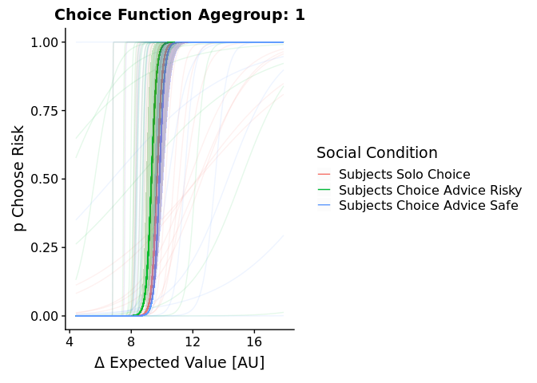
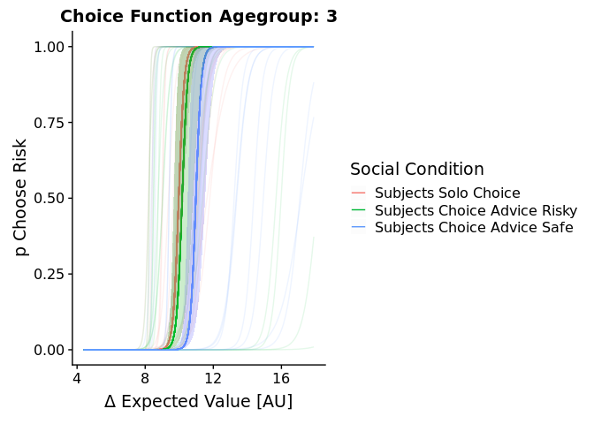

Braams\_PerAge
================
Simon Ciranka
6 11 2018

-   [Braams Data](#braams-data)
    -   ["Stimuli"](#stimuli)
-   [Modelling](#modelling)
    -   [What am I doing here?](#what-am-i-doing-here)
-   [Plot Parameter Erstimates.](#plot-parameter-erstimates.)
-   [Parameter Distributions](#parameter-distributions)
    -   [rho](#rho)
    -   [Tau.](#tau.)
    -   [Beta](#beta)
    -   [Psi Safe Advices](#psi-safe-advices)
    -   [Psi Risky Advices.](#psi-risky-advices.)
        -   [Correlation between safe and Risky OCU?](#correlation-between-safe-and-risky-ocu)
-   [Posterior Predictives](#posterior-predictives)
    -   [Posterior Predictives Plot](#posterior-predictives-plot)
-   [Chocie Functions.](#chocie-functions.)
    -   [Summary Plot](#summary-plot)
    -   [Subjectwise plots](#subjectwise-plots)
    -   [Agent Choice Curve](#agent-choice-curve)

NEWS
====

I added agegroup wise choice curves. For means and errors i computed the mean and the standart error of the mean of the Posterior
Parameters. You can also find the advisors' choice functions in this report. 
This Reports' model assume one Hyperdistribution of Parameters for all subjects. 


Braams Data
===========

``` r
BraamsGamble<-read.csv("RawData/PG_raw_data_combined_cleaned_Wouter.csv")

BraamsGamble<- BraamsGamble%>%dplyr::mutate(
  PeerChoiceSafe0_Risk1 = case_when(
    condition1=="solo" ~ 2,# i dont need this but i restricted the numbers in stan between 1 and 3
    condition1=="socialrisky" ~ 3,# risky choices are coded as 3 in my stan code
    condition1=="socialsafe" ~ 1,# safe choices are coded as 1 in my stan code
    TRUE~0 # keep the rest.
  ),#end PeerChoice.
  typeRA = case_when(
    Ambiguity>0~0,# AMBIGUITY IS RECODED AS 0
    Ambiguity==0~1,# RISK IS RECODED AS 1
    TRUE~0
  ),Agegroup = case_when(
    Age.bins=="12-13"~1,# AMBIGUITY IS RECODED AS 0
    Age.bins=="14-15"~2,# RISK IS RECODED AS 1
    Age.bins=="16-17"~2,
    Age.bins=="16-17"~3,
    Age.bins=="18-19"~3,
    Age.bins=="20-21"~4,
    Age.bins=="22"~4,
    TRUE~0
  ),
  #thats where i calculate the EV.
  EVDiff= case_when(
    Ambiguity>0 ~ ((0.5*Vhighrisky)+((1-0.5)*Vlowrisky))-((0.5*Vhighsafe)+((1-0.5)*Vlowsafe)),#calculate ambiguity neutral expected value
    Ambiguity==0 ~ ((Phigh*Vhighrisky)+((1-Phigh)*Vlowrisky))-((Phigh*Vhighsafe)+((1-Phigh)*Vlowsafe))#calculate risk expected value
  )# end Riskamb
)
#ModelP
# first check if the data looks like in the paper. OK NOW I NEED TO ADD TRIALWISE POSTERIOR PREDICTIVES HERE!
ggplot(BraamsGamble, aes(y=as.numeric(choice),x=as.factor(PeerChoiceSafe0_Risk1)))+
  stat_summary(fun.y = 'mean', fun.ymin = function(x) 0, geom = 'bar', 
               aes(fill =as.factor(PeerChoiceSafe0_Risk1)), position = 'dodge')+
  stat_summary(fun.y = mean, fun.ymin =function(x) mean(x) - 1.960*(sd(x)/sqrt(length(x))), fun.ymax =function(x) mean(x)+ 1.960*(sd(x)/sqrt(length(x))))+
  scale_fill_discrete(name="Social Condition",breaks=c(1,2,3),labels=c("OtherSafe","Solo","OtherRisk"))+
  ylab("% Risky Choice")+
  scale_x_discrete(name="Social Condition",breaks=c(1,2,3),labels=c("OtherSafe","Solo","OtherRisk"))+my_theme
```

 We see that there is a difference in Number of Risky Choice depending on the Advice. If i put this into a linear mixed model we find a significant difference between the advice condition and the Solo Condition. I added Errorbars as the 95%Ci.This looks tricky, because judging from this, the effect seems quite small. Now, in order to split up the age group and get the Continous age back, we need to load another dataset in which all sorts of measures are stored. Then we merge them, so that for further analysis, the exact age is available. At the same time and importantly, we rearrange the data so that it is ordered per age, ascendingly. This is done because we arranged the data like that for fitting the model as well and it will save us a lot of trouble if we have the same structure.

``` r
BraamsGamble<-BraamsGamble%>%arrange(Age.bins)# i order it first so i can make sure that 
Agegroups<-unique(BraamsGamble$Age.bins)# for indexing my agegroups.
```

### "Stimuli"

Since we were investigating the distribution of Expected Value differences (Stimuli in the classical Sense). We can see that there is a slight assymetry in the Stimuli but not a huge one. This means that the Difference in expected Value did overall not have a big influence on what is advised. An Optimal Advice Policy Probably lies in between the two extremes that the two datasets to my disposal represent.

``` r
ggplot(data=BraamsGamble[BraamsGamble$typeRA==1,], aes(EVDiff*10, fill=as.factor(PeerChoiceSafe0_Risk1))) + 
  geom_histogram(bins=100)+facet_grid(.~PeerChoiceSafe0_Risk1)+
  scale_fill_discrete(name="SocialSolo",breaks=c(1,2,3),labels=c("Safe Advice","Solo","Risky Advice"))+ my_theme
```


Next step is again to check if the Advisor shows behaviors that vary systematically with the age of our participants.

``` r
BraamsGamble[BraamsGamble$PeerChoiceSafe0_Risk1!=2,]%>%mutate(PeerChoiceSafe0_Risk1=case_when(PeerChoiceSafe0_Risk1==1 ~0, PeerChoiceSafe0_Risk1==3 ~1)) %>%
  ggplot(aes(y=as.numeric(PeerChoiceSafe0_Risk1),x=as.factor(Agegroup)))+
  stat_summary(fun.y = 'mean', fun.ymin = function(x) 0, geom = 'bar', 
               aes(fill = as.factor(Agegroup)), position = 'dodge')+
  ggtitle("Advisor")+ylab("% Risky (Choice???) Advisor")+
  scale_x_discrete(name="Agegroup")+
  scale_fill_discrete(name="Agegroup")+my_theme
```


This agent chose the Risky Option in 50% of the cases for All Agegroups. This is how its supposed to be i guess.

Modelling
=========

Here too, I compare a Reward Sensitivity Model with a trembling hand Noise model, a OCU model and a null model, in the latest version, I added the Model with that accounts for that safe and risky advice may have assymetric effects on behavior. I omit approximate loo and only focus on DIC. How i compute that is defined in my start\_workflow script. I assumed different hyperdistributions per age but I started with the same priors for each agegroup in order not to bias my analysis before. The script which I used to fit the model on a linux cluster can be found here \[\]LINK and the shell script that sent everything out to the cluster can be found \[\]LINK

What am I doing here?
---------------------

I inspect the folder for how many different agegrops there is a seperate modelfit file and load them. For each age i compute the fit criteria seperately. The structure of the Files is always as follows: Age\[NUMBER\]\_Braams\_ModelFits\[MODELLNAME\]\_Model\[INDEX\].RData

``` r
#First i prepare a structure to add up the DIC.
#Agerange is from 10 to 25. 

#Agegroups=c("12-13","14-15","16-17","18-19","20-21","22")

Agegroups=c("NA") #Change this to ages when you know the Ages. 

Models=c("Info_Model1","Risk_Model2","Noise_Model3","Null_Model4","Sep_Model5")
nGroups=length(Agegroups)
nModels=5
nTrials=180

DICtibble<-tibble(
  Value=rep(NA,(nGroups*nModels)),
  Model=rep(NA,(nGroups*nModels)),
  Group=rep(NA,(nGroups*nModels))
)#setwd(paste0(here(),"/Fit_BraamsensteinData"))
#
tibbleCNT=1;
#########################################
#########################################
for(AgeIDX in 1:nGroups){
  for (ModelIDX in 1:nModels){
    
    load(paste0("Model_Comparison/Age",Agegroups[AgeIDX],"_Braams_ModelFits",Models[ModelIDX],".RData"))# load early adolescents.
    # I have to do this because as a sanity check the Data structure comes with different names for 
    switch(ModelIDX,
           "1"={
             params<-extract(fitInfo)
           },
           "2"={
             params<-extract(fitRisk)
           },
           "3"={
             params<-extract(fitNoise)
           },
           "4"={
             params<-extract(fitNull)
           },
           "5"={
             params<-extract(fitSep)
           }
    )
    
    n=length(params$beta[1,])
    # here i make a matrix that stores all the loglikelhoods in a way that i can pass them to my DIC function... which is written to take the same structure
    # as the waic and the loo function in the loo package
    
    loglik<- array(NA, dim=c(10002*nTrials, 1, n))#dim1=Samples*Trials; dim2=Chains; dim3=Subs
    for(i in 1:n){
      # here i make the vectors that i need for model comparison.
      loglik[,,i]<-as.vector(params$log_lik[,i,])
    }
    # make model comparison.
    DICInfo<-calculateDIC((loglik))
    
    #Add DICs
    DICtibble$Value[tibbleCNT]=mean(DICInfo$DIC)
    DICtibble$Model[tibbleCNT]=ModelIDX
    DICtibble$Group[tibbleCNT]=Agegroups[AgeIDX]
    tibbleCNT=tibbleCNT+1;
    # this is just to see if its doing sth
    print(paste0("Model_Comparison/Age",Agegroups[AgeIDX],"_Braams_ModelFits",Models[ModelIDX],".RData \n Done"))
  }
}
```

    ## [1] "Model_Comparison/AgeNA_Braams_ModelFitsInfo_Model1.RData \n Done"
    ## [1] "Model_Comparison/AgeNA_Braams_ModelFitsRisk_Model2.RData \n Done"
    ## [1] "Model_Comparison/AgeNA_Braams_ModelFitsNoise_Model3.RData \n Done"
    ## [1] "Model_Comparison/AgeNA_Braams_ModelFitsNull_Model4.RData \n Done"
    ## [1] "Model_Comparison/AgeNA_Braams_ModelFitsSep_Model5.RData \n Done"

I the following i compare the different Models via DIC. The smallest value is indicative for the best fitting model. I added the model that assumes seperate Contributions of safe and risky signals. It outperforms the others. But

``` r
ggplot(DICtibble,aes(y=Value,x=Model))+geom_bar(stat="identity")+
  scale_x_continuous(breaks=c(1,2,3,4,5),labels=c("Info","RewSensitivity","TremblingHand","No Influence","Assymetric"))+
  coord_cartesian(ylim=c(164.5,168))+ggtitle("DICs for Braamsenstein et al")+my_theme
```


``` r
Winner<-DICtibble%>%group_by(Model)%>%
  summarise(mean = sum(Value), n = n())%>%
  mutate(Win=case_when(
    (min(mean)==mean)~1,
    (min(mean)!=mean)~0
  )
  )
WinnerIDX<-Winner[Winner$Win==1,]$Model
```

Ok this now looks as if we would be satisfied by this on the first glimpse. Lets check out the individual Parameters of the winning model. This is not the general OCU model anymore but is now the one for seperate Learningrates.

Plot Parameter Erstimates.
==========================

``` r
#setwd(paste0(here(),"/Fit_BraamsensteinData"))

# This only wokrs because i sorted it before for modelfitting. 
# I get an array of Agegroups that i can stick to the 
IdentifierDF<-unique(BraamsGamble%>%group_by(OSFparticipantID)%>%select(OSFparticipantID,Age.bins))
#I look at the null model here because they dont differ so much.

Subjs<-length(unique(BraamsGamble$OSFparticipantID))
RaincloudTibbleBraams<-tibble(
  PostMeanRho=rep(0,Subjs),
  PostVarRho=rep(0,Subjs),
  PostMeanTau=rep(0,Subjs),
  PostVarTau=rep(0,Subjs),
  PostMeanBeta=rep(0,Subjs),
  PostVarBeta=rep(0,Subjs),
  PostMeanPsiSafe=rep(0,Subjs),
  PostVarPsiSafe=rep(0,Subjs),
  PostMeanPsiRisk=rep(0,Subjs),
  PostVarPsiRisk=rep(0,Subjs),
  Group="12-13"
)
i=1;#this is my tibbleIndex
for(AgeIDX in 1:nGroups){
  # okay whatever model i want to look at.
  load(paste0("Model_Comparison/Age",Agegroups[AgeIDX],"_Braams_ModelFits",Models[WinnerIDX],".RData"))
  print(paste0("Processing... \n Age",Agegroups[AgeIDX],"_Braams_ModelFits",Models[WinnerIDX],".RData"))
  params<-extract(fitSep)
  # get means and variance of each agegroup and 
  for (j in 1:length(params$rho[1,])){
    RaincloudTibbleBraams$PostMeanRho[i]=mean(params$rho[,j])
    RaincloudTibbleBraams$PostVarRho[i]=var(params$rho[,j])
    RaincloudTibbleBraams$PostMeanTau[i]=mean(params$tau[,j])
    RaincloudTibbleBraams$PostVarTau[i]=var(params$tau[,j])
    RaincloudTibbleBraams$PostMeanBeta[i]=mean(params$beta[,j])
    RaincloudTibbleBraams$PostVarBeta[i]=var(params$beta[,j])
    RaincloudTibbleBraams$PostMeanPsiSafe[i]=mean(params$ocuSafe[,j])
    RaincloudTibbleBraams$PostVarPsiSafe[i]=var(params$ocuSafe[,j])
    RaincloudTibbleBraams$PostMeanPsiRisk[i]=mean(params$ocuRisk[,j])
    RaincloudTibbleBraams$PostVarPsiRisk[i]=var(params$ocuRisk[,j])
    RaincloudTibbleBraams$Group[i]=IdentifierDF$Age.bins[i]
    i=i+1;
  }#End Entryloop 
}#EndAgeloop
```

    ## [1] "Processing... \n AgeNA_Braams_ModelFitsSep_Model5.RData"

Okay now i want to plot nice fit lines as i do it for the other Dataset so i need to make the Agegroup numeric. Is easiest with jusing dplyr again, as above.

Parameter Distributions
=======================

Now that i obtained the parameter posterior means i now may have a first quick look at the parameter distributions. I use Raincloud plots and Group the Distributions by Age. Because the rainclouds are a little bit overwhelming, we also look only at the means in bar plots and put a fit line over it. The fit lines are either locally weighted scatterplot smoothing or linear fit.

rho
---

``` r
ggplot(RaincloudTibbleBraams,aes(x=as.numeric(Group),y=PostMeanRho, fill = as.factor(Group)))+
  geom_flat_violin(position = position_nudge(x = .35, y = 0),adjust =2,trim = FALSE)+
  geom_point(position = position_jitter(width = .15), size = 1,shape=9)+
  #note that here we need to set the x-variable to a numeric variable and bump it to get the boxplots to line up with the rainclouds. 
  geom_boxplot(aes(x = as.numeric(Group)+.25, y = PostMeanRho), alpha = 0.3, width = .1, colour = "BLACK") +
  ylab(expression(paste("Posterior Mean of ",rho)))+
  scale_x_continuous(name="Age",breaks=c(1,2,3,4,5,6),labels=Agegroups)+
  scale_fill_discrete(name="Age",breaks=c(1,2,3,4,5,6),labels=Agegroups)+
  #coord_flip()+guides(fill = FALSE, colour = FALSE) +
  ggtitle(expression(paste("Mean Posterior Estimates of ",rho," by Agegroup")))+ my_theme
```


``` r
ggplot(RaincloudTibbleBraams,aes(x=as.numeric(Group),y=PostMeanRho))+ geom_point(aes(color=as.factor(Group)),position = position_jitter(width = .25), size = 2,shape=9)+  geom_smooth(method = "lm")+
  scale_color_discrete(name="Age")+
  stat_summary(geom="bar",fun.y=mean,alpha=0.3)+
  stat_summary(geom="pointrange",fun.y=mean,fun.ymin =function(x) mean(x)-sd(x),fun.ymax=function(x) mean(x)+sd(x))+
  ylab(expression(paste("Posterior Mean of ",rho)))+
  guides(fill = FALSE, colour = FALSE)+
  scale_x_continuous(name="Age",breaks=c(1,2,3,4,5,6),labels=Agegroups)+
  ggtitle("Risk Attitude")+ my_theme

ggplot(RaincloudTibbleBraams,aes(x=as.numeric(Group),y=PostVarRho))+ geom_point(aes(color=as.factor(Group)),position = position_jitter(width = .25), size = 2,shape=9)+  geom_smooth(method = "loess")+
  scale_color_discrete(name="Age")+
  ylab(expression(paste("Posterior Mean of ",rho)))+
  scale_x_continuous(name="Age",breaks=c(1,2,3,4,5,6),labels=Agegroups)+
  ggtitle("Posterior Uncertainty About Risk Attitude")+ my_theme
```

 It seems now like young adults have lower risk attitudes than the adolescents and the kids.

Tau.
----

``` r
ggplot(RaincloudTibbleBraams,aes(x=as.numeric(Group),y=PostMeanTau, fill = as.factor(Group)))+
  geom_flat_violin(position = position_nudge(x = .35, y = 0),adjust =2,trim = FALSE)+
  geom_point(position = position_jitter(width = .15), size = 1,shape=9)+
  #note that here we need to set the x-variable to a numeric variable and bump it to get the boxplots to line up with the rainclouds. 
  geom_boxplot(aes(x = as.numeric(Group) +0.25, y = PostMeanTau), alpha = 0.3, width = .1, colour = "BLACK") +
  ylab(expression(paste("Posterior Mean of ",tau)))+
  scale_x_continuous(name="Age",breaks=c(1,2,3,4,5,6),labels=Agegroups)+
  scale_fill_discrete(name="Age",breaks=c(1,2,3,4,5,6),labels=Agegroups)+
  ggtitle(expression(paste("Mean Posterior Estimates of ",tau," by Agegroup")))+ my_theme
```


Again maybe we see it better without all the boxplots.

``` r
ggplot(RaincloudTibbleBraams,aes(x=as.numeric(Group),y=PostMeanTau))+ geom_point(aes(color=as.factor(Group)),position = position_jitter(width = .25), size = 2,shape=9)+ 
  scale_x_continuous(name="Age",breaks=c(1,2,3,4,5,6),labels=Agegroups)+
  stat_summary(geom="bar",fun.y=mean,alpha=0.3)+
  stat_summary(geom="pointrange",fun.y=mean,fun.ymin =function(x) mean(x)-sd(x),fun.ymax=function(x) mean(x)+sd(x))+
  ylab(expression(paste("Posterior Mean of ",tau)))+
  guides(fill = FALSE, colour = FALSE)+
  geom_smooth(method = "lm")+
  ggtitle("Temperature")

ggplot(RaincloudTibbleBraams,aes(x=as.numeric(Group),y=PostVarTau))+ geom_point(aes(color=as.factor(Group)),position = position_jitter(width = .25), size = 2,shape=9)+ 
  scale_x_continuous(name="Age",breaks=c(1,2,3,4,5,6),labels=Agegroups)+
  ylab(expression(paste("Posterior ", sigma, " of ",tau)))+
  geom_smooth(method = "loess")+
  coord_cartesian(ylim=(c(0,10)))+
  ggtitle("Posterior Uncertainty about Temperature")
```

 Hm looks like a linear increase in temperature with age.

Beta
----

``` r
ggplot(RaincloudTibbleBraams,aes(x=as.numeric(Group),y=PostMeanBeta, fill = as.factor(Group)))+
  geom_flat_violin(position = position_nudge(x = .35, y = 0),adjust =2,trim = FALSE)+
  geom_point(position = position_jitter(width = .15), size = 1,shape=9)+
  #note that here we need to set the x-variable to a numeric variable and bump it to get the boxplots to line up with the rainclouds. 
  geom_boxplot(aes(x = as.numeric(Group) +0.25, y = PostMeanBeta), alpha = 0.3, width = .1, colour = "BLACK") +
  ylab(expression(paste("Posterior Mean of ",beta)))+
  scale_x_continuous(name="Age",breaks=c(1,2,3,4,5,6),labels=Agegroups)+
  scale_fill_discrete(name="Age",breaks=c(1,2,3,4,5,6),labels=Agegroups)+
  #coord_flip()+guides(fill = FALSE, colour = FALSE) +
  ggtitle(expression(paste("Ambiguity Aversion")))+ my_theme
```


``` r
ggplot(RaincloudTibbleBraams,aes(x=as.numeric(Group),y=PostMeanBeta))+ 
  stat_summary(geom="bar",fun.y=mean,alpha=0.3)+
  stat_summary(geom="pointrange",fun.y=mean,fun.ymin =function(x) mean(x)-sd(x),fun.ymax=function(x) mean(x)+sd(x))+
  geom_point(aes(color=as.factor(Group)),position = position_jitter(width = .25), size = 2,shape=9)+  geom_smooth(method = "lm")+
  scale_color_discrete(name="Age",breaks=c(1,2,3,4,5,6),labels=Agegroups)+
  scale_x_continuous(name="Age",breaks=c(1,2,3,4,5,6),labels=Agegroups)+
  ylab(expression(paste("Posterior Mean of ",beta)))+
  coord_cartesian(ylim=c(0.39,0.4))
  ggtitle("Ambiguity Aversion")
```

    ## $title
    ## [1] "Ambiguity Aversion"
    ## 
    ## $subtitle
    ## NULL
    ## 
    ## attr(,"class")
    ## [1] "labels"

``` r
ggplot(RaincloudTibbleBraams,aes(x=as.numeric(Group),y=PostVarBeta))+ geom_point(aes(color=as.factor(Group)),position = position_jitter(width = .25), size = 2,shape=9)+  geom_smooth(method = "lm")+
  scale_color_discrete(name="Age",breaks=c(1,2,3,4,5,6),labels=Agegroups)+
  scale_x_continuous(name="Age",breaks=c(1,2,3,4,5,6),labels=Agegroups)+
  ylab(expression(paste("Posterior Mean of ",beta)))+
  ggtitle("Ambiguity Aversion Parameter Uncertainty")
```

 Looks like nothing is going on here, too.

Psi Safe Advices
----------------

``` r
ggplot(RaincloudTibbleBraams,aes(x=as.numeric(Group),y=PostMeanPsiSafe, fill = as.factor(Group)))+
  geom_flat_violin(position = position_nudge(x = .35, y = 0),adjust =2,trim = FALSE)+
  geom_point(position = position_jitter(width = .15), size = 1,shape=9)+
  #note that here we need to set the x-variable to a numeric variable and bump it to get the boxplots to line up with the rainclouds. 
  geom_boxplot(aes(x = as.numeric(Group) +0.25, y = PostMeanPsiSafe), alpha = 0.3, width = .1, colour = "BLACK") +
  ylab(expression(paste("Posterior Mean of ",psi," Safe")))+scale_x_continuous(name="Age")+
  scale_x_continuous(name="Age",breaks=c(1,2,3,4,5,6),labels=Agegroups)+
  scale_fill_discrete(name="Age",breaks=c(1,2,3,4,5,6),labels=Agegroups)+
  #coord_flip()+guides(fill = FALSE, colour = FALSE) +
  ggtitle(expression(paste("Taking Safe Advice")))+ my_theme
```

    ## Scale for 'x' is already present. Adding another scale for 'x', which
    ## will replace the existing scale.


``` r
ggplot(RaincloudTibbleBraams,aes(x=as.numeric(Group),y=PostMeanPsiSafe))+ geom_point(aes(color=as.factor(Group)),position = position_jitter(width = .25), size = 2,shape=9)+  geom_smooth(method = "loess")+
  scale_color_discrete(name="Age",breaks=c(1,2,3,4,5,6),labels=Agegroups)+
  scale_x_continuous(name="Age",breaks=c(1,2,3,4,5,6),labels=Agegroups)+
  stat_summary(geom="bar",fun.y=mean,alpha=0.3)+
  stat_summary(geom="pointrange",fun.y=mean,fun.ymin =function(x) mean(x)-sd(x),fun.ymax=function(x) mean(x)+sd(x))+
  ylab(expression(paste("Posterior Mean of ",psi,"Safe")))+
  ggtitle("Taking Safe Advice Parameter mean")

ggplot(RaincloudTibbleBraams,aes(x=as.numeric(Group),y=PostVarPsiSafe))+ geom_point(aes(color=as.factor(Group)),position = position_jitter(width = .25), size = 2,shape=9)+  geom_smooth(method = "loess")+
  scale_color_discrete(name="Age",breaks=c(1,2,3,4,5,6),labels=Agegroups)+
  scale_x_continuous(name="Age",breaks=c(1,2,3,4,5,6),labels=Agegroups)+
  ylab(expression(paste("Posterior ", sigma, " of ",psi,"Safe")))+
  ggtitle("Taking Safe Advice Parameter Uncertainty")
```

 In agreement with what was reported in teh paper; my model also says Safe Advices have the greatest impact in the younger agegroups and then become smaller

Psi Risky Advices.
------------------

``` r
ggplot(RaincloudTibbleBraams,aes(x=as.numeric(Group),y=PostMeanPsiRisk, fill = as.factor(Group)))+
  geom_flat_violin(position = position_nudge(x = .35, y = 0),adjust =2,trim = FALSE)+
  geom_point(position = position_jitter(width = .15), size = 1,shape=9)+
  #note that here we need to set the x-variable to a numeric variable and bump it to get the boxplots to line up with the rainclouds. 
  geom_boxplot(aes(x = as.numeric(Group) +0.25, y = PostMeanPsiRisk), alpha = 0.3, width = .1, colour = "BLACK") +
  ylab(expression(paste("Posterior Mean of ",psi,"Risky")))+
  scale_x_continuous(name="Age",breaks=c(1,2,3,4,5,6),labels=Agegroups)+
  scale_fill_discrete(name="Age",breaks=c(1,2,3,4,5,6),labels=Agegroups)+
  ggtitle(expression(paste("Taking Risky Advice")))+ my_theme
```


``` r
ggplot(RaincloudTibbleBraams,aes(x=as.numeric(Group),y=PostMeanPsiRisk))+ geom_point(aes(color=as.factor(Group)),position = position_jitter(width = .25), size = 2,shape=9)+  geom_smooth(method = "lm")+
  scale_color_discrete(name="Age",breaks=c(1,2,3,4,5,6),labels=Agegroups)+
  scale_x_continuous(name="Age",breaks=c(1,2,3,4,5,6),labels=Agegroups)+
  stat_summary(geom="bar",fun.y=mean,alpha=0.3)+
  stat_summary(geom="pointrange",fun.y=mean,fun.ymin =function(x) mean(x)-sd(x),fun.ymax=function(x) mean(x)+sd(x))+
  ylab(expression(paste("Posterior Mean of ",psi,"Risky")))+
    guides(fill = FALSE, colour = FALSE)+
  ggtitle("Taking Risky Advice")

ggplot(RaincloudTibbleBraams,aes(x=as.numeric(Group),y=PostVarPsiRisk))+ geom_point(aes(color=as.factor(Group)),position = position_jitter(width = .25), size = 2,shape=9)+  geom_smooth(method = "lm")+
  scale_color_discrete(name="Age",breaks=c(1,2,3,4,5,6),labels=Agegroups)+
  scale_x_continuous(name="Age",breaks=c(1,2,3,4,5,6),labels=Agegroups)+
  ylab(expression(paste("Posterior Var of ",psi,"Risky")))+
  ggtitle("Taking Risky Advice Parameter Uncertainty")
```

 The Agetred generally looks similar to the one reported in the paper. It does not seem as if there is a huge effect going on here in terms of but from eyeballing, one could think that OCU\_Safe and OCU\_Risk are anticorrelated.

### Correlation between safe and Risky OCU?

``` r
ggplot(RaincloudTibbleBraams,aes(x=PostMeanPsiSafe,y=PostMeanPsiRisk))+ 
  geom_point(aes(color=as.factor(Group)))+
  geom_smooth(method="lm")+
  scale_color_discrete(name="Age",breaks=c(1,2,3,4,5,6),labels=Agegroups)+
  ylab(expression(paste(psi, "Risk")))+
  xlab(expression(paste(psi, "Safe")))+
  ggtitle("Correlation Psi Risk & Safe")
```


Posterior Predictives
=====================

Posterior Predictives are an important indicator as to what is Now lets see if we can add the posterior Predictives. For this i first reorder the data so that i can just glue the mean of my y\_pred matrix onto the whole Dataframe that i used ti make the plot before.

``` r
Agegroups<-NA

GroupedBraams<-BraamsGamble%>% 
  group_by(Age.bins)%>%arrange((Age.bins))
GroupedBraams$rho<-NA
GroupedBraams$tau<-NA
GroupedBraams$beta<-NA

subz<-unique(GroupedBraams$OSFparticipantID)
for(i in 1:length(subz)){
  GroupedBraams[GroupedBraams$OSFparticipantID==subz[i],]$rho<-RaincloudTibbleBraams$PostMeanRho[i]
  GroupedBraams[GroupedBraams$OSFparticipantID==subz[i],]$tau<-RaincloudTibbleBraams$PostMeanTau[i]
  GroupedBraams[GroupedBraams$OSFparticipantID==subz[i],]$beta<-RaincloudTibbleBraams$PostMeanBeta[i]
}
GroupedBraams$meanPostPred<-NA

for(AgeIDX in 1:nGroups){
  # okay whatever model i want to look at.
  #i should´ve saved this but i didnt k.
  load(paste0("Model_Comparison/Age",Agegroups[AgeIDX],"_Braams_ModelFits",Models[WinnerIDX],".RData"))
  print(paste0("Processing... \n Age",Agegroups[AgeIDX],"_Braams_ModelFits",Models[WinnerIDX],".RData"))
 # subz<-unique(GroupedBraams[GroupedBraams$Age.bins==Agegroups[AgeIDX],]$OSFparticipantID)
  subz<-unique(GroupedBraams$OSFparticipantID)
  params<-extract(fitSep)
  for(i in 1:length(subz)){
    #data=GroupedBraams[GroupedBraams$OSFparticipantID==subz[i],]#subset
    postPred<-params$y_pred[,i,]
    #-1 refers a the dummy that was used in stan. only use the ones where it worked. This Means: Use Only these Rows and Columns for Replacement that are not the Dummy anymore.
    GroupedBraams[GroupedBraams$OSFparticipantID==subz[i],]$meanPostPred<-apply(postPred[postPred[,1]!=-1,postPred[1,]!=-1],2,mean)#attach the simulations and use the mean of the choices.
  }#endSubzPerAge
}#endAgeloop
```

    ## [1] "Processing... \n AgeNA_Braams_ModelFitsSep_Model5.RData"

Posterior Predictives Plot
--------------------------

In the Following Plot you can see the mean of Risky Choice depending on the Advice Condition in Black. Blue dots correspond to model Predictions under the full Posterior. Errorbars are the 95% CI. While all the Model Predicions are within the 95% CI of the data, there seems to be some Bias. The Absoulte Bias is relatively small, the Predictions are odd no more than 1% but if we zoom in like this, it seems quite larger than it is.

``` r
# first check if the data looks like in the paper. OK NOW I NEED TO ADD TRIALWISE POSTERIOR PREDICTIVES HERE!
ggplot(GroupedBraams, aes(y=as.numeric(choice),x=as.factor(PeerChoiceSafe0_Risk1)))+
  
  stat_summary(fun.y = 'mean', fun.ymin = function(x) 0, geom = 'bar', position = 'dodge')+
  stat_summary(fun.y = mean, fun.ymin =function(x) mean(x) - 1.960*(sd(x)/sqrt(length(x))), fun.ymax =function(x) mean(x)+ 1.960*(sd(x)/sqrt(length(x))))+
  #add posterior predictives
  stat_summary( mapping = aes (y = meanPostPred ),fun.y = mean,
                fun.ymin =function(x) mean(x) -  1.960*(sd(x)/sqrt(length(x))), fun.ymax =function(x) mean(x)+  1.960*(sd(x)/sqrt(length(x))),
                size=0.5, 
                position = position_nudge(x = -0.1),color="blue") + 
  #scale_fill_discrete(name="Social Condition",breaks=c(1,2,3),labels=c("OtherSafe","Solo","OtherRisk"))+
  ylab("% Risky Choice")+
  coord_cartesian(ylim=c(0.275,0.37))+
  scale_x_discrete(name="Social Condition",breaks=c(1,2,3),labels=c("OtherSafe","Solo","OtherRisk"))+
  ggtitle("Data & Posterior Predictives")+
  my_theme
```


Chocie Functions.
=================

In the following i use the Posterior parameter estimates and make the sigmoid choice functions of my age groups. I use the Same function as for Blankenstein et al but maybe i should modify it? Since there are fewer Subjects & fewer trials the aggregate choice functions look funny. They depict the depending on condition. Since certainty equivalent as a safe alternative as it is used in Blankenstein et al comes with different predictions as compared to the lower outcome variance as "safe" alternative used in this paper. [Therefore i wrote another function to plot the Choice functions](Helpers/plotProbFunBraams.R).

``` r
source("Helpers/plotProbFunBraams.R")
RaincloudTibbleBraams$OSFparticipantID=NA# make OSFparticipantID
RaincloudTibbleBraams$OSFparticipantID=1:length(RaincloudTibbleBraams$PostMeanRho)
subz=unique(RaincloudTibbleBraams$OSFparticipantID)
#for subsetting. eah i know its pointless but still.
data=RaincloudTibbleBraams[RaincloudTibbleBraams$OSFparticipantID==subz[1],]#subset
data$ppn=subz[1]
AllSubs<-plotProbFunRiskBraams(data)
for(i in 2:length(subz)){
  data=RaincloudTibbleBraams[RaincloudTibbleBraams$OSFparticipantID==subz[i],]#subset
  data$ppn=subz[i]
  Onesub<-plotProbFunRiskBraams(data)
  AllSubs<-rbind(AllSubs,Onesub)
}
```

Summary Plot
------------

This was actually quite trickey. To plot a summary line for the different subject groups, i this we take the mean of each Agegroups Parameter estimates and make new nice choice functions. To get the errors, we will do this as well with the lower and upper 95%ci of the parameter Esitmaties. In the Plots dotted and dased lines correspond to predictions that are made under the upper and lower confidence parameter estimate as calculated by obtaining the standart error of the mean of each parameter estimate. Solid lines are the predictions under mean values. .. I was thinking... Maybe, to illustrate my point i should not allow different slopes here and only use the errors of the OCU parameters, otherwise it is very tricky to read.

``` r
rhos<-c("meanRho","minciRho","maxciRho","Group")
betas<-c("meanBeta","minciBeta","maxciBeta","Group")
taus<-c("meanTau","minciTau","maxciTau","Group")
PsiSafe<-c("meanPsiSafe","minciPsiSafe","maxciPsiSafe","Group")
PsiRisk<-c("meanPsiRisk","minciPsiRisk","maxciPsiRisk","Group")


MeansAndCIs<-RaincloudTibbleBraams%>%group_by(Group)%>%summarise(
  meanRho=mean(PostMeanRho),
  minciRho=mean(PostMeanRho)-sd(PostMeanRho)/sqrt(n()),
  maxciRho=mean(PostMeanRho)+sd(PostMeanRho)/sqrt(n()),
  meanBeta=mean(PostMeanBeta),
  minciBeta=mean(PostMeanBeta)-sd(PostMeanBeta)/sqrt(n()),
  maxciBeta=mean(PostMeanBeta)+sd(PostMeanBeta)/sqrt(n()),
  meanTau=mean(PostMeanTau),
  minciTau=mean(PostMeanTau)-sd(PostMeanTau)/sqrt(n()),
  maxciTau=mean(PostMeanTau)+sd(PostMeanTau)/sqrt(n()),
  meanPsiSafe=mean(PostMeanPsiSafe),
  minciPsiSafe=mean(PostMeanPsiSafe)-sd(PostMeanPsiSafe)/sqrt(n()),
  maxciPsiSafe=mean(PostMeanPsiSafe)+sd(PostMeanPsiSafe)/sqrt(n()),
  meanPsiRisk=mean(PostMeanPsiRisk),
  minciPsiRisk=mean(PostMeanPsiRisk)-sd(PostMeanPsiRisk)/sqrt(n()),
  maxciPsiRisk=mean(PostMeanPsiRisk)+sd(PostMeanPsiRisk)/sqrt(n())
)

Rhos.long<-gather(MeansAndCIs[rhos],key="Subgroup",value="PostMeanRho",values=c(rhos[1:3]))
Betas.long<-gather(MeansAndCIs[betas],key="Subgroup",value="PostMeanBeta",values=c(betas[1:3]))
Tau.long<-gather(MeansAndCIs[taus],key="Subgroup",value="PostMeanTau",values=c(taus[1:3]))
PsiSafe.long<-gather(MeansAndCIs[PsiSafe],key="Subgroup",value="PostMeanPsiSafe",values=c(PsiSafe[1:3]))
PsiRisk.long<-gather(MeansAndCIs[PsiRisk],key="Subgroup",value="PostMeanPsiRisk",values=c(PsiRisk[1:3]))

#IDK WHAT THAT IS.... but maybe ill need it at some point again. 
# MeanSubs<-merge(Rhos.long, Betas.long, by.x="Group", by.y="Group")%>%
#   merge(Tau.long,by.x="Group", by.y="Group")%>%
#   merge(PsiSafe.long,by.x="Group", by.y="Group")%>%
#   merge(PsiRisk.long,by.x="Group", by.y="Group")

MeanSubs<-cbind(Rhos.long,Betas.long,Tau.long,PsiSafe.long,PsiRisk.long)
```

In this piece of code, i make the Choice Functions for the Mean and the upper and lower standart error bound of the parameter estimates.

``` r
Groups=unique(MeanSubs$Group)
subz=1:3
#for subsetting. eah i know its pointless but still.
Gdata<-MeanSubs[MeanSubs$Group==Groups[1],]#subset
Gdata$ppn<-1:length(Gdata$Group)
data<-data[Gdata$ppn==subz[1],]
```

    ## Warning: Length of logical index must be 1, not 3

``` r
AggregateSub<-plotProbFunRiskBraams(data)
AllAggregates=AggregateSub
#AllSubs$ppn=subz[1]
for(i in 1:length(Groups)){
  
  Gdata<-MeanSubs[MeanSubs$Group==Groups[i],]#subset the Groups
  Gdata$ppn<-1:length(Gdata$Group)# give the data a ppn
  
  for(sIDX in 1:length(subz)){
    
    data<-Gdata[Gdata$ppn==subz[sIDX],]#subset the Group
    AggregateSub<-plotProbFunRiskBraams(data)
    AllAggregates<-rbind(AllAggregates, AggregateSub)
  }
}
# NOTE: PPN IS 1:MEAN, 2 LOWR CI 3 UPPER CI
```

Now Having this i need to Glue it bacak together Otherwise i can not make shaded errors and the Plotting looks really Awful an i cant make Legends and so on. For this down here i build a Monsterloop that goes through all the Choice Curves of all subjects and add the mean and the Upper and Lower Bounds in a seperate Column that i define above.

``` r
AllSubs$MeanGroup<-NA
AllSubs$Lower<-NA
AllSubs$Upper<-NA
 # This takes the unique entries of the Aggregate data and ONLY takes teh subset that is not NA.
conditions<-c("ProbChooseRiskLonely","ProbChooseRiskSocial","ProbChooseRiskSocialSafe")
PPNs<-unique(AllSubs$ppn)

for(Condi in 1:length(conditions)){
    for (i in 1:length(PPNs)){
      AllSubs[AllSubs$condition==conditions[Condi] & AllSubs$ppn==PPNs[i],]$MeanGroup=
                 AllAggregates[AllAggregates$condition==conditions[Condi] & AllAggregates$Age==unique(AllSubs[AllSubs$condition==conditions[Condi] & AllSubs$ppn==PPNs[i],]$Age) & AllAggregates$ppn==1,]$measurement#[1:1000]
               #add lower bound choice curve
               AllSubs[AllSubs$condition==conditions[Condi] & AllSubs$ppn==PPNs[i],]$Lower=
                 AllAggregates[AllAggregates$condition==conditions[Condi] & AllAggregates$Age==unique(AllSubs[AllSubs$condition==conditions[Condi] & AllSubs$ppn==PPNs[i],]$Age) & AllAggregates$ppn==2,]$measurement#[1:1000]
               #add upper bound choice curve
                AllSubs[AllSubs$condition==conditions[Condi] & AllSubs$ppn==PPNs[i],]$Upper=
                 AllAggregates[AllAggregates$condition==conditions[Condi] & AllAggregates$Age==unique(AllSubs[AllSubs$condition==conditions[Condi] & AllSubs$ppn==PPNs[i],]$Age) & AllAggregates$ppn==3,]$measurement#[1:1000]
    }
}#endgroups
```

Subjectwise plots
-----------------

``` r
for (AgeIDX in 1:length(Groups)){
  p<-ggplot(AllSubs[AllSubs$Age==Groups[AgeIDX]&AllSubs$condition!="ProbChooseRiskAgent",],
       aes(x=deltaEV,y=measurement,color=as.factor(condition),group=interaction(ppn,condition)))+geom_line(alpha=0.1)+
  geom_line(aes(x=deltaEV,y=MeanGroup))+geom_ribbon(aes(ymin = Lower, ymax= Upper,fill=as.factor(condition)),alpha=0.01,linetype=0)+
    #geom_point(aes(color=as.factor(condition),fill=as.factor(condition)), alpha=0,size=0)+
    scale_color_discrete(name="Social Condition",breaks=c("ProbChooseRiskAgent","ProbChooseRiskLonely","ProbChooseRiskSocial","ProbChooseRiskSocialSafe"),labels=c("Advisors Choice","Subjects Solo Choice","Subjects Choice Advice Risky","Subjects Choice Advice Safe"))+
    guides(fill=FALSE)+
    ylab("p Choose Risk")+
    xlab(expression(paste(Delta, " Expected Value [AU]")))+
    ggtitle(paste0("Choice Function Agegroup: ", Groups[AgeIDX]))+my_theme
  print(p)
  
}
```



Agent Choice Curve
------------------

In their paper, they used three different agents, one Random, one Risky and One Safe Agent. I did fit the normal expected Utility model to the Agents Choices - Which is a stimulus to the participant. I did this [here](./FitModel/Braams_peer.R). There you can see how which index referrs to wich agent but for clairity lets repeat this: 1)Risky Peer (75% Risky Choice) 2)Random Peer (50% Risky Choice) 3)Safe Peer (25% Risky Choice)

In the Table Below you can see the Parameter estimates. Note the High Variance and for the Temperature Parameter, Tau. Choices have been seleceted Randomly. Pooled over all participants this results in *all agents* getting very high reward sensitvity parameters. Before again making broad claims about that sth is seriously off there, i would like to check the sanity of this before though.

``` r
#setwd(paste0(here(),"/Fit_BraamsensteinData"))

#I look at the null model here because they dont differ so much.

Subjs<-3
BraamsAgent<-tibble(
  PostMeanRho=rep(0,Subjs),
  PostVarRho=rep(0,Subjs),
  PostMeanTau=rep(0,Subjs),
  PostVarTau=rep(0,Subjs),
  PostMeanBeta=rep(0,Subjs),
  PostVarBeta=rep(0,Subjs),
  Group=rep(0,Subjs)
)
i=1;#this is my tibbleIndex
  # okay whatever model i want to look at.
  load(paste0("Model_Comparison/Agent_Braams_ModelFitsNull_Model.RData"))
  #print(paste0("Processing... \n Age",Agegroups[AgeIDX],"_Braams_ModelFits",Models[WinnerIDX],".RData"))
  params<-extract(fitAgent)
  # get means and variance of each agegroup and 
  for (j in 1:length(params$rho[1,])){
    BraamsAgent$PostMeanRho[j]=mean(params$rho[,j])
    BraamsAgent$PostVarRho[j]=var(params$rho[,j])
    BraamsAgent$PostMeanTau[j]=mean(params$tau[,j])
    BraamsAgent$PostVarTau[j]=var(params$tau[,j])
    BraamsAgent$PostMeanBeta[j]=mean(params$beta[,j])
    BraamsAgent$PostVarBeta[j]=var(params$beta[,j])
    BraamsAgent$Group[j]=j
   # i=i+1;
  }#End Entryloop 
  
  BraamsAgent%>%mutate(Group=case_when(
    Group=="1"~ "RiskyPeer",
    Group=="2"~ "RandomPeer",
    Group=="3"~ "SafePeer"
  ))
```

    ## # A tibble: 3 x 7
    ##   PostMeanRho PostVarRho PostMeanTau PostVarTau PostMeanBeta PostVarBeta
    ##         <dbl>      <dbl>       <dbl>      <dbl>        <dbl>       <dbl>
    ## 1        1.47     0.0898        2.80       7.17      0.00192       0.171
    ## 2        1.47     0.0892        2.82       7.31      0.00375       0.170
    ## 3        1.47     0.0898        2.81       7.12      0.00125       0.171
    ## # ... with 1 more variable: Group <chr>

``` r
knitr::kable(BraamsAgent)
```

|  PostMeanRho|  PostVarRho|  PostMeanTau|  PostVarTau|  PostMeanBeta|  PostVarBeta|  Group|
|------------:|-----------:|------------:|-----------:|-------------:|------------:|------:|
|     1.466541|   0.0898271|     2.801950|    7.171265|     0.0019203|    0.1708076|      1|
|     1.469213|   0.0892050|     2.819368|    7.307812|     0.0037503|    0.1699651|      2|
|     1.468530|   0.0897944|     2.813866|    7.121018|     0.0012512|    0.1710522|      3|

If i plot the Advisors Utility Functions, we can see that they actuallly overlap completely. You can look at the function i used to plot these Utility curves [Here](Helpers/plotProbFunBraams.R)

``` r
Agent1<-plotProbFunRiskAgentBraams(alpha = BraamsAgent$PostMeanRho[1],theta = BraamsAgent$PostMeanTau[1])
Agent2<-plotProbFunRiskAgentBraams(alpha = BraamsAgent$PostMeanRho[2],theta = BraamsAgent$PostMeanTau[2])
Agent3<-plotProbFunRiskAgentBraams(alpha = BraamsAgent$PostMeanRho[3],theta = BraamsAgent$PostMeanTau[3])

ggplot(Agent1,aes(x=deltaEV,y=measurement,color=as.factor(condition),fill=as.factor(condition)))+
geom_line(aes(x=deltaEV,y=measurement,color="green"),size=0.3,data=Agent1)+
  geom_line(aes(x=deltaEV,y=measurement,color="blue"),size=0.3,data=Agent2)+
    geom_line(aes(x=deltaEV,y=measurement,color="red"),size=0.3,data=Agent3)+
  scale_color_discrete(name="Advisor Identitiy",breaks=c("blue","green","red"),labels=c("RandomAgent","RiskyAgent","SafeAgent"))+
  ggtitle("Advisor Choice Function")+
my_theme
```


