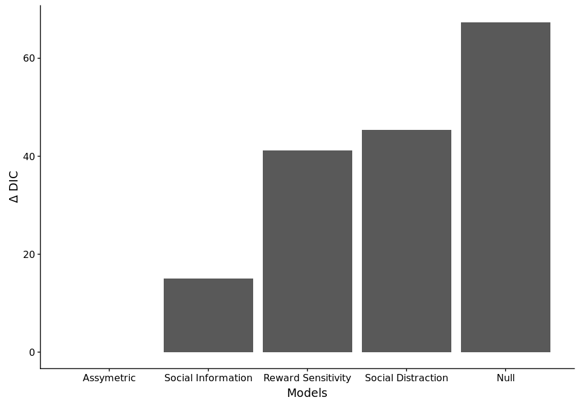
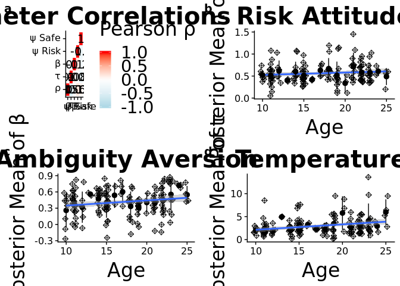
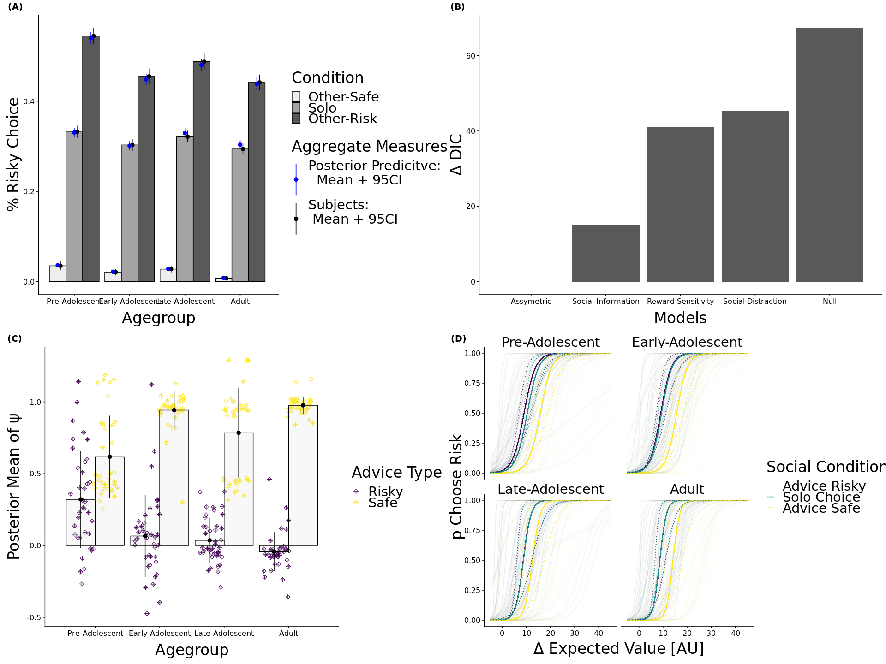
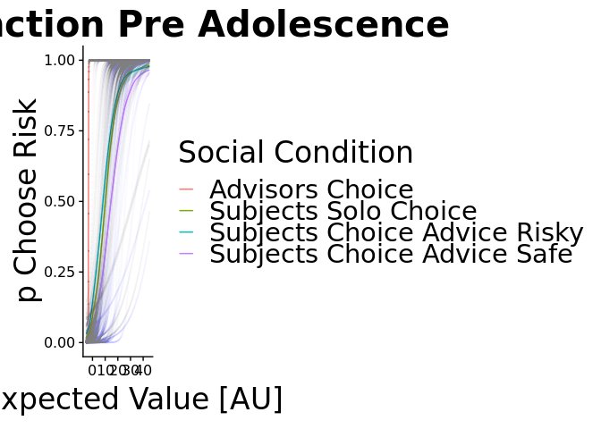
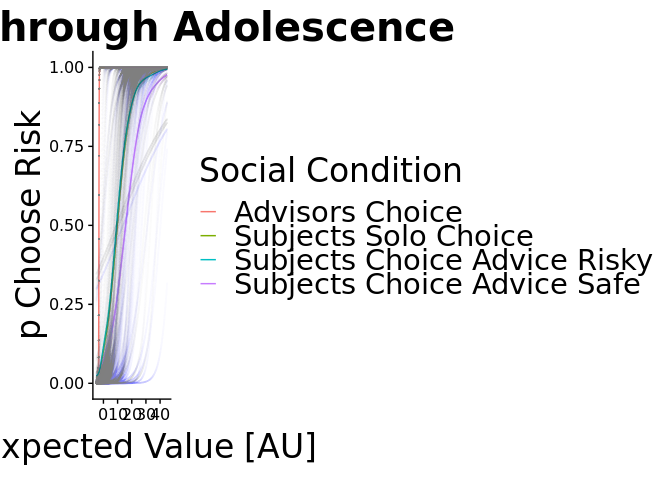
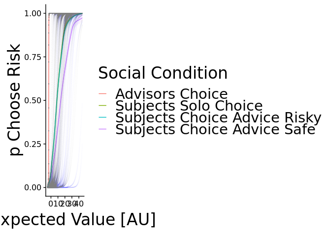

Blankenstein\_All\_Agegroups
================
Simy
24 10 2018

-   [News](#news)
-   [Blankenstein Data](#blankenstein-data)
    -   [Choices.](#choices.)
    -   ["Stimuli"](#stimuli)
-   [Modelling](#modelling)
    -   [What am I doing here?](#what-am-i-doing-here)
-   [Model Comparison via DIC](#model-comparison-via-dic)
-   [Percent per Agegroup](#percent-per-agegroup)
-   [Parameter Correlations](#parameter-correlations)
    -   [rho](#rho)
    -   [Tau.](#tau.)
    -   [Beta](#beta)
-   [Panel](#panel)
    -   [Psi Risky & Safe](#psi-risky-safe)
    -   [A small regression](#a-small-regression)
    -   [Psi Sum of Risk and Safe Advices.](#psi-sum-of-risk-and-safe-advices.)
-   [Posterior Predictives](#posterior-predictives)
    -   [Plot](#plot)
-   [Chocie Functions.](#chocie-functions.)
-   [Individual Choice Curves are made here.](#individual-choice-curves-are-made-here.)
-   [Aggregate Choice Curves down there.](#aggregate-choice-curves-down-there.)
    -   [Choice Function All Agegroups.](#choice-function-all-agegroups.)
-   [I do the same but get the mean of all subjects and dont make seperate Plots for each group.](#i-do-the-same-but-get-the-mean-of-all-subjects-and-dont-make-seperate-plots-for-each-group.)
    -   [Choice Function All Agegroups.](#choice-function-all-agegroups.-1)
-   [Here I make the Main Plot.](#here-i-make-the-main-plot.)
    -   [Agents Choice Function.](#agents-choice-function.)
-   [Chocie Functions - How i did it before.](#chocie-functions---how-i-did-it-before.)
    -   [Choice Function Kids Agegroup.](#choice-function-kids-agegroup.)
    -   [Choice Function "Adolescent" Agegroup.](#choice-function-adolescent-agegroup.)
    -   [Choice Function "Post Adolescent" Agegroup.](#choice-function-post-adolescent-agegroup.)

``` r
knitr::opts_chunk$set(echo = TRUE)
#knitr::opts_chunk$set(dev = c('png'))
library(here)
```

    ## here() starts at /home/ciranka/Users/CirankaSimon/Projects/OCU_Clean/D_Fit_BlankensteinData

``` r
setwd(here())
library(tidyverse)
```

    ## ── Attaching packages ───────────────────────────────────────────────────────────────────────────────────── tidyverse 1.2.1 ──

    ## ✔ ggplot2 3.1.0       ✔ purrr   0.3.0  
    ## ✔ tibble  2.0.1       ✔ dplyr   0.8.0.1
    ## ✔ tidyr   0.8.2       ✔ stringr 1.3.1  
    ## ✔ readr   1.3.1       ✔ forcats 0.4.0

    ## ── Conflicts ──────────────────────────────────────────────────────────────────────────────────────── tidyverse_conflicts() ──
    ## ✖ dplyr::filter() masks stats::filter()
    ## ✖ dplyr::lag()    masks stats::lag()

``` r
library(lme4)
```

    ## Loading required package: Matrix

    ## 
    ## Attaching package: 'Matrix'

    ## The following object is masked from 'package:tidyr':
    ## 
    ##     expand

``` r
#source("simulateData.R")
#source("/Users/ciranka/Documents/Projects/work_in_Progress/!HelperFunctions/Start_Workflow.R")
#source("plotProbFunRisk.R")

# first i need to extract the parameter values i dummy load the first dataset

packages <- c("ggplot2", "dplyr", "lavaan", "plyr", "cowplot", "rmarkdown", 
              "readr", "caTools", "bitops","reshape2")

if (length(setdiff(packages, rownames(installed.packages()))) > 0) {
  install.packages(setdiff(packages, rownames(installed.packages())))  
}

library(rstan)
```

    ## Loading required package: StanHeaders

    ## rstan (Version 2.18.2, GitRev: 2e1f913d3ca3)

    ## For execution on a local, multicore CPU with excess RAM we recommend calling
    ## options(mc.cores = parallel::detectCores()).
    ## To avoid recompilation of unchanged Stan programs, we recommend calling
    ## rstan_options(auto_write = TRUE)

    ## 
    ## Attaching package: 'rstan'

    ## The following object is masked from 'package:tidyr':
    ## 
    ##     extract

``` r
library(dplyr)
library(readr)
library(loo)
```

    ## This is loo version 2.0.0.
    ## **NOTE: As of version 2.0.0 loo defaults to 1 core but we recommend using as many as possible. Use the 'cores' argument or set options(mc.cores = NUM_CORES) for an entire session. Visit mc-stan.org/loo/news for details on other changes.

    ## 
    ## Attaching package: 'loo'

    ## The following object is masked from 'package:rstan':
    ## 
    ##     loo

``` r
library(Hmisc)
```

    ## Loading required package: lattice

    ## Loading required package: survival

    ## Loading required package: Formula

    ## 
    ## Attaching package: 'Hmisc'

    ## The following objects are masked from 'package:dplyr':
    ## 
    ##     src, summarize

    ## The following objects are masked from 'package:base':
    ## 
    ##     format.pval, units

``` r
source("Helpers/Start_Workflow.R")
source("Helpers/R_rainclouds.R")
source("Helpers/summarySE.R")
#library(corrr)
library(here)
library(knitr)
library(stringr)
library(sigmoid)
library(reshape2)
```

    ## 
    ## Attaching package: 'reshape2'

    ## The following object is masked from 'package:tidyr':
    ## 
    ##     smiths

``` r
library("RColorBrewer")
library(rstanarm)
```

    ## Loading required package: Rcpp

    ## rstanarm (Version 2.18.2, packaged: 2018-11-08 22:19:38 UTC)

    ## - Do not expect the default priors to remain the same in future rstanarm versions.

    ## Thus, R scripts should specify priors explicitly, even if they are just the defaults.

    ## - For execution on a local, multicore CPU with excess RAM we recommend calling

    ## options(mc.cores = parallel::detectCores())

    ## - Plotting theme set to bayesplot::theme_default().

    ## 
    ## Attaching package: 'rstanarm'

    ## The following object is masked from 'package:rstan':
    ## 
    ##     loo

``` r
library(cowplot)
```

    ## 
    ## Attaching package: 'cowplot'

    ## The following object is masked from 'package:ggplot2':
    ## 
    ##     ggsave

``` r
theme_set(theme_cowplot())

###### these tow functions where once used to make half correlation Matrixes.
#But now not anymore.
get_lower_tri<-function(cormat){
  cormat[upper.tri(cormat)] <- NA
  return(cormat)
}

get_upper_tri <- function(cormat){
  cormat[lower.tri(cormat)]<- NA
  return(cormat)
}

# Loads the results of my stan 
```

News
====

I found quite a bug in my code that attenuated all Ambiguity parameter estimates. I realized it when i looked ad Parameter Correlations (Added A Matrix now.) I changed it now. and now there is more variance and the parameter Estiamtes look less suspicious. I implemented a model that assumes one hyperdistribution and compared it against a mode that assumes a separate hyperdistribution for parameters depending on age. The Model that assumes and estimates seperate hyperdistribtuions wins. Further i made new sigmoid plots for Agegroups. For this i used the standart error of the mean for errors and the mean of the posterior parameter estimates for the mean lines per agegroup.

Blankenstein Data
=================

``` r
# okay i want to get rid of the whole stuff that ive loaded bc it will kill the cache at some point i think.
#rm(list = ls())
#ok i have to source it again.
#setwd(paste0(here(),"/Fit_BlankensteinData"))
load("Raw_Data/GambleData.RData")
## mutate the Data so that it looks the same as the Blankenstein Data and i have less trouble in fitting my model.
BlankensteinGamble<- ModelParamsFull%>%dplyr::mutate(
  PeerChoiceSafe0_Risk1 = case_when(
    PeerChoiceSafe0_Risk1==99 ~ 2,# i dont need this but i restricted the numbers in stan between 1 and 3
    PeerChoiceSafe0_Risk1==1 ~ 3,# risky choices are coded as 3 in my stan code
    PeerChoiceSafe0_Risk1==0 ~ 1,# safe choices are coded as 1 in my stan code
    TRUE~0 # keep the rest.
  ),#end PeerChoice.
  typeRA = case_when(
    typeRA=='A'~0,# AMBIGUITY IS RECODED AS 0
    typeRA=='R'~1,# RISK IS RECODED AS 1
    TRUE~0
  ),
  EVDiff=EVValueGamble-valueSure,
  Agegroup=as.factor(Agegroup)
  # end Riskamb
)
```

Choices.
--------

In the Bars here, we see the % of Risky Choice depending on whether Choices are made alone or with others.

``` r
# first check if the data looks like in the paper. OK NOW I NEED TO ADD TRIALWISE POSTERIOR PREDICTIVES HERE!
ggplot(BlankensteinGamble, aes(y=as.numeric(choice),x=as.factor(PeerChoiceSafe0_Risk1)))+
  stat_summary(fun.y = 'mean', fun.ymin = function(x) 0, geom = 'bar', 
               aes(fill =as.factor(PeerChoiceSafe0_Risk1)), position = 'dodge')+
  stat_summary(fun.y = mean, fun.ymin =function(x) mean(x) - 1.960*(sd(x)/sqrt(length(x))), fun.ymax =function(x) mean(x)+ 1.960*(sd(x)/sqrt(length(x))))+
  scale_fill_discrete(name="Social Condition",breaks=c(1,2,3),labels=c("OtherSafe","Solo","OtherRisk"))+
  ylab("% Risky Choice")+
  scale_x_discrete(name="Social Condition",breaks=c(1,2,3),labels=c("OtherSafe","Solo","OtherRisk"))
```

 We see that there is a huge difference in Number of Risky Choice depending on the Advice. If i put this into a linear mixed model we find a significant difference between the advice condition and the Solo Condition. I added Errorbars as the 95%Ci.This looks good. So now in order to split up the age group and get the Continous age back, we need to load another dataset in which all sorts of measures are stored. Then we merge them, so that for further analysis, the exact age is available. At the same time and importantly, we rearrange the data so that it is ordered per age, ascendingly. This is done because we arranged the data like that for fitting the model as well and it will save us a lot of trouble if we have the same structure.

``` r
# Get actual Age and not only Agegroup.
AgeAndMore<-read.csv2("Raw_Data/Rest.csv")# This is a df with nusiance. and all the other fun.
AgeAndMore$Age<-round(as.numeric(as.character(AgeAndMore$Age)))
#Arrange it correctly and merge so that i can glue it together later.
BlankensteinGamble<-merge(BlankensteinGamble,AgeAndMore[,c("Age","Subject")] , by.x="ppn", by.y="Subject")%>%arrange(Age)
```

"Stimuli"
---------

Since we were investigating the distribution of Expected Value differences for the Braams Dataset, I think we should do the same here too. We can see that the Distributions are strongly skewed towards the left, meaning that choices that are subject to small differences in expected values (that may result in a risk-averse decision maker to choose the safe option) are overrepresented in the design. A safe Advice was never given when the Difference of Expected value Exeeded 0.

``` r
ggplot(data=BlankensteinGamble[BlankensteinGamble$typeRA==1,], aes(EVDiff, fill=as.factor(PeerChoiceSafe0_Risk1))) + 
  geom_histogram(bins=100)+facet_grid(.~PeerChoiceSafe0_Risk1)+
  scale_fill_discrete(name="SocialSolo",breaks=c(1,2,3),labels=c("Safe Advice","Solo","Risky Advice"))
```


Ok this all looks nice and as if it makes sense. And we knew it before. Another thing we looked at for Braams data is the Choice proportions of the Advisor. We wanted to check if the different Agegroups had systematically saw different things. So lets do it here, too and see if there is something going on. For this i select Data that has been subject to advice and then recode it so that it 0 becomes safe and 1 risk adivce and the mean will now reflect the % of risky advice by agegroup.

``` r
BlankensteinGamble[BlankensteinGamble$PeerChoiceSafe0_Risk1!=2,]%>%mutate(PeerChoiceSafe0_Risk1=case_when(PeerChoiceSafe0_Risk1==1 ~0, PeerChoiceSafe0_Risk1==3 ~1)) %>%
  ggplot(aes(y=as.numeric(PeerChoiceSafe0_Risk1),x=as.factor(Agegroup)))+
  stat_summary(fun.y = 'mean', fun.ymin = function(x) 0, geom = 'bar', 
               aes(fill = as.factor(Agegroup)), position = 'dodge')+
  ggtitle("Advisor")+ylab("% Risky (Choice???) Advisor")+
  scale_x_discrete(name="Agegroup")+
  scale_fill_discrete(name="Agegroup")
```


This agent chose the Risky Option in 60% of the cases for All Agegroups. Since there was a deterministic,risk seeking choice Rule for the advisor this makes sense. So less scepticism here.

Modelling
=========

Lets get down to buisness. I compare a Reward Sensitivity Model with a trembling hand Noise model, a OCU model and a null model, in the latest version, I added the Model with that accounts for that safe and risky advice may have assymetric effects on behavior. I omit approximate loo and only focus on DIC. How i compute that is defined in my start\_workflow script. I assumed different hyperdistributions per age but I started with the same priors for each agegroup in order not to bias my analysis before. The script which I used to fit the model on a linux cluster can be found here \[\]LINK and the shell script that sent everything out to the cluster can be found \[\]LINK

What am I doing here?
---------------------

I inspect the folder for how many different agegrops there is a seperate modelfit file and load them. For each age i compute the fit criteria seperately. The structure of the Files is always as follows: Age\[NUMBER\]\_Blank\_ModelFits\[MODELLNAME\]\_Model\[INDEX\].RData

    ## [1] "Model_Comparison/Age10_Blank_ModelFitsInfo_Model1.RData \n Done"
    ## [1] "Model_Comparison/Age10_Blank_ModelFitsRisk_Model2.RData \n Done"
    ## [1] "Model_Comparison/Age10_Blank_ModelFitsNoise_Model3.RData \n Done"
    ## [1] "Model_Comparison/Age10_Blank_ModelFitsNull_Model4.RData \n Done"
    ## [1] "Model_Comparison/Age10_Blank_ModelFitsSep_Model5.RData \n Done"
    ## [1] "Model_Comparison/Age11_Blank_ModelFitsInfo_Model1.RData \n Done"
    ## [1] "Model_Comparison/Age11_Blank_ModelFitsRisk_Model2.RData \n Done"
    ## [1] "Model_Comparison/Age11_Blank_ModelFitsNoise_Model3.RData \n Done"
    ## [1] "Model_Comparison/Age11_Blank_ModelFitsNull_Model4.RData \n Done"
    ## [1] "Model_Comparison/Age11_Blank_ModelFitsSep_Model5.RData \n Done"
    ## [1] "Model_Comparison/Age12_Blank_ModelFitsInfo_Model1.RData \n Done"
    ## [1] "Model_Comparison/Age12_Blank_ModelFitsRisk_Model2.RData \n Done"
    ## [1] "Model_Comparison/Age12_Blank_ModelFitsNoise_Model3.RData \n Done"
    ## [1] "Model_Comparison/Age12_Blank_ModelFitsNull_Model4.RData \n Done"
    ## [1] "Model_Comparison/Age12_Blank_ModelFitsSep_Model5.RData \n Done"
    ## [1] "Model_Comparison/Age13_Blank_ModelFitsInfo_Model1.RData \n Done"
    ## [1] "Model_Comparison/Age13_Blank_ModelFitsRisk_Model2.RData \n Done"
    ## [1] "Model_Comparison/Age13_Blank_ModelFitsNoise_Model3.RData \n Done"
    ## [1] "Model_Comparison/Age13_Blank_ModelFitsNull_Model4.RData \n Done"
    ## [1] "Model_Comparison/Age13_Blank_ModelFitsSep_Model5.RData \n Done"
    ## [1] "Model_Comparison/Age14_Blank_ModelFitsInfo_Model1.RData \n Done"
    ## [1] "Model_Comparison/Age14_Blank_ModelFitsRisk_Model2.RData \n Done"
    ## [1] "Model_Comparison/Age14_Blank_ModelFitsNoise_Model3.RData \n Done"
    ## [1] "Model_Comparison/Age14_Blank_ModelFitsNull_Model4.RData \n Done"
    ## [1] "Model_Comparison/Age14_Blank_ModelFitsSep_Model5.RData \n Done"
    ## [1] "Model_Comparison/Age15_Blank_ModelFitsInfo_Model1.RData \n Done"
    ## [1] "Model_Comparison/Age15_Blank_ModelFitsRisk_Model2.RData \n Done"
    ## [1] "Model_Comparison/Age15_Blank_ModelFitsNoise_Model3.RData \n Done"
    ## [1] "Model_Comparison/Age15_Blank_ModelFitsNull_Model4.RData \n Done"
    ## [1] "Model_Comparison/Age15_Blank_ModelFitsSep_Model5.RData \n Done"
    ## [1] "Model_Comparison/Age16_Blank_ModelFitsInfo_Model1.RData \n Done"
    ## [1] "Model_Comparison/Age16_Blank_ModelFitsRisk_Model2.RData \n Done"
    ## [1] "Model_Comparison/Age16_Blank_ModelFitsNoise_Model3.RData \n Done"
    ## [1] "Model_Comparison/Age16_Blank_ModelFitsNull_Model4.RData \n Done"
    ## [1] "Model_Comparison/Age16_Blank_ModelFitsSep_Model5.RData \n Done"
    ## [1] "Model_Comparison/Age17_Blank_ModelFitsInfo_Model1.RData \n Done"
    ## [1] "Model_Comparison/Age17_Blank_ModelFitsRisk_Model2.RData \n Done"
    ## [1] "Model_Comparison/Age17_Blank_ModelFitsNoise_Model3.RData \n Done"
    ## [1] "Model_Comparison/Age17_Blank_ModelFitsNull_Model4.RData \n Done"
    ## [1] "Model_Comparison/Age17_Blank_ModelFitsSep_Model5.RData \n Done"
    ## [1] "Model_Comparison/Age18_Blank_ModelFitsInfo_Model1.RData \n Done"
    ## [1] "Model_Comparison/Age18_Blank_ModelFitsRisk_Model2.RData \n Done"
    ## [1] "Model_Comparison/Age18_Blank_ModelFitsNoise_Model3.RData \n Done"
    ## [1] "Model_Comparison/Age18_Blank_ModelFitsNull_Model4.RData \n Done"
    ## [1] "Model_Comparison/Age18_Blank_ModelFitsSep_Model5.RData \n Done"
    ## [1] "Model_Comparison/Age19_Blank_ModelFitsInfo_Model1.RData \n Done"
    ## [1] "Model_Comparison/Age19_Blank_ModelFitsRisk_Model2.RData \n Done"
    ## [1] "Model_Comparison/Age19_Blank_ModelFitsNoise_Model3.RData \n Done"
    ## [1] "Model_Comparison/Age19_Blank_ModelFitsNull_Model4.RData \n Done"
    ## [1] "Model_Comparison/Age19_Blank_ModelFitsSep_Model5.RData \n Done"
    ## [1] "Model_Comparison/Age20_Blank_ModelFitsInfo_Model1.RData \n Done"
    ## [1] "Model_Comparison/Age20_Blank_ModelFitsRisk_Model2.RData \n Done"
    ## [1] "Model_Comparison/Age20_Blank_ModelFitsNoise_Model3.RData \n Done"
    ## [1] "Model_Comparison/Age20_Blank_ModelFitsNull_Model4.RData \n Done"
    ## [1] "Model_Comparison/Age20_Blank_ModelFitsSep_Model5.RData \n Done"
    ## [1] "Model_Comparison/Age21_Blank_ModelFitsInfo_Model1.RData \n Done"
    ## [1] "Model_Comparison/Age21_Blank_ModelFitsRisk_Model2.RData \n Done"
    ## [1] "Model_Comparison/Age21_Blank_ModelFitsNoise_Model3.RData \n Done"
    ## [1] "Model_Comparison/Age21_Blank_ModelFitsNull_Model4.RData \n Done"
    ## [1] "Model_Comparison/Age21_Blank_ModelFitsSep_Model5.RData \n Done"
    ## [1] "Model_Comparison/Age22_Blank_ModelFitsInfo_Model1.RData \n Done"
    ## [1] "Model_Comparison/Age22_Blank_ModelFitsRisk_Model2.RData \n Done"
    ## [1] "Model_Comparison/Age22_Blank_ModelFitsNoise_Model3.RData \n Done"
    ## [1] "Model_Comparison/Age22_Blank_ModelFitsNull_Model4.RData \n Done"
    ## [1] "Model_Comparison/Age22_Blank_ModelFitsSep_Model5.RData \n Done"
    ## [1] "Model_Comparison/Age23_Blank_ModelFitsInfo_Model1.RData \n Done"
    ## [1] "Model_Comparison/Age23_Blank_ModelFitsRisk_Model2.RData \n Done"
    ## [1] "Model_Comparison/Age23_Blank_ModelFitsNoise_Model3.RData \n Done"
    ## [1] "Model_Comparison/Age23_Blank_ModelFitsNull_Model4.RData \n Done"
    ## [1] "Model_Comparison/Age23_Blank_ModelFitsSep_Model5.RData \n Done"
    ## [1] "Model_Comparison/Age24_Blank_ModelFitsInfo_Model1.RData \n Done"
    ## [1] "Model_Comparison/Age24_Blank_ModelFitsRisk_Model2.RData \n Done"
    ## [1] "Model_Comparison/Age24_Blank_ModelFitsNoise_Model3.RData \n Done"
    ## [1] "Model_Comparison/Age24_Blank_ModelFitsNull_Model4.RData \n Done"
    ## [1] "Model_Comparison/Age24_Blank_ModelFitsSep_Model5.RData \n Done"
    ## [1] "Model_Comparison/Age25_Blank_ModelFitsInfo_Model1.RData \n Done"
    ## [1] "Model_Comparison/Age25_Blank_ModelFitsRisk_Model2.RData \n Done"
    ## [1] "Model_Comparison/Age25_Blank_ModelFitsNoise_Model3.RData \n Done"
    ## [1] "Model_Comparison/Age25_Blank_ModelFitsNull_Model4.RData \n Done"
    ## [1] "Model_Comparison/Age25_Blank_ModelFitsSep_Model5.RData \n Done"

Model Comparison via DIC
========================

Ok but we dont want the loo because it is way too strict. So in the following i compare the different Models via DIC. Again, the smallest value is indicative for the best fitting model. I added the model that assumes seperate Contributions of safe and risky signals. It outperforms the others. But not by much. In the Codechunks down here, i save the Winningmodel in order to reload it later on. (I do this reloading not to produce a memory overfloe in Rs Workspace on 32 Bit systems btw.)

``` r
DICtibble=DICtibble[!is.na(DICtibble$Model),]
Argh<-DICtibble%>%group_by(Model)%>%summarise(DICSum=sum(Value))%>%mutate(
  delta=DICSum-min(DICSum,na.rm = T),
  ModelName=case_when(
    Model==1~"Social Information",
    Model==2~"Reward Sensitivity",
    Model==3~"Social Distraction",
    Model==4~"Null",
    Model==5~"Assymetric"
  )
)%>%arrange(delta)%>%mutate(id = row_number())
ggplot(Argh,aes(y=delta,x=id))+geom_bar(stat="identity")+
  scale_x_continuous(name="Models",breaks=c(1,2,3,4,5),labels=Argh$ModelName)+
  ylab(expression(paste(Delta," DIC")))->B
 # coord_flip()+
  #coord_cartesian(ylim=c(2875,2950))+
 # ggtitle("DICs for Blankenstein et al.,(2016)")->B
  print(B)
```



``` r
  ggsave("../X_Figures/Blanky_DIC.pdf",height = 4,width=7)
  
Winner<-DICtibble%>%dplyr::group_by(Model)%>%
  dplyr::summarise(mean = sum(Value), n = dplyr::n()) %>%
  dplyr::mutate(Win=case_when(
    (min(mean)==mean)~1,
    (min(mean)!=mean)~0
  )
  )
WinnerIDX<-Winner[Winner$Win==1,]$Model
```

Percent per Agegroup
====================

Another thing that might be interesting to look at is how many percent of the participants are best described by which model. so lets check.

``` r
DICtibble<-DICtibble[!is.na(DICtibble$Group),]
DICtibble$Bin=NA
#Add them Age Bins
DICtibble[DICtibble$Group<=13,]$Bin<-1
DICtibble[DICtibble$Group<=15 & DICtibble$Group>13,]$Bin<-2
DICtibble[DICtibble$Group<=17 & DICtibble$Group>15,]$Bin<-2
DICtibble[DICtibble$Group<=19 & DICtibble$Group>17,]$Bin<-3
DICtibble[DICtibble$Group<=21 & DICtibble$Group>19,]$Bin<-3
DICtibble[DICtibble$Group>=22,]$Bin<-4

DICtibble<-DICtibble[!is.na(DICtibble$Value),]


DICtibble%>%group_by(Sub)%>%dplyr::mutate(Win=case_when(
  (min(Value)==Value)~1,
  (min(Value)!=Value)~0
)
)%>%ungroup()%>%group_by(Bin,Model)%>%summarise(
  NumberWinner=sum(Win),
  n=n(),
  PercentWinner=sum(Win)/n()*100
)%>%ggplot(aes(y=PercentWinner,x=as.factor(Bin),fill=as.factor(Model)))+geom_bar(stat="identity")+
    scale_fill_discrete(name="Modelspace",breaks=c(1,2,3,4,5),labels=c("Info","RewSensitivity","TremblingHand","No Influence","Assymetric"))+scale_x_discrete(name="Age",breaks=c(1,2,3,4),labels=c(">13","14-17","17-21",">=22"))
```


``` r
  ggsave("../X_Figures/Blanky_ModelPercent.pdf",height = 5,width=6.5)
```

So over all it seems like the Assymetric Weights model is the best and yep it is.

Ok this now looks as if we would be satisfied by this on the first glimpse. Lets check out the individual Parameters of the winning model. This is not the general OCU model anymore but is now the one for seperate Weights. In the following i build a dataframe that contains the parameter esimtates. For this to work it is important that the data has been passed to the fitting procedure in the same order as it is here in the Datastructure. Luckily this is the case soe we can just glue the parameter esitmates to our subject data in a loop without making unnecessary comparisons.

    ## [1] "Processing... \n Age10_Blank_ModelFitsSep_Model5.RData"

    ## Warning: Unknown or uninitialised column: 'AgeGroup'.

    ## [1] "Processing... \n Age11_Blank_ModelFitsSep_Model5.RData"
    ## [1] "Processing... \n Age12_Blank_ModelFitsSep_Model5.RData"
    ## [1] "Processing... \n Age13_Blank_ModelFitsSep_Model5.RData"
    ## [1] "Processing... \n Age14_Blank_ModelFitsSep_Model5.RData"
    ## [1] "Processing... \n Age15_Blank_ModelFitsSep_Model5.RData"
    ## [1] "Processing... \n Age16_Blank_ModelFitsSep_Model5.RData"
    ## [1] "Processing... \n Age17_Blank_ModelFitsSep_Model5.RData"
    ## [1] "Processing... \n Age18_Blank_ModelFitsSep_Model5.RData"
    ## [1] "Processing... \n Age19_Blank_ModelFitsSep_Model5.RData"
    ## [1] "Processing... \n Age20_Blank_ModelFitsSep_Model5.RData"
    ## [1] "Processing... \n Age21_Blank_ModelFitsSep_Model5.RData"
    ## [1] "Processing... \n Age22_Blank_ModelFitsSep_Model5.RData"
    ## [1] "Processing... \n Age23_Blank_ModelFitsSep_Model5.RData"
    ## [1] "Processing... \n Age24_Blank_ModelFitsSep_Model5.RData"
    ## [1] "Processing... \n Age25_Blank_ModelFitsSep_Model5.RData"

Parameter Correlations
======================

If we want to continue with Parameter inference we should not have substantial correlations between the Model parameters. There is a non neglegible negative Correlation between the Reward Sensitivity and the Temperature Parameter. I would be very sceptical if soeone would make broad claims based on single parameter estimates here.

``` r
Matrix<-RaincloudTibbleBlank[c(1,3,5,7,9)]

cormat<-round(cor(Matrix,use = "complete.obs"),2)
lower_tri <- get_lower_tri(cormat)
melted_cormat <- reshape2::melt(lower_tri)
#melted_cormat<-reshape2::melt(cormat)# 
ggplot(data = melted_cormat, aes(x=Var1, y=Var2, fill=value)) +  geom_tile(color = "white") +
  scale_fill_gradientn(limits=c(-1,1),na.value = "white",trans="identity",name=expression(paste("Pearson ", rho)),
                       colors = c("lightblue","white","red"),
                       values=scales::rescale(identity(
                         c(-1, -0.5, #blue parameters
                           -0.5, 0.5,#
                           0.5, 1 ))))+ #red parametersrs
  geom_text(aes(Var1, Var2, label = value), color = "black", size = 5) +
  ggtitle("Parameter Correlations")+
  scale_y_discrete(name="",breaks=c("PostMeanRho","PostMeanTau","PostMeanBeta","PostMeanPsiRisk","PostMeanPsiSafe"),labels=c(expression(rho),expression(tau),expression(beta),expression(paste(psi," Safe")),expression(paste(psi," Risk"))))+
  scale_x_discrete(name="",breaks=c("PostMeanRho","PostMeanTau","PostMeanBeta","PostMeanPsiRisk","PostMeanPsiSafe"),labels=c(expression(rho),expression(tau),expression(beta),expression(paste(psi," Safe")),expression(paste(psi," Risk"))))->ParameterCorrs
print(ParameterCorrs)
```

    ## Warning: Removed 10 rows containing missing values (geom_text).

``` r
  ggsave("../X_Figures/Blanky_ParamCors.pdf",height = 7,width=7)
```

    ## Warning: Removed 10 rows containing missing values (geom_text).

 \#Parameter Distributions

Now that i obtained the parameter posterior means i now may have a first quick look at the parameter distributions. I use Raincloud plots and Group the Distributions by Age. Generally, I think age is just a crappy variable for grouping. Maybe i should just fit the models for each subject seperately?

rho
---

We have less suspicious distributions now. But its a little bit overwhelming. So lets look only at the means The Fit lines are linear fit.

``` r
ggplot(RaincloudTibbleBlank,aes(x=as.numeric(Group),y=PostMeanRho))+ geom_point(position = position_jitter(width = .25), size = 2,shape=9)+  geom_smooth(method = "lm")+
  scale_x_continuous(name="Agegroup",breaks=c(1,2,3,4),labels=c("Pre-Adolescent","Early-Adolescent","Late-Adolescent","Adult"))+
  #stat_summary(geom="bar",fun.y=mean,alpha=0.3)+
  stat_summary(geom="pointrange",fun.y=mean,fun.ymin =function(x) mean(x)-sd(x),fun.ymax=function(x) mean(x)+sd(x))+
  ylab(expression(paste("Posterior Mean of ",rho)))+
  guides(fill = FALSE, colour = FALSE) +
  scale_x_continuous(name="Age")+
  ggtitle("Risk Attitude")->RiskAttitute
```

    ## Scale for 'x' is already present. Adding another scale for 'x', which
    ## will replace the existing scale.

``` r
print(RiskAttitute)

ggsave("../X_Figures/Alpha_Blanky.pdf",height = 4,width=6)


ggplot(RaincloudTibbleBlank,aes(x=as.numeric(Group),y=PostVarRho))+ geom_point(aes(color=as.factor(Group)),position = position_jitter(width = .25), size = 2,shape=9)+  geom_smooth(method = "loess")+
  scale_color_discrete(name="Age")+
  ylab(expression(paste("Posterior Mean of ",rho)))+
  scale_x_continuous(name="Age")+
  ggtitle("Posterior Uncertainty About Risk Attitude")
```


There may be a small decrease with age in the Risk Attitude Paramter.

Tau.
----

Again maybe we see it better without all the boxplots.

``` r
ggplot(RaincloudTibbleBlank,aes(x=as.numeric(Group),y=PostMeanTau))+ geom_point(position = position_jitter(width = .25), size = 2,shape=9)+ 
  scale_x_continuous(name="Age")+
  #stat_summary(geom="bar",fun.y=mean,alpha=0.3)+
  stat_summary(geom="pointrange",fun.y=mean,fun.ymin =function(x) mean(x)-sd(x),fun.ymax=function(x) mean(x)+sd(x))+
  ylab(expression(paste("Posterior Mean of ",tau)))+
  guides(fill = FALSE, colour = FALSE) +
  geom_smooth(method = "lm")+
  ggtitle("Temperature")->Temperature
print(Temperature)
ggsave("../X_Figures/Temp_Blanky.pdf",height = 4,width=6)


ggplot(RaincloudTibbleBlank,aes(x=as.numeric(Group),y=PostVarTau))+ geom_point(aes(color=as.factor(Group)),position = position_jitter(width = .25), size = 2,shape=9)+ 
  scale_color_discrete(name="Age")+
  ylab(expression(paste("Posterior ", sigma, " of ",tau)))+
  geom_smooth(method = "loess")+
  coord_cartesian(ylim=(c(0,10)))+
  ggtitle("Posterior Uncertainty about Temperature")
```

 Also no indication for an Age Effect

Beta
----

This now is interesting. We have clearly something going on. Since Age is unbalanced the posteriors have different varaince

``` r
ggplot(RaincloudTibbleBlank,aes(x=as.numeric(Group),y=PostMeanBeta))+ 
  #stat_summary(geom="bar",fun.y=mean,alpha=0.3)+
  stat_summary(geom="pointrange",fun.y=mean,fun.ymin =function(x) mean(x)-sd(x),fun.ymax=function(x) mean(x)+sd(x))+
  geom_point(position = position_jitter(width = .25), size = 2,shape=9)+
  scale_x_continuous(name="Age")+
  ylab(expression(paste("Posterior Mean of ",beta)))+
  guides(fill = FALSE, colour = FALSE) +
  geom_smooth(method = "lm")+
  ggtitle("Ambiguity Aversion")->Ambiguity
print(Ambiguity)
ggsave("../X_Figures/Ambiguity_Aversion_Blanky.pdf",height = 4,width=6)


ggplot(RaincloudTibbleBlank,aes(x=as.numeric(Group),y=PostVarBeta))+ geom_point(aes(color=as.factor(Group)),position = position_jitter(width = .25), size = 2,shape=9)+  geom_smooth(method = "loess")+
  scale_color_discrete(name="Age")+
  ylab(expression(paste("Posterior Mean of ",beta)))+
  ggtitle("Ambiguity Aversion Parameter Uncertainty")
```


Panel
=====

In the following couple lines i build the panel for Blankenstein Data in the appendix.

``` r
theme_update(
    text = element_text(size=25),
    plot.title = element_text(hjust = 0.5,size=30)
)

cowplot::plot_grid(ParameterCorrs,RiskAttitute,Ambiguity,Temperature,labels="auto")
```

    ## Warning: Removed 10 rows containing missing values (geom_text).



``` r
ggsave("../X_Figures/ParamsBlanky.pdf",heigh=15,width=15)
```

Psi Risky & Safe
----------------

To obtain a figure that includes both, risky and safe advice per agegroup i need to make it long again

``` r
keycol <- "condition"
valuecol <- "measurement"
gathercols <- c("PostMeanPsiRisk", "PostMeanPsiSafe")
library(viridis)
```

    ## Loading required package: viridisLite

``` r
C<-RaincloudTibbleBlank%>%gather("Condition","measurment",gathercols)%>%ggplot(aes(x=as.numeric(AgeGroup),y=measurment, fill=Condition,group=Condition))+ 
  geom_point(aes(color=Condition),position = position_jitterdodge(), size = 2,shape=9) +
  stat_summary(geom="bar",fun.y=mean,alpha=0.1,position = "dodge",color="black",fill="grey")+
  scale_x_continuous(name="Agegroup",breaks=c(1,2,3,4),labels=c("Pre-Adolescent","Early-Adolescent","Late-Adolescent","Adult"))+
  stat_summary(mapping=aes(group=Condition,fill=Condition),
               geom="pointrange",
               fun.y=mean,fun.ymin =function(x) mean(x)-sd(x),fun.ymax=function(x) mean(x)+sd(x),
                position = position_dodge(0.9))+
  ylab(expression(paste("Posterior Mean of ",psi)))+
  guides(fill = FALSE) +
     scale_color_viridis(name="Advice Type",discrete = TRUE,breaks=gathercols,labels=c("Risky","Safe"))
  #scale_color_manual(name="Advice Quality",values=c("red", "green"),labels=c("Risky","Safe"))
  #ggtitle("Taking Advice per Age")
print(C)
ggsave("../X_Figures/Adv_Blank.pdf",height = 4,width=10)
```


A small regression
------------------

``` r
ForReg<-RaincloudTibbleBlank%>%mutate(
  LinearAge=(poly(as.numeric(RaincloudTibbleBlank$AgeGroup),2))[,1],
  QuadraticAge=(poly(as.numeric(RaincloudTibbleBlank$AgeGroup),2)*-1)[,2]
)

modelRisk<-stan_glm(PostMeanPsiRisk~LinearAge+QuadraticAge, data=ForReg,cores=3,iter=300000,warmup=1000)
modelSafe<-stan_glm(PostMeanPsiSafe~LinearAge+QuadraticAge, data=ForReg,cores=3,iter=300000,warmup=1000)

summary(modelRisk)
```

    ## 
    ## Model Info:
    ## 
    ##  function:     stan_glm
    ##  family:       gaussian [identity]
    ##  formula:      PostMeanPsiRisk ~ LinearAge + QuadraticAge
    ##  algorithm:    sampling
    ##  priors:       see help('prior_summary')
    ##  sample:       1196000 (posterior sample size)
    ##  observations: 156
    ##  predictors:   3
    ## 
    ## Estimates:
    ##                 mean   sd    2.5%   25%   50%   75%   97.5%
    ## (Intercept)     0.1    0.0   0.1    0.1   0.1   0.1   0.1  
    ## LinearAge      -1.5    0.2  -2.0   -1.7  -1.5  -1.4  -1.1  
    ## QuadraticAge   -0.5    0.2  -1.0   -0.7  -0.5  -0.4  -0.1  
    ## sigma           0.2    0.0   0.2    0.2   0.2   0.3   0.3  
    ## mean_PPD        0.1    0.0   0.0    0.1   0.1   0.1   0.1  
    ## log-posterior  -6.5    1.4 -10.2   -7.2  -6.2  -5.5  -4.7  
    ## 
    ## Diagnostics:
    ##               mcse Rhat n_eff  
    ## (Intercept)   0.0  1.0  1549335
    ## LinearAge     0.0  1.0  1523472
    ## QuadraticAge  0.0  1.0  1403048
    ## sigma         0.0  1.0  1342006
    ## mean_PPD      0.0  1.0  1351757
    ## log-posterior 0.0  1.0   526121
    ## 
    ## For each parameter, mcse is Monte Carlo standard error, n_eff is a crude measure of effective sample size, and Rhat is the potential scale reduction factor on split chains (at convergence Rhat=1).

``` r
summary(modelSafe)
```

    ## 
    ## Model Info:
    ## 
    ##  function:     stan_glm
    ##  family:       gaussian [identity]
    ##  formula:      PostMeanPsiSafe ~ LinearAge + QuadraticAge
    ##  algorithm:    sampling
    ##  priors:       see help('prior_summary')
    ##  sample:       1196000 (posterior sample size)
    ##  observations: 156
    ##  predictors:   3
    ## 
    ## Estimates:
    ##                 mean   sd   2.5%   25%   50%   75%   97.5%
    ## (Intercept)    0.8    0.0  0.8    0.8   0.8   0.8   0.9   
    ## LinearAge      1.2    0.2  0.8    1.1   1.2   1.4   1.7   
    ## QuadraticAge   0.4    0.2 -0.1    0.2   0.4   0.6   0.9   
    ## sigma          0.2    0.0  0.2    0.2   0.2   0.3   0.3   
    ## mean_PPD       0.8    0.0  0.8    0.8   0.8   0.9   0.9   
    ## log-posterior -5.3    1.4 -8.9   -6.0  -5.0  -4.2  -3.5   
    ## 
    ## Diagnostics:
    ##               mcse Rhat n_eff  
    ## (Intercept)   0.0  1.0  1504419
    ## LinearAge     0.0  1.0  1491915
    ## QuadraticAge  0.0  1.0  1513827
    ## sigma         0.0  1.0  1398794
    ## mean_PPD      0.0  1.0  1333144
    ## log-posterior 0.0  1.0   528565
    ## 
    ## For each parameter, mcse is Monte Carlo standard error, n_eff is a crude measure of effective sample size, and Rhat is the potential scale reduction factor on split chains (at convergence Rhat=1).

``` r
PreAdoln<-length(ForReg[ForReg$AgeGroup==1,]$AgeGroup)
EarlyAdoln<-length(ForReg[ForReg$AgeGroup==2,]$AgeGroup)
LateAdoln<-length(ForReg[ForReg$AgeGroup==3,]$AgeGroup)
PostAdoln<-length(ForReg[ForReg$AgeGroup==4,]$AgeGroup)
```

Psi Sum of Risk and Safe Advices.
---------------------------------

It might be interesting to see a net influence of advice over here.

``` r
RaincloudTibbleBlank$SI<-(RaincloudTibbleBlank$PostMeanPsiSafe)+(RaincloudTibbleBlank$PostMeanPsiRisk)

ggplot(RaincloudTibbleBlank,aes(x=as.numeric(Group),y=SI))+ geom_point(aes(color=as.factor(Group)),position = position_jitter(width = .25), size = 2,shape=9)+  geom_smooth(method = "lm")+
  #scale_color_discrete(name="Age",breaks=c(1,2,3,4,5,6),labels=Agegroups)+
  #scale_x_continuous(name="Age",breaks=c(1,2,3,4,5,6),labels=Agegroups)+
  stat_summary(geom="bar",fun.y=mean,alpha=0.3)+
  stat_summary(geom="pointrange",fun.y=mean,fun.ymin =function(x) mean(x) - 1.960*(sd(x)/sqrt(length(x))),fun.ymax=function(x) mean(x) + 1.960*(sd(x)/sqrt(length(x))))+
  ylab(expression(paste("Sum of ",psi,"Risky", " and ",psi,"Safe")))+
  guides(fill = FALSE, colour = FALSE)+
  ggtitle("Taking Advice Generally")
```


Posterior Predictives
=====================

Now lets see if we can add the posterior Predictives. For this i first reorder the data so that i can just glue the mean of my y\_pred matrix onto the whole Dataframe that i used ti make the plot before.

``` r
GroupedBlanky<-BlankensteinGamble%>% 
  group_by(Agegroup)%>%arrange((Agegroup))
GroupedBlanky$rho<-NA
GroupedBlanky$tau<-NA
GroupedBlanky$beta<-NA

subz<-unique(GroupedBlanky$ppn)
for(i in 1:length(subz)){
  GroupedBlanky[GroupedBlanky$ppn==subz[i],]$rho<-RaincloudTibbleBlank$PostMeanRho[i]
  GroupedBlanky[GroupedBlanky$ppn==subz[i],]$tau<-RaincloudTibbleBlank$PostMeanTau[i]
  GroupedBlanky[GroupedBlanky$ppn==subz[i],]$beta<-RaincloudTibbleBlank$PostMeanBeta[i]
}
GroupedBlanky$meanPostPred<-NA

for(AgeIDX in 1:nGroups){
  # okay whatever model i want to look at.
  #i should´ve saved this but i didnt k.
  load(paste0("Model_Comparison/Age",Agegroups[AgeIDX],"_Blank_ModelFits",Models[WinnerIDX],".RData"))
  print(paste0("Processing... \n Age",Agegroups[AgeIDX],"_Blank_ModelFits",Models[WinnerIDX],".RData"))
  subz<-unique(GroupedBlanky[GroupedBlanky$Age==Agegroups[AgeIDX],]$ppn)
  params<-extract(fitSep)
  for(i in 1:length(subz)){
    postPred<-params$y_pred[,i,]
    #-1 refers a the dummy that was used in stan. only use the ones where it worked. This Means: Use Only these Rows and Columns for Replacement that are not the Dummy anymore. 
    #  I knew before that there was one participant who sucked. This wicked formulation just says: dont use it. 
    GroupedBlanky[GroupedBlanky$ppn==subz[i],]$meanPostPred<-apply(postPred[postPred[,1]!=-1,postPred[1,]!=-1],2,mean)#attach the simulations and use the mean of the choices.
  }
}
```

    ## [1] "Processing... \n Age10_Blank_ModelFitsSep_Model5.RData"
    ## [1] "Processing... \n Age11_Blank_ModelFitsSep_Model5.RData"
    ## [1] "Processing... \n Age12_Blank_ModelFitsSep_Model5.RData"
    ## [1] "Processing... \n Age13_Blank_ModelFitsSep_Model5.RData"
    ## [1] "Processing... \n Age14_Blank_ModelFitsSep_Model5.RData"
    ## [1] "Processing... \n Age15_Blank_ModelFitsSep_Model5.RData"
    ## [1] "Processing... \n Age16_Blank_ModelFitsSep_Model5.RData"
    ## [1] "Processing... \n Age17_Blank_ModelFitsSep_Model5.RData"
    ## [1] "Processing... \n Age18_Blank_ModelFitsSep_Model5.RData"
    ## [1] "Processing... \n Age19_Blank_ModelFitsSep_Model5.RData"
    ## [1] "Processing... \n Age20_Blank_ModelFitsSep_Model5.RData"
    ## [1] "Processing... \n Age21_Blank_ModelFitsSep_Model5.RData"
    ## [1] "Processing... \n Age22_Blank_ModelFitsSep_Model5.RData"
    ## [1] "Processing... \n Age23_Blank_ModelFitsSep_Model5.RData"
    ## [1] "Processing... \n Age24_Blank_ModelFitsSep_Model5.RData"
    ## [1] "Processing... \n Age25_Blank_ModelFitsSep_Model5.RData"

Plot
----

In the Following Plot you can see the mean of Risky Choice depending on the Advice Condition in Black. Blue dots correspond to model Predictions under the full Posterior. Errorbars are the 95% CI. I find them suspiciously low i have to say.... Maybe someone knows another way?

``` r
#like in the paper. OK NOW I NEED TO ADD TRIALWISE POSTERIOR PREDICTIVES HERE!
A<-ggplot(GroupedBlanky, aes(y=as.numeric(choice),x=as.numeric(Agegroup)))+
  stat_summary(aes(group=as.factor(PeerChoiceSafe0_Risk1),alpha = PeerChoiceSafe0_Risk1),fun.y = 'mean', fun.ymin = function(x) 0, geom = 'bar', position = 'dodge',color="black")+
  stat_summary(aes(group=as.factor(PeerChoiceSafe0_Risk1),x=as.numeric(Agegroup)+0.05,color="Subjects:\n Mean + 95CI\n"),fun.y = mean, fun.ymin =function(x) mean(x) - 1.960*(sd(x)/sqrt(length(x))), fun.ymax =function(x) mean(x)+ 1.960*(sd(x)/sqrt(length(x))),
               position=position_dodge(0.9))+
  #add posterior predictives
  stat_summary( mapping = aes (y = meanPostPred,group=as.factor(PeerChoiceSafe0_Risk1),color="Posterior Predicitve:\n  Mean + 95CI\n"),fun.y = mean,
                fun.ymin =function(x) mean(x) -  1.960*(sd(x)/sqrt(length(x))), fun.ymax =function(x) mean(x)+  1.960*(sd(x)/sqrt(length(x))),
                size=0.5, 
                position = position_dodge(0.9)) + 
  #scale_fill_discrete(name="Social Condition",breaks=c(1,2,3),labels=c("OtherSafe","Solo","OtherRisk"))+
  ylab("% Risky Choice")+
  #coord_cartesian(ylim=c(0.22,0.5))+
  scale_x_continuous(name="Agegroup",breaks=c(1,2,3,4),labels=c("Pre-Adolescent","Early-Adolescent","Late-Adolescent","Adult"))+
  scale_alpha_continuous(name="Condition",breaks=c(1,2,3),labels=c("Other-Safe","Solo","Other-Risk"))+
  scale_color_manual(name="Aggregate Measures",breaks =c("Posterior Predicitve:\n  Mean + 95CI\n","Subjects:\n Mean + 95CI\n"), values = c('blue','black'))
  #ggtitle("Blankenstein et al.,(2016) Data & Posterior Predictives")

print(A)
```

    ## Warning: Removed 236 rows containing non-finite values (stat_summary).


``` r
ggsave("../X_Figures/PostPredBlank.pdf",height = 7,width=10)
```

    ## Warning: Removed 236 rows containing non-finite values (stat_summary).

Chocie Functions.
=================

Okay wow thi was actually very tricky. In the following i use the Posterior parameter estimates and make the sigmoid choice functions of my age groups. For this i wrote a function over [here](..Helpers/plotProbFunRisk.R). I used to plot the single Subject Choice Functions and then calculated mean and 95% CI of this mean as shaded error. This was flawed since the 95CI was small by design since i simulated a lot of data to generate these funcitons. After our last discussion i now compute one choice function by obtaining the mean and 95ci of the posterior parameter estimates. I use these for plotting.

``` r
rhos<-c("meanRho","minciRho","maxciRho","Group")
betas<-c("meanBeta","minciBeta","maxciBeta","Group")
taus<-c("meanTau","minciTau","maxciTau","Group")
PsiSafe<-c("meanPsiSafe","minciPsiSafe","maxciPsiSafe","Group")
PsiRisk<-c("meanPsiRisk","minciPsiRisk","maxciPsiRisk","Group")


MeansAndCIs<-RaincloudTibbleBlank%>%group_by(Group)%>%summarise(
  meanRho=mean(PostMeanRho),
  minciRho=mean(PostMeanRho)-sd(PostMeanRho)/sqrt(n()),
  maxciRho=mean(PostMeanRho)+sd(PostMeanRho)/sqrt(n()),
  meanBeta=mean(PostMeanBeta),
  minciBeta=mean(PostMeanBeta)-sd(PostMeanBeta)/sqrt(n()),
  maxciBeta=mean(PostMeanBeta)+sd(PostMeanBeta)/sqrt(n()),
  meanTau=mean(PostMeanTau),
  minciTau=mean(PostMeanTau)-sd(PostMeanTau)/sqrt(n()),
  maxciTau=mean(PostMeanTau)+sd(PostMeanTau)/sqrt(n()),
  meanPsiSafe=mean(PostMeanPsiSafe),
  minciPsiSafe=mean(PostMeanPsiSafe)-sd(PostMeanPsiSafe)/sqrt(n()),
  maxciPsiSafe=mean(PostMeanPsiSafe)+sd(PostMeanPsiSafe)/sqrt(n()),
  meanPsiRisk=mean(PostMeanPsiRisk),
  minciPsiRisk=mean(PostMeanPsiRisk)-sd(PostMeanPsiRisk)/sqrt(n()),
  maxciPsiRisk=mean(PostMeanPsiRisk)+sd(PostMeanPsiRisk)/sqrt(n())
)

Rhos.long<-gather(MeansAndCIs[rhos],key="Subgroup",value="PostMeanRho",values=c(rhos[1:3]))
Betas.long<-gather(MeansAndCIs[betas],key="Subgroup",value="PostMeanBeta",values=c(betas[1:3]))
Tau.long<-gather(MeansAndCIs[taus],key="Subgroup",value="PostMeanTau",values=c(taus[1:3]))
PsiSafe.long<-gather(MeansAndCIs[PsiSafe],key="Subgroup",value="PostMeanPsiSafe",values=c(PsiSafe[1:3]))
PsiRisk.long<-gather(MeansAndCIs[PsiRisk],key="Subgroup",value="PostMeanPsiRisk",values=c(PsiRisk[1:3]))

MeanSubs<-cbind(Rhos.long,Betas.long,Tau.long,PsiSafe.long,PsiRisk.long)
MeanSubs <- MeanSubs[, !duplicated(colnames(MeanSubs))]
```

Individual Choice Curves are made here.
=======================================

``` r
source("Helpers/plotProbFunRisk.R")
RaincloudTibbleBlank$ppn=NA# make ppn
RaincloudTibbleBlank$ppn=1:length(RaincloudTibbleBlank$PostMeanRho)
subz=unique(RaincloudTibbleBlank$ppn)
#for subsetting. eah i know its pointless but still.
data=RaincloudTibbleBlank[RaincloudTibbleBlank$ppn==subz[1],]#subset
AllSubs<-plotProbFunRisk(data)
subz=unique(RaincloudTibbleBlank$ppn)

for(i in 2:length(subz)){
  data=RaincloudTibbleBlank[RaincloudTibbleBlank$ppn==subz[i],]#subset
  Onesub<-plotProbFunRisk(data)
  AllSubs<-rbind(AllSubs,Onesub)
}
```

Aggregate Choice Curves down there.
===================================

``` r
Groups=unique(MeanSubs$Group)
subz=1:3
MeanSubs%>%mutate(
  Group=
)
```

    ## Error: object '' not found

``` r
#for subsetting. eah i know its pointless but still.
Gdata<-MeanSubs[MeanSubs$Group==Groups[1],]#subset
Gdata$ppn<-1:length(Gdata$Group)
data<-data[Gdata$ppn==subz[1],]
```

    ## Warning: Length of logical index must be 1, not 3

``` r
# This is where the Choice Curve is made.
AggregateSub<-plotProbFunRisk(data)
AllAggregates=AggregateSub# Preallocate.
AllAggregates[,]<-NA
#AllSubs$ppn=subz[1]
for(i in 1:length(Groups)){
  
  Gdata<-MeanSubs[MeanSubs$Group==Groups[i],]#subset the Groups
  Gdata$ppn<-1:length(Gdata$Group)# give the data a ppn
  for(sIDX in 1:length(subz)){
    data<-Gdata[Gdata$ppn==subz[sIDX],]#subset the Group
    #again. Here is where the Choice Curve is made.
    AggregateSub<-plotProbFunRisk(data)
    AllAggregates<-rbind(AllAggregates, AggregateSub)
  }
}
AllAggregates<-AllAggregates[!is.na(AllAggregates),]
AllAggregates <- unique(AllAggregates)# it makes duplicates and i am too lazy to look for the bug

# NOTE: PPN IS 1:MEAN, 2 LOWR CI 3 UPPER CI
```

Now Having this i need to Glue it bacak together Otherwise i can not make shaded errors and the Plotting looks really Awful an i cant make Legends and so on. For this down here i build a Monsterloop that goes through all the Choice Curves of all subjects and add the mean and the Upper and Lower Bounds in a seperate Column that i define above.

``` r
AllSubs$MeanGroup<-NA
AllSubs$Lower<-NA
AllSubs$Upper<-NA
# This takes the unique entries of the Aggregate data and ONLY takes teh subset that is not NA.
conditions<-c("ProbChooseRiskLonely","ProbChooseRiskSocial","ProbChooseRiskSocialSafe")
PPNs<-unique(AllSubs$ppn)

for(Condi in 1:length(conditions)){
  for (i in 1:length(PPNs)){
    AllSubs[AllSubs$condition==conditions[Condi] & AllSubs$ppn==PPNs[i],]$MeanGroup=
      AllAggregates[AllAggregates$condition==conditions[Condi] & AllAggregates$Age==unique(AllSubs[AllSubs$condition==conditions[Condi] & AllSubs$ppn==PPNs[i],]$Age) & AllAggregates$ppn==1,]$measurement[1:1000]
    #add lower bound choice curve
    AllSubs[AllSubs$condition==conditions[Condi] & AllSubs$ppn==PPNs[i],]$Lower=
      AllAggregates[AllAggregates$condition==conditions[Condi] & AllAggregates$Age==unique(AllSubs[AllSubs$condition==conditions[Condi] & AllSubs$ppn==PPNs[i],]$Age) & AllAggregates$ppn==2,]$measurement[1:1000]
    #add upper bound choice curve
    AllSubs[AllSubs$condition==conditions[Condi] & AllSubs$ppn==PPNs[i],]$Upper=
      AllAggregates[AllAggregates$condition==conditions[Condi] & AllAggregates$Age==unique(AllSubs[AllSubs$condition==conditions[Condi] & AllSubs$ppn==PPNs[i],]$Age) & AllAggregates$ppn==3,]$measurement[1:1000]
  }
}#endgroups
```

Choice Function All Agegroups.
------------------------------

In the following I plotted the predictions made with the means and CIs of the posterior parameter estimates. Shaded areas are predictions made under the upper and lower confidence bound beeing the standard error of the mean +/- mean of the posterior parameter estimates.

``` r
for (AgeIDX in 1:length(Groups)){
  p<-ggplot(AllSubs[AllSubs$Age==Groups[AgeIDX]&AllSubs$condition!="ProbChooseRiskAgent",],
            aes(x=deltaEV,y=measurement,color=as.factor(condition),group=interaction(ppn,condition)))+geom_line(alpha=0.1)+
    geom_line(aes(x=deltaEV,y=MeanGroup))+geom_ribbon(aes(ymin = Lower, ymax= Upper,fill=as.factor(condition)),alpha=0.01,linetype=0)+
    #geom_point(aes(color=as.factor(condition),fill=as.factor(condition)), alpha=0,size=0)+
    scale_color_discrete(name="Social Condition",breaks=c("ProbChooseRiskAgent","ProbChooseRiskLonely","ProbChooseRiskSocial","ProbChooseRiskSocialSafe"),labels=c("Advisors Choice","Subjects Solo Choice","Subjects Choice Advice Risky","Subjects Choice Advice Safe"))+
    guides(fill=FALSE)+
    ylab("p Choose Risk")+
    xlab(expression(paste(Delta, " Expected Value [AU]")))+
    ggtitle(paste0("Choice Function Age: ", Groups[AgeIDX]))
  print(p)
}
```


I do the same but get the mean of all subjects and dont make seperate Plots for each group.
===========================================================================================

``` r
RealMean<-MeanSubs%>%mutate(Bin= case_when(
  Group<=13~1,
  (Group<=15 & Group>13)~2,
  (Group<=17 & Group>15)~2,
  (Group<=19 & Group>17)~3,
  (Group<=21 & Group>19)~3,
  (Group>=22)~4
))%>%group_by(Bin,Subgroup)%>%summarise(PostMeanRho = mean(PostMeanRho),
                               PostMeanBeta = mean(PostMeanBeta),
                               PostMeanTau = mean(PostMeanTau),
                               PostMeanPsiSafe = mean(PostMeanPsiSafe),
                               PostMeanPsiRisk = mean(PostMeanPsiRisk))


Groups=unique(RealMean$Bin)
subz=1:3
#for subsetting. eah i know its pointless but still.
Gdata<-RealMean[RealMean$Bin==Groups[1],]#subset
Gdata$ppn<-1:length(Gdata$Bin)
data<-Gdata[Gdata$ppn==subz[1],]

data$Group<-data$Bin
# This is where the Choice Curve is made.
AggregateSub<-plotProbFunRisk(data)
AllAggregates=AggregateSub# Preallocate.
AllAggregates[,]<-NA
#AllSubs$ppn=subz[1]
for(i in 1:length(Groups)){
  Gdata<-RealMean[RealMean$Bin==Groups[i],]#subset the Groups
  Gdata$ppn<-1:length(Gdata$Bin)# give the data a ppn
  for(sIDX in 1:length(subz)){
    data<-Gdata[Gdata$ppn==subz[sIDX],]#subset the Group
    data$Group=data$Bin
    #again. Here is where the Choice Curve is made.
    AggregateSub<-plotProbFunRisk(data)
    AllAggregates<-rbind(AllAggregates, AggregateSub)
  }
}

AllAggregates<-AllAggregates[!is.na(AllAggregates),]
AllAggregates <- unique(AllAggregates)# it makes duplicates and i am too lazy to look for the bug

# NOTE: PPN IS 1:MEAN, 2 LOWR CI 3 UPPER CI
```

Now Having this i need to Glue it bacak together Otherwise i can not make shaded errors and the Plotting looks really Awful an i cant make Legends and so on. For this down here i build a Monsterloop that goes through all the Choice Curves of all subjects and add the mean and the Upper and Lower Bounds in a seperate Column that i define above.

``` r
AllSubs$MeanGroup<-NA
AllSubs$Lower<-NA
AllSubs$Upper<-NA
# This takes the unique entries of the Aggregate data and ONLY takes teh subset that is not NA.
conditions<-c("ProbChooseRiskLonely","ProbChooseRiskSocial","ProbChooseRiskSocialSafe")
PPNs<-unique(AllSubs$ppn)

AllSubs<-AllSubs%>%mutate(Bin= case_when(
  Age<=13~1,
  (Age<=15 & Age>13)~2,
  (Age<=17 & Age>15)~2,
  (Age<=19 & Age>17)~3,
  (Age<=21 & Age>19)~3,
  (Age>=22)~4
))

for(Condi in 1:length(conditions)){
  for (i in 1:length(PPNs)){
    AllSubs[AllSubs$condition==conditions[Condi] & AllSubs$ppn==PPNs[i],]$MeanGroup=
      AllAggregates[AllAggregates$condition==conditions[Condi] & AllAggregates$Age==unique(AllSubs[AllSubs$condition==conditions[Condi] & AllSubs$ppn==PPNs[i],]$Bin) & AllAggregates$ppn==2,]$measurement[1:1000]
    #add lower bound choice curve
    AllSubs[AllSubs$condition==conditions[Condi] & AllSubs$ppn==PPNs[i],]$Lower=
      AllAggregates[AllAggregates$condition==conditions[Condi] & AllAggregates$Age==unique(AllSubs[AllSubs$condition==conditions[Condi] & AllSubs$ppn==PPNs[i],]$Bin) & AllAggregates$ppn==3,]$measurement[1:1000]
    #add upper bound choice curve
    AllSubs[AllSubs$condition==conditions[Condi] & AllSubs$ppn==PPNs[i],]$Upper=
      AllAggregates[AllAggregates$condition==conditions[Condi] & AllAggregates$Age==unique(AllSubs[AllSubs$condition==conditions[Condi] & AllSubs$ppn==PPNs[i],]$Bin) & AllAggregates$ppn==1,]$measurement[1:1000]
  }
}#endgroups
```

Choice Function All Agegroups.
------------------------------

In the following I plotted the predictions made with the means and CIs of the posterior parameter estimates. Shaded areas are predictions made under the upper and lower confidence bound beeing the standard error of the mean +/- mean of the posterior parameter estimates.

``` r
# construct facet labels
Bins <- c(
  "1" = "Pre-Adolescent",
  "2" = "Early-Adolescent",
  "3" = "Late-Adolescent",
  "4" = "Adult"
)

# do this to make the colorscale appear the same as in the plot next to 
AllSubs%>%mutate(condition=case_when(
  (condition=="ProbChooseRiskAgent")~"C",
  (condition=="ProbChooseRiskLonely")~"B",
  (condition=="ProbChooseRiskSocial")~"A",
  (condition=="ProbChooseRiskSocialSafe")~"D",
  TRUE~condition
),
Bin=as.factor(Bin)
)%>%filter(condition!="C")%>%ggplot(aes(x=deltaEV,y=measurement,color=as.factor(condition),group=interaction(ppn,condition)))+
  geom_line(alpha=0.05)+
  geom_line(aes(x=deltaEV,color=as.factor(condition),y=MeanGroup))+
  geom_line(aes(y = Lower,color=as.factor(condition)),alpha=0.05,linetype="dotted")+
  geom_line(aes(y = Upper,color=as.factor(condition)),alpha=0.05,linetype="dotted")+
    #geom_point(aes(color=as.factor(condition),fill=as.factor(condition)), alpha=0,size=0)+
  scale_color_viridis(discrete = TRUE,name="Social Condition",breaks=c("A","B","C","D"),labels=c("Advice Risky","Solo Choice","Blurp","Advice Safe"))+
  scale_fill_viridis(discrete = TRUE,name="Social Condition",breaks=c("A","B","C","D"),labels=c("Advice Risky","Solo Choice","Blurp","Advice Safe"))+
  guides(fill=FALSE)+
  ylab("p Choose Risk")+
  xlab(expression(paste(Delta, " Expected Value [AU]")))+
  facet_grid(.~Bin)+
  facet_wrap(~ Bin, labeller = labeller(Bin=Bins), nrow = 2)+
  theme(strip.background =element_rect(fill="White"))->D
  
  print(D)
```


Here I make the Main Plot.
==========================

``` r
cowplot::plot_grid(A, B,C,D, labels = c("(A)", "(B)","(C)","(D)"), nrow = 2,align = c("h","v"),axis = "tblr")
```

    ## Warning: Removed 236 rows containing non-finite values (stat_summary).



``` r
ggsave("../X_Figures/BlankyWholePlot.tiff",height = 10,width=20, dpi=300)
```

### Agents Choice Function.

Last but not least lets look at the Agents choice functions. This Advisor Accepted the Gamble deterministically always when the value of the risky option was higher than 5.

``` r
ggplot(AllSubs[AllSubs$condition=="ProbChooseRiskAgent",],aes(x=deltaEV,y=measurement,color=as.factor(condition),fill=as.factor(condition)))+
  geom_line(color="magenta")+scale_color_discrete(name="",breaks=c("ProbChooseRiskAgent"),labels=c("Advisors Choice Curve"))+
  guides(fill=FALSE)+
  ylab("p Choose Risk")+
  xlab(expression(paste(Delta, " Expected Value [AU]")))+
  ggtitle(paste0("Choice Function Advisor"))
```


Chocie Functions - How i did it before.
=======================================

In the following i use the Posterior parameter estimates and make the sigmoid choice functions of my age groups. FOor this i wrote a function over HERE LINK. Generally since i now omit Age Groups, the Question arises: On which Groups shall i Base these Plots upon?

``` r
source("Helpers/plotProbFunRisk.R")
RaincloudTibbleBlank$ppn=NA# make ppn
RaincloudTibbleBlank$ppn=1:length(RaincloudTibbleBlank$PostMeanRho)
subz=unique(RaincloudTibbleBlank$ppn)
#for subsetting. eah i know its pointless but still.
data=RaincloudTibbleBlank[RaincloudTibbleBlank$ppn==subz[1],]#subset
AllSubs<-plotProbFunRisk(data)
subz=unique(RaincloudTibbleBlank$ppn)

for(i in 2:length(subz)){
  data=RaincloudTibbleBlank[RaincloudTibbleBlank$ppn==subz[i],]#subset
  Onesub<-plotProbFunRisk(data)
  AllSubs<-rbind(AllSubs,Onesub)
}
```

Choice Function Kids Agegroup.
------------------------------

Here I look at the Choice functions and Model Predictions For Pre adoelscent Subjects. By this i mean Kids Aged 10-13.

``` r
ggplot(AllSubs[AllSubs$Age<=13,],aes(x=deltaEV,y=measurement,color=as.factor(condition),fill=as.factor(condition)))+
  stat_summary(fun.y=mean,geom="line")+
  stat_summary(geom="ribbon", fun.ymin=function(x) mean(x) - (sd(x)/sqrt(length(x))), fun.ymax=function(x) mean(x) + (sd(x)/sqrt(length(x))),aes(fill=condition),colour=NA, alpha=0.1)+
  geom_point(aes(color=as.factor(condition),fill=as.factor(condition)), alpha=.005,size=0.3)+
  scale_color_discrete(name="Social Condition",breaks=c("ProbChooseRiskAgent","ProbChooseRiskLonely","ProbChooseRiskSocial","ProbChooseRiskSocialSafe"),labels=c("Advisors Choice","Subjects Solo Choice","Subjects Choice Advice Risky","Subjects Choice Advice Safe"))+
  guides(fill=FALSE)+
  ylab("p Choose Risk")+
  xlab(expression(paste(Delta, " Expected Value [AU]")))+
  ggtitle("Choice Function Pre Adolescence")
```



Choice Function "Adolescent" Agegroup.
--------------------------------------

In the Following i look at Kids between 14 and 20.

``` r
ggplot(AllSubs[AllSubs$Age>13 & AllSubs$Age<20,],aes(x=deltaEV,y=measurement,color=as.factor(condition),fill=as.factor(condition)))+
  stat_summary(fun.y=mean,geom="line")+
  stat_summary(geom="ribbon", fun.ymin=function(x) mean(x) - (sd(x)/sqrt(length(x))), fun.ymax=function(x) mean(x) + (sd(x)/sqrt(length(x))),aes(fill=condition),colour=NA, alpha=0.1)+
  geom_point(aes(color=as.factor(condition),fill=as.factor(condition)), alpha=.005,size=0.3)+
  scale_color_discrete(name="Social Condition",breaks=c("ProbChooseRiskAgent","ProbChooseRiskLonely","ProbChooseRiskSocial","ProbChooseRiskSocialSafe"),labels=c("Advisors Choice","Subjects Solo Choice","Subjects Choice Advice Risky","Subjects Choice Advice Safe"))+
  guides(fill=FALSE)+
  ylab("p Choose Risk")+
  ggtitle("Choice Through Adolescence")+
  xlab(expression(paste(Delta, " Expected Value [AU]")))
```



Choice Function "Post Adolescent" Agegroup.
-------------------------------------------

And Here I look at the Predictions of All Subjects older than 18.

``` r
ggplot(AllSubs[AllSubs$Age>=20,],aes(x=deltaEV,y=measurement,color=as.factor(condition),fill=as.factor(condition)))+
  stat_summary(fun.y=mean,geom="line")+
  stat_summary(geom="ribbon", fun.ymin=function(x) mean(x) - (sd(x)/sqrt(length(x))), fun.ymax=function(x) mean(x) + (sd(x)/sqrt(length(x))),aes(fill=condition),colour=NA, alpha=0.1)+
  geom_point(aes(color=as.factor(condition),fill=as.factor(condition)), alpha=.005,size=0.3)+
  scale_color_discrete(name="Social Condition",breaks=c("ProbChooseRiskAgent","ProbChooseRiskLonely","ProbChooseRiskSocial","ProbChooseRiskSocialSafe"),labels=c("Advisors Choice","Subjects Solo Choice","Subjects Choice Advice Risky","Subjects Choice Advice Safe"))+
  guides(fill=FALSE)+
  ylab("p Choose Risk")+
  xlab(expression(paste(Delta, " Expected Value [AU]")))
```


